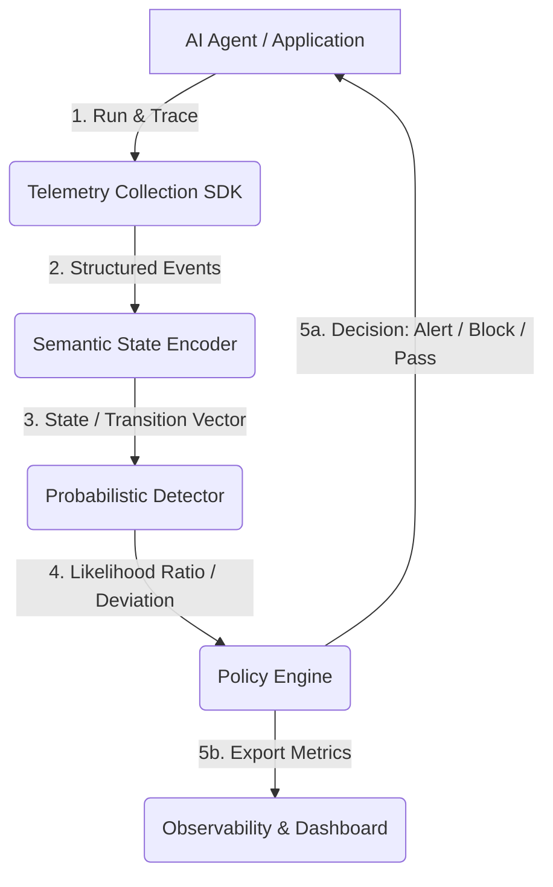

# Runtime Verification Framework for AI Agents (`runtimeverify`)

[](https://python.org)
[](LICENSE)

An open, extensible, low-overhead runtime verification framework that continuously observes autonomous AI agent behavior, models normal execution patterns, and detects statistically significant deviations in real time using classical statistical methods.

---

## 🌟 Vision

Modern AI agents are rapidly evolving from simple chatbots into autonomous systems capable of executing code, invoking external tools, accessing databases, modifying files, calling APIs, and collaborating in multi-agent networks. 

As autonomy increases, ensuring safe, predictable, and consistent behavior becomes paramount. Existing observability and guardrail solutions typically rely on LLM-as-a-judge evaluators (expensive, slow, non-deterministic) or static regex-based rule checks (brittle, narrow).

**`runtimeverify`** provides a third way: **Statistical Runtime Verification**. By transforming raw tool calls, state changes, and telemetry into mathematical execution states, the framework models agent behavior using probabilistic models (e.g., Markov Chains) and evaluates deviations using sequential statistical hypothesis testing (e.g., Sequential Probability Ratio Testing). 

The goal is to serve as a framework-independent, low-overhead infrastructure layer—an **OpenTelemetry for agent safety and validation**.

---

## 🚀 Key Features & Design Principles

- **Detector Agnostic:** Algorithms (Markov Chains, HMMs, SPRT, CUSUM) are implemented as interchangeable plugins.
- **Explainability First:** Decisions are backed by quantifiable statistical evidence (likelihood ratios, p-values) rather than opaque neural network scores.
- **Ultra-Low Runtime Overhead:** Verification operates entirely on lightweight telemetry data without invoking additional LLMs, keeping latency to a minimum.
- **Framework Independent:** Standardized hooks and middleware for popular orchestrators including LangGraph, PydanticAI, OpenAI Agents SDK, CrewAI, and AutoGen.
- **Real-Time Policy Guardrails:** Intercepts agent actions *before* execution if a deviation exceeds configured statistical thresholds, enabling auto-pausing or fallback protocols.

---

## 🏗️ Architecture Overview

The framework processes agent execution telemetry through a decoupled, multi-stage pipeline:



1. **Telemetry Collection:** Interceptors capture tool invocations, planning steps, token usage, execution durations, and error responses.
2. **Semantic State Encoding:** Translates unstructured events into clean, discrete symbolic states (e.g., `PLANNING`, `TOOL_WRITE_FILE`, `API_FETCH`).
3. **Probabilistic Detector:** Calculates the probability of the incoming sequence under a learned behavioral model (e.g., transition matrix) and tests for statistical drift.
4. **Policy Engine:** Assesses the verification output against active rules and executes guardrail actions (e.g., halting execution, prompting human-in-the-loop approval).

---

## 📂 Repository Layout

The project is structured modularly to allow easy extension of state representation, statistical models, and integrations:

```
runtime-verify/
├── docs/                      # Detailed technical documentation
│   ├── Architecture.md        # Deep dive into pipeline & system design
│   ├── Telemetry.md           # Telemetry schemas, interceptors & SDK reference
│   ├── StateEncoding.md       # Semantic state representation & encoding schemes
│   ├── DetectorAPI.md         # Statistical detectors & verification interfaces
│   ├── PolicyEngine.md        # Guardrails, mitigation actions & rule definitions
│   └── Roadmap.md             # Development phases & planned features
├── runtimeverify/             # Core Python package code
│   ├── cli/                   # Command line utilities (training, monitoring)
│   ├── telemetry/             # Tracing SDK and integration points
│   ├── encoder/               # Telemetry-to-state transformation logic
│   ├── detector/              # Statistical detection models (SPRT, Markov, HMM)
│   ├── policy/                # Invariant, temporal, and probabilistic rule engines
│   ├── integrations/          # Framework adapters (LangGraph, CrewAI, etc.)
│   └── utils/                 # General-purpose math & serialization helpers
├── tests/                     # Test suites (unit, integration, statistical validity)
└── examples/                  # Demo agents instrumented with runtimeverify
```

---

## 📖 Technical Documentation Index

To learn more about the inner workings of the framework, explore the specific modules:

* 📄 **[System Architecture](file:///D:/runtime-verify/docs/Architecture.md):** Deep dive into the modular pipeline and how components interact.
* 📄 **[Telemetry & Collection](file:///D:/runtime-verify/docs/Telemetry.md):** How the SDK hooks into agents and what events it gathers.
* 📄 **[State Encoding](file:///D:/runtime-verify/docs/StateEncoding.md):** The mapping process from raw telemetry events to symbolic states.
* 📄 **[Detector API](file:///D:/runtime-verify/docs/DetectorAPI.md):** Specifications for Markov Chain transition probability and Sequential Probability Ratio Test (SPRT) models.
* 📄 **[Policy Engine](file:///D:/runtime-verify/docs/PolicyEngine.md):** Configuring thresholds, safety constraints, and automated execution blocks.
* 📄 **[Roadmap](file:///D:/runtime-verify/docs/Roadmap.md):** Our short-term milestone goals and long-term vision.

---

## 🛠️ Quick Start (Conceptual)

Below is a conceptual example of instrumenting an agent and enforcing runtime verification policies:

```python
import runtimeverify as rv

# 1. Initialize the verification agent
verifier = rv.Verifier(
    encoder=rv.encoders.MarkovStateEncoder(),
    detector=rv.detectors.SPRTDetector(alpha=0.05, beta=0.05),
    policy=rv.policies.ThresholdPolicy(action="BLOCK", threshold=10.0)
)

# 2. Instrument your agent loop or tools
@verifier.trace_tool(name="execute_system_command")
def run_command(cmd: str):
    # original tool code...
    pass
```

---

## 📄 License

This project is licensed under the MIT License. See [LICENSE](LICENSE) for details.
