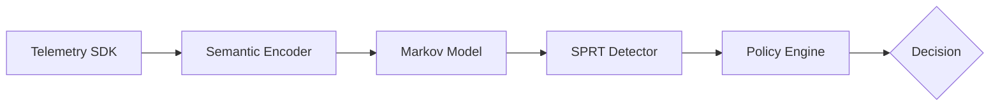

# 🛡️ RuntimeVerify: Statistical Runtime Verification for AI Agents

[](https://www.python.org/)
[](LICENSE)
[]()
[]()

**Non-intrusive, high-performance behavioral monitoring for AI agents. Detect drift and policy violations using classical statistical process control instead of expensive LLM critics.**

---

## 🌟 Why RuntimeVerify?

Traditional "guardrail" systems often rely on LLM-based critics to determine if an agent is behaving correctly. This introduces a "recursive cost" problem: you spend tokens and latency to check if you are spending tokens and latency.

`RuntimeVerify` shifts the paradigm from **semantic critique** to **statistical verification**. By treating agent execution as a stochastic process, it learns a "behavioral baseline" and triggers alerts when the agent's trajectory deviates significantly from that baseline.

### 🚀 Key Advantages
- **⚡ Ultra-Low Latency**: $\approx 1\text{ms}$ overhead per transition.
- **💰 Zero Token Cost**: No LLM calls required for the verification loop.
- **📉 Mathematical Rigor**: Powered by Wald's Sequential Probability Ratio Test (SPRT).
- **🔍 Non-Intrusive**: Minimal instrumentation via Python decorators.

### 🎯 Use-Cases
- **Sensitive Tool Access**: Ensure an agent doesn't suddenly start reading `/etc/shadow` after a period of normal behavior.
- **Financial Agents**: Detect behavioral drift in trading agents before they execute an anomalous sequence of trades.
- **Enterprise Compliance**: Verify that agents adhere to operational policies without introducing runtime bottlenecks.

---

## 📐 Technical Architecture

The system transforms raw telemetry into a binary decision (`ALLOW` / `BLOCK`) via a linear pipeline:



1. **Telemetry**: Capture high-fidelity events via `@observe_tool` or `@observe_llm`.
2. **Semantic Encoding**: Map raw event noise (UUIDs, paths) to a finite alphabet of symbolic states $\Sigma$ (e.g., `SENSITIVE_WRITE`).
3. **Probabilistic Detection**: A first-order Markov Model estimates the probability of the current transition $P(s_t | s_{t-1})$.
4. **Statistical Accumulation**: The SPRT accumulates log-likelihood ratios to distinguish between $H_0$ (normal) and $H_1$ (drifted).
5. **Policy Enforcement**: Maps the statistical result to a mitigation action.

---

## 🛠️ Quick Start

### 1. Installation
Using `uv` (recommended) or `pip`:

```bash
# Using uv
uv pip install .

# Using pip
pip install .
```

### 2. Instrument Your Agent
Simply wrap your tools and LLM calls with the `runtimeverify` decorators:

```python
from runtimeverify.telemetry.decorators import observe_tool, observe_llm

@observe_tool(name="filesystem_write")
def write_to_disk(path: str, content: str):
    with open(path, "w") as f:
        f.write(content)
    return "Success"

@observe_llm(model="claude-3-5-sonnet")
def get_agent_response(prompt: str):
    # Your LLM call here
    return "The user's request was processed."

# Now, every time these are called, telemetry is automatically 
# captured and sent to the verification engine.
```

### 3. Train Your Behavioral Baseline
Collect "golden" traces (JSON/JSONL files) and train your model:

```bash
# Initialize workspace
verify init

# Train the Markov model
verify train ./data/golden_traces/ --output behavior_model.json
```

### 4. Inspect Your Model
Verify the learned state transitions and sparsity:

```bash
verify inspect behavior_model.json
```

---

## 🧪 Deep Dive: The Math

At the heart of `RuntimeVerify` is **Wald's Sequential Probability Ratio Test (SPRT)**. While the standard SPRT is designed for i.i.d. samples, we employ the generalized version for Markov-dependent observations, where the likelihood ratio is computed based on transition probabilities $P(s_t \mid s_{t-1})$. Instead of making a decision based on a single transition, we maintain a cumulative log-likelihood ratio $\Lambda_t$:

$$\Lambda_t = \Lambda_{t-1} + \ln \frac{P(s_t \mid s_{t-1}; H_1)}{P(s_t \mid s_{t-1}; H_0)}$$

**Decision Boundaries:**
- $\Lambda_t \ge \ln(\frac{1 - \beta}{\alpha}) \implies$ **Anomaly Detected** (Reject $H_0$)
- $\Lambda_t \le \ln(\frac{\beta}{1 - \alpha}) \implies$ **Reset Accumulator** (Accept $H_0$)
- Otherwise $\implies$ **Continue Sampling**

This allows the system to ignore transient noise while rapidly identifying systemic behavioral drift.

---

## 📦 CLI Reference

The `verify` command provides the following utilities:

| Command | Description | Example |
| :--- | :--- | :--- |
| `init` | Initializes a new `.runtimeverify` workspace | `verify init` |
| `train` | Trains a Markov model from session traces | `verify train ./traces -o model.json` |
| `inspect` | Analyzes state occupancy and sparsity | `verify inspect model.json` |
| `explain` | Explains a specific state transition probability | `verify explain READ_SENSITIVE WRITE_FILE` |
| `doctor` | Runs environment and configuration diagnostics | `verify doctor` |
| `version` | Prints the current framework version | `verify version` |

---

## 👩‍💻 Extension Guide

`RuntimeVerify` is designed for extensibility via Abstract Base Classes (ABCs).

### Implementing a Custom Detector
To implement a new statistical method (e.g., CUSUM), inherit from `BaseDetector`:

```python
from runtimeverify.detector.interfaces import BaseDetector
from runtimeverify.detector import DetectorResult

class MyCustomDetector(BaseDetector):
    def train(self, trace_sequences):
        # Implement training logic
        pass

    def update(self, current_state: str) -> DetectorResult:
        # Implement statistical test
        return DetectorResult(deviation_score=0.5, decision="NORMAL", evidence={})

    def reset(self):
        pass
```

---

## 📊 Performance Metrics

Optimized for inline runtime guardrails:
- **Encoding Latency**: $< 0.5\text{ms}$
- **Detection Overhead**: $\approx 1\text{ms}$ per transition.
- **Memory Footprint**: $\mathcal{O}(|\Sigma|^2)$ where $|\Sigma|$ is the size of the state alphabet.

## 🗺️ Roadmap
- [ ] **HMM Integration**: Moving beyond first-order Markov chains to Hidden Markov Models.
- [ ] **OTLP Export**: Native support for OpenTelemetry.
- [ ] **LTL Policies**: Support for Linear Temporal Logic forbidden sequences.

---

## 🤝 Contributing
We welcome contributions! Please see [CONTRIBUTING.md](CONTRIBUTING.md) for our guidelines.

## 📜 License
Distributed under the MIT License. See [LICENSE](LICENSE) for more details.
