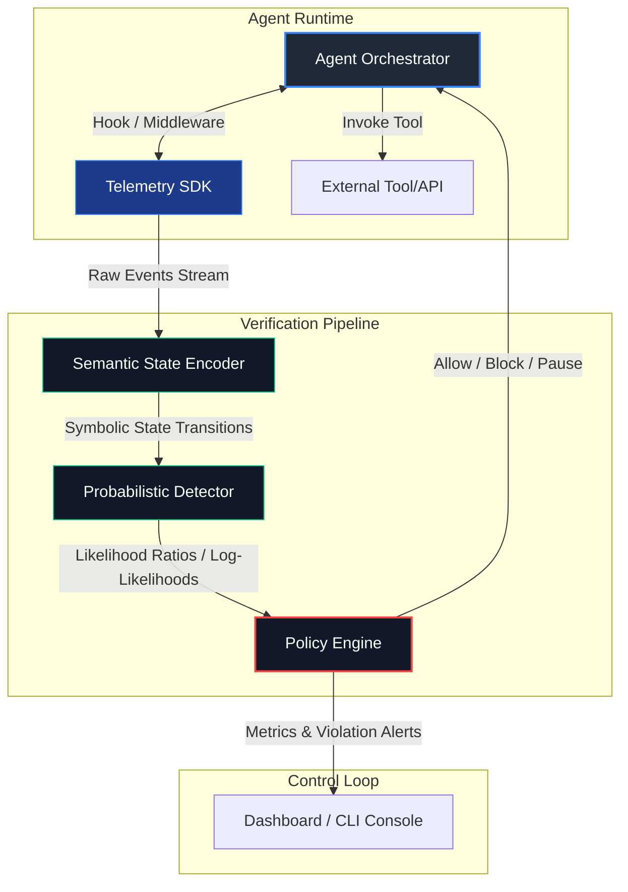

# System Architecture

This document describes the design principles, pipeline phases, component interfaces, and deployment topologies of the `runtimeverify` framework.

---

## 🏛️ Architecture Overview

The `runtimeverify` system operates as a stateful, non-intrusive stream processing engine. It converts agent execution traces (telemetry) into a symbolic state sequence, computes statistical deviation metrics on that sequence, and applies declarative policy guardrails.

---

## 🔄 The Data Flow Pipeline

The framework operates in five distinct pipeline stages:

### 1. Instrumentation & Event Interception
The `Telemetry SDK` wraps agent orchestrators, decision loops, and tools using Python decorators, decorators for tool functions, or middleware classes. 
* Whenever the agent starts a step, calls a tool, gets a response, or raises an error, an event is emitted.
* Events capture contextual metadata: timestamp, calling component, tool name, argument hashes, output summaries, token counts, and execution duration.

### 2. Semantic State Encoding
Raw telemetry events are highly variable. The `Semantic State Encoder` aggregates and simplifies these raw events into discrete, symbolic states. 
* For example, a raw tool execution event like `call_tool(name="run_sql_query", query="SELECT * FROM users")` might be encoded into the discrete state `DB_READ`.
* A sequence of events is transformed into a sequence of state transitions: $S = (s_1, s_2, s_3, \dots, s_t)$, where each $s_i \in \Sigma$ (a finite alphabet of states).
* For details, see the [State Encoding Documentation](file:///D:/runtime-verify/docs/StateEncoding.md).

### 3. Probabilistic Anomaly Detection
The encoded sequence is fed to the `Detector`. The detector evaluates whether the sequence $S$ deviates from a reference model (learned during a training phase or specified as an invariant).
* The detector maintains a running statistical test (e.g., Sequential Probability Ratio Test, CUSUM).
* It outputs statistical metrics, such as the cumulative log-likelihood ratio, indicating the confidence that the agent has drifted from "normal" operation.
* For details, see the [Detector API Documentation](file:///D:/runtime-verify/docs/DetectorAPI.md).

### 4. Policy Decisioning
The `Policy Engine` monitors the detector's output metrics at every transition.
* It compares statistical values (like SPRT log-likelihood ratio $\Lambda_t$) or p-values against user-defined thresholds.
* It determines whether the current transition is safe, suspicious, or dangerous.
* For details, see the [Policy Engine Documentation](file:///D:/runtime-verify/docs/PolicyEngine.md).

### 5. Guardrail Control
If a policy violation is triggered, the engine executes mitigation actions:
* **`ALLOW`**: Proceed normally.
* **`ALERT`**: Fire an alert to monitoring systems, but let the agent continue.
* **`BLOCK`**: Intercept and cancel the impending tool invocation or action.
* **`PAUSE`**: Suspend agent execution and wait for human-in-the-loop validation.
* **`FALLBACK`**: Divert agent execution to a safety-fallback policy.

---

## ⚙️ Deployment Modes

The framework supports two deployment topologies:

### Synchronous (Inline Guardrails)
In this mode, the instrumentation SDK blocks agent execution until the verifier completes state encoding, detector evaluation, and policy resolution.
* **Pros:** Guarantees that unsafe tool calls or actions are blocked *before* they affect the environment.
* **Cons:** Introduces minor overhead to the execution path (typically $<1$ to $5$ milliseconds).
* **Use Case:** High-risk actions (e.g., executing shell scripts, modifying files, transferring funds).

### Asynchronous (Out-of-band Monitoring)
In this mode, telemetry events are pushed to an in-memory queue or message broker (e.g., Redis). The verification pipeline processes the events in a separate thread or microservice.
* **Pros:** Zero impact on the agent's runtime speed or latency.
* **Cons:** Detection is delayed by the queue latency. A dangerous action might execute before the block command can be applied.
* **Use Case:** Broad behavioral monitoring, analytics, alerting, and dashboard visualization.
