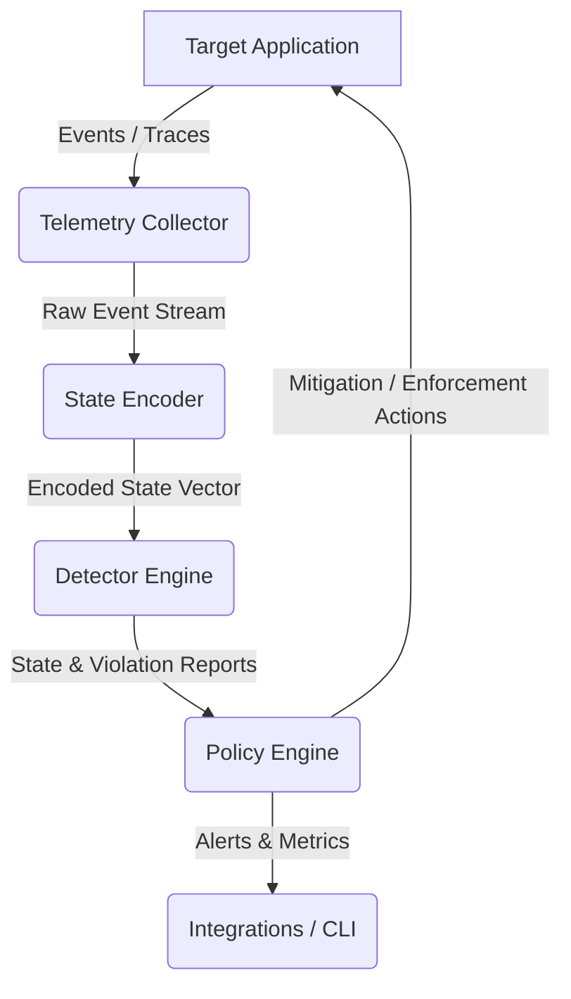

# Runtime Verify: Architecture Overview

`runtimeverify` is a modular, extensible framework designed for runtime verification of software systems. It monitors system execution, encodes trace streams into defined state spaces, detects safety or liveness violations, and enforces policies dynamically.

## System Workflow

## Core Components

1. **Telemetry Collector (`runtimeverify.telemetry`)**
   - Captures runtime events, logs, execution traces, or system calls.
   - Low-overhead instrumentation of target systems.

2. **State Encoder (`runtimeverify.encoder`)**
   - Normalizes raw telemetry into structured event states.
   - Maps events to numerical vectors, state machines, or timeline representations.

3. **Detector Engine (`runtimeverify.detector`)**
   - Analyzes state transitions and encoded states against properties.
   - Supports signature-based, pattern-matching, or statistical anomaly detection.

4. **Policy Engine (`runtimeverify.policy`)**
   - Evaluates detected states against high-level security, safety, or business policies.
   - Coordinates automated mitigation responses (e.g., blocking actions, logging, throttling, or graceful shutdown).

5. **Integrations & CLI (`runtimeverify.integrations`, `runtimeverify.cli`)**
   - Provides third-party platform bindings (SIEM, Slack, Webhooks).
   - Exposes commands for running, configuring, and analyzing runtime monitors.
