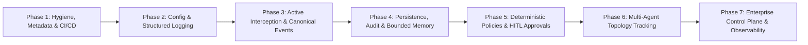
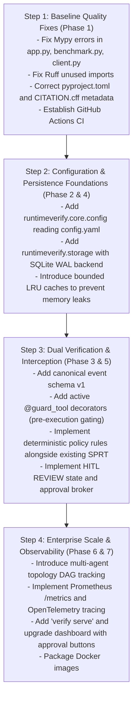

# Engineering Roadmap: RuntimeVerify Production Evolution

**Version:** 1.0.0  
**Date:** September 2026  
**Status:** Approved Implementation Plan  
**Target Repository:** [RadeshKK/Runtime-Verify](https://github.com/RadeshKK/Runtime-Verify)

---

## 1. Executive Strategy & Guiding Principles

This roadmap outlines the phased transformation of **RuntimeVerify** into an industry-grade, vendor-neutral runtime security and behavioral verification platform for autonomous AI agents.

To protect system reliability and maintain research rigor, this evolution follows four foundational rules:
1. **Zero Destructive Refactoring**: Never remove or rewrite existing working functionality. Existing Markov modeling and SPRT sequential verification must remain intact.
2. **Strict Backward Compatibility**: Public APIs, decorator signatures, CLI command invocations, and JSON model checkpoint formats must remain functional.
3. **Additive Phasing**: Every phase builds upon the previous without breaking legacy contracts.
4. **Verification-Driven Development**: Total test suite coverage must remain $\ge 90\%$, with zero Mypy errors and zero Ruff warnings maintained across all commits.

---

## 2. Phase-by-Phase Implementation Plan

---

### Phase 1: Packaging Hygiene, Metadata Hardening & CI/CD Baseline
**Objective**: Correct stale repository metadata, resolve existing static analysis errors, expand Python version compatibility, and establish automated continuous integration.

- **Tasks**:
  1. **Update `pyproject.toml` Metadata**:
     - Replace placeholder description (`"Add your description here"`) with: `"Vendor-neutral statistical runtime verification and behavioral security platform for autonomous AI agents"`.
     - Add author, maintainer, repository, and homepage URLs pointing to `https://github.com/RadeshKK/Runtime-Verify`.
     - Broaden Python version constraint from `requires-python = ">=3.14"` to `requires-python = ">=3.10"`.
  2. **Update Attribution & Security Docs**:
     - Correct `CITATION.cff` repository URL to `https://github.com/RadeshKK/Runtime-Verify`.
     - Update `SECURITY.md` contact instructions to reference the official repository security advisory process.
  3. **Resolve Existing Static Analysis Diagnostics**:
     - Fix 10 Mypy type errors across `src/runtimeverify/api/app.py`, `src/runtimeverify/evaluation/benchmark.py`, and `src/runtimeverify/cloud/client.py`.
     - Resolve 39 Ruff unused imports in test suites (`tests/test_evaluation.py`, `tests/test_events.py`, etc.).
  4. **Establish GitHub Actions CI/CD Pipeline**:
     - Add `.github/workflows/ci.yml` running matrix tests across Python 3.10, 3.11, 3.12, 3.13, and 3.14 on Linux, macOS, and Windows.
     - Enforce `ruff check`, `mypy src/`, and `pytest --cov=runtimeverify` in CI.
- **Deliverables**: Clean build passing on all supported Python versions; zero Mypy/Ruff errors; active CI workflow.

---

### Phase 2: Unified Configuration & Structured Logging Engine
**Objective**: Eliminate hardcoded thresholds and configuration disconnects by introducing a centralized Pydantic settings manager and structured logging.

- **Tasks**:
  1. **Centralized Configuration Manager (`runtimeverify.core.config`)**:
     - Implement `RuntimeVerifySettings` using Pydantic Settings (`pydantic-settings`).
     - Load from `.runtimeverify/config.yaml`, environment variables (`RUNTIMEVERIFY_*`), or defaults.
     - Expose typed settings for SPRT thresholds ($\alpha, \beta$, smoothing), session TTL, logging, and storage paths.
  2. **Structured Logging (`runtimeverify.core.logging`)**:
     - Implement standard structured JSON logging with context-propagated correlation IDs, session IDs, and agent IDs.
     - Replace unformatted print statements in workers and silent error suppressions in `CloudVerificationClient`.
  3. **Wire Configuration into CLI & Engine**:
     - Update `verify init` to generate a schema-validated `config.yaml`.
     - Wire `RuntimeEngine`, `api.app`, and `SPRTEngine` to automatically initialize with `RuntimeVerifySettings`.
- **Deliverables**: End-to-end config loading from `.runtimeverify/config.yaml`; structured JSON logs with correlation IDs.

---

### Phase 3: Active Inline Interception & Canonical Event Schema v1
**Objective**: Enable real-time pre-execution gating (`BLOCK` before action occurs) while standardizing telemetry into a versioned canonical event model.

- **Tasks**:
  1. **Canonical Event Schema v1 (`runtimeverify.events.canonical`)**:
     - Define `schema_version = "1.0.0"` across all event definitions.
     - Create canonical schemas: `AgentLifecycleEvent`, `ToolExecutionEvent`, `ModelInferenceEvent`, `ResourceAccessEvent`.
  2. **Active Inline Guardrail Decorator (`@guard_tool`, `@guard_agent`)**:
     - Implement pre-execution interception decorators in `runtimeverify.telemetry.decorators`.
     - Before invoking the target tool function, synchronously evaluate the pipeline via `RuntimeEngine.observe()`.
     - If the decision is `ALLOW`, proceed to function execution; if `BLOCK`, raise `PolicyViolationError` to prevent tool execution.
  3. **Framework Middleware Enhancements**:
     - Upgrade `LangGraphAdapter`, `PydanticAIAdapter`, and `CrewAIAdapter` to support blocking pre-tool interception.
- **Deliverables**: Functional pre-execution blocking preventing unsafe operations; versioned canonical event schema.

---

### Phase 4: Persistence, Immutable Audit Trails & Bounded Memory
**Objective**: Transition from ephemeral in-memory storage to persistent, production-grade SQLite/PostgreSQL storage with bounded memory guarantees.

- **Tasks**:
  1. **Pluggable Storage Layer (`runtimeverify.storage`)**:
     - Implement `StorageBackend` abstract interface for sessions, transitions, decisions, and audit records.
     - Implement `SQLiteStorageBackend` (embedded mode default with Write-Ahead Logging `WAL` mode for high concurrency).
     - Implement `PostgreSQLStorageBackend` for enterprise distributed deployments.
  2. **Cryptographically Hashed Audit Trail (`runtimeverify.storage.audit`)**:
     - Implement an append-only, SHA-256 hash-chained audit log recording every transition, detector score, and policy action.
  3. **Bounded In-Memory Caches & Eviction**:
     - Upgrade `SessionManager`, `StateEncoderPipeline`, and `SPRTEngine` with LRU caching and background TTL eviction to guarantee $O(1)$ memory bounds regardless of session volume.
     - Wire `RuntimePipeline._default_persist` to commit decisions directly to the storage backend.
- **Deliverables**: Persistent session history surviving restarts; immutable audit trail; guaranteed bounded memory.

---

### Phase 5: Deterministic Policies, Risk Tiers & Human-in-the-Loop (HITL)
**Objective**: Expand policy capabilities with deterministic fast-path rules, semantic risk categorization, and `REVIEW` state with human authorization workflows.

- **Tasks**:
  1. **Semantic Risk Classifier (`runtimeverify.encoder.classifier`)**:
     - Classify actions into structured risk tiers: `LOW`, `MEDIUM`, `HIGH`, `CRITICAL`.
  2. **Deterministic Fast-Path Policy Rules (`runtimeverify.policy.rules`)**:
     - Implement path deny-lists (e.g., blocking `/etc/*`, `.env`, `~/.ssh/*`).
     - Implement parameter taint inspection (command injection tokens).
     - Implement Temporal Invariant rules (e.g., forbidding `READ_SECRET -> EXTERNAL_API` transitions).
  3. **Human Approval Workflow Subsystem (`runtimeverify.hitl`)**:
     - Add `REVIEW` decision status in `runtimeverify.runtime.context.Decision`.
     - Implement `ApprovalBroker` generating expiring approval tickets and cryptographic tokens.
     - Implement webhook notification dispatcher (dispatching approval requests to Slack, webhooks).
     - Add CLI approval command: `verify approve <ticket_id>` and `verify reject <ticket_id>`.
     - Expose approval endpoints in FastAPI (`POST /v1/approvals/{ticket_id}/decision`).
- **Deliverables**: Deterministic boundary rules; 4-state decisions (`ALLOW`, `REVIEW`, `BLOCK`, `QUARANTINE`); working human approval queue.

---

### Phase 6: Multi-Agent Interaction Topology & Delegation Tracking
**Objective**: Monitor distributed multi-agent systems, tracking delegation hierarchies and cross-agent cascade failures.

- **Tasks**:
  1. **Agent Topology Graph (`runtimeverify.multiagent.graph`)**:
     - Build a Directed Acyclic Graph (DAG) tracking agent parent-child relationships and message routing.
  2. **Delegation Tracking**:
     - Implement `DelegationEvent` tracking agent task handoffs, subagent spawning, and tool permissions.
  3. **Cascade Anomaly Detection**:
     - Evaluate collective multi-agent transition trajectories, detecting privilege escalation across agent delegations.
- **Deliverables**: Graph-based multi-agent execution tracking and collective drift verification.

---

### Phase 7: Enterprise Control Plane, Dashboard & Observability
**Objective**: Deliver enterprise production readiness with Prometheus metrics, OpenTelemetry tracing, an upgraded live dashboard, and containerization.

- **Tasks**:
  1. **Enterprise Observability**:
     - Add OpenTelemetry distributed tracing spans to pipeline stages.
     - Expose Prometheus `/metrics` endpoint (SPRT LLR histograms, transition latencies, anomaly counters).
  2. **Web Dashboard Upgrade (`runtimeverify.dashboard`)**:
     - Upgrade dark-mode dashboard with real-time pending approval actions (one-click Approve / Deny).
     - Add live session search, filter by risk level, and transition matrix heatmap inspection.
  3. **Production CLI Enhancements**:
     - Implement `verify serve` to launch the FastAPI server with configurable workers, host, and port.
     - Implement `verify monitor` for live terminal-based monitoring.
  4. **Packaging & Deployment Assets**:
     - Provide official `Dockerfile` and `docker-compose.yml` for verified enterprise container deployments.
- **Deliverables**: Production-ready control plane; live approval dashboard; Prometheus/OpenTelemetry metrics; Docker packaging.

---

### Phase 8: Structured Audit, Observability & Secret Redaction (Completed)
**Objective**: Guarantee that every RuntimeVerify decision, state change, approval ticket, and execution outcome is auditable, correlated, and redacted of raw credentials.

- **Tasks**:
  1. **Canonical Audit Record Schema (`runtimeverify.audit.models`)**:
     - Implement `AuditRecord`, `AuditRecordType`, `AuditSeverity`, with correlation across `trace_id`, `session_id`, `event_id`, `agent_id`, `action_id`, and `span_id`.
  2. **Secret Redaction Engine (`runtimeverify.audit.redaction`)**:
     - Key scrubbing for `password`, `token`, `secret`, `api_key`, `private_key`, `auth`, `credentials`.
     - Value regex matching for OpenAI keys, AWS keys, GitHub tokens, Bearer headers, RSA/EC private keys, and database connection strings.
  3. **Pluggable Audit Sinks (`runtimeverify.audit.sinks`)**:
     - Implement `FileAuditSink` (NDJSON), `MemoryAuditSink`, `ConsoleAuditSink`, `CompositeAuditSink`, and adapters for `PostgresAuditSink`, `ObjectStorageAuditSink`, and `SIEMAuditSink`.
  4. **Retention Enforcement (`runtimeverify.audit.repository`)**:
     - Age-based (`max_age_days`) and volume-based (`max_records`) pruning.
  5. **CLI Subcommands**:
      - `runtimeverify audit list`, `runtimeverify audit show`, `runtimeverify audit prune`.
- **Deliverables**: Tamper-evident NDJSON audit logging; zero raw secret exposure; retention pruning; full test suite and documentation.

---

### Phase 9: Agent Integration SDK & Framework Adapters (Completed)
**Objective**: Deliver a lightweight, in-process Python SDK and standard framework integrations without requiring an external server or dashboard.

- **Tasks**:
  1. **Core SDK Interfaces (`runtimeverify.sdk`)**:
     - Implement `RuntimeVerifyClient` managing in-process policy evaluation, verification, and audit pipelines.
     - Implement `AgentSession` context manager preserving correlation IDs (`agent_id`, `session_id`, `trace_id`, `environment`).
     - Expose `check()`, `observe()`, `authorize()`, `execute()`, `record()`, `close()`.
     - Decorator `@session.wrap_tool` for wrapping arbitrary Python functions with pre-execution gating.
  2. **Multi-Format Tool Ingestion**:
     - Map dicts, raw strings, callables, LangChain `ToolCall`, and OpenAI `ToolCall` structures to canonical `Action` and `CanonicalEvent`.
  3. **Official LangChain & LangGraph Integration (`runtimeverify.integrations.langchain`)**:
     - Subclass LangChain `BaseCallbackHandler` with `RuntimeVerifyCallbackHandler` (`on_tool_start`, `on_tool_end`, `on_tool_error`, `on_agent_action`, `on_llm_start`, `on_llm_end`).
     - Implement `guard_langchain_tool` for explicit `BaseTool` wrapping.
  4. **Documentation**:
     - `docs/sdk/README.md` and `docs/integrations/langchain.md`.
- **Deliverables**: Complete Python SDK; LangChain callback integration; full test suite (14 SDK tests, 9 integration tests); comprehensive documentation.

---

### Phase 10: Production CLI (Completed)
**Objective**: Transform RuntimeVerify into a developer security tool with terminal commands, standardized exit codes, JSON/quiet output, and shell-safe execution.

- **Tasks**:
  1. **Core Command Suite (`runtimeverify.cli`)**:
     - `runtimeverify init`: Initialize workspace, starter policy, and configuration (`--json`, `--quiet`).
     - `runtimeverify check`: Pre-execution action gating with shortcuts (`--file`, `--command`) and semantic exit codes (0=ALLOW, 2=BLOCK, 3=REVIEW).
     - `runtimeverify run`: Supervised process execution with shell-safe arguments (`-- <agent command...>`).
     - `runtimeverify monitor`: Real-time telemetry monitoring and trace replaying (`--agent`, `--trace`).
     - `runtimeverify policy validate` & `policy test`: Automated syntax validation and test suite execution against policies.
     - `runtimeverify events`: Query and display canonical events from audit logs (`list`, `show`).
     - `runtimeverify approvals`: CLI approval workflow management (`list`, `approve`, `deny`, `show`).
     - `runtimeverify status`: Complete diagnostic status of workspace, policies, models, and Laya availability.
     - `runtimeverify benchmark`: Microbenchmarks for policy evaluation throughput and redaction latency.
     - `runtimeverify version`: Framework, Python, and OS platform information.
  2. **Developer Ergonomics & Security**:
     - Strict exit code semantics (`0`, `1`, `2`, `3`, `4`).
     - Standard `--json`, `--quiet`, and `--verbose` modes across commands.
     - Automated `SecretRedactor` scanning ensuring zero raw secret leakage to terminal or JSON outputs.
  3. **Integration Tests & Documentation**:
     - 23 integration tests in `tests/test_cli_production.py`.
     - Complete CLI guide in `docs/cli/README.md`.
- **Deliverables**: Production-grade developer CLI; 23 integration tests; full documentation.

---

---

### Phase 11: RuntimeVerify Enterprise API (Completed)
**Objective**: Expose RuntimeVerify capabilities through a versioned REST API (`/api/v1`) with pluggable authentication, RBAC authorization, OpenAPI 3.0 documentation, sliding-window rate limiting, correlation ID tracking, and automated secret redaction.

- **Tasks**:
  1. **Authentication & Authorization Abstraction (`runtimeverify.api.auth`)**:
     - Implement `AuthProvider` ABC with `ApiKeyAuthProvider`, `OIDCAuthProvider` (Keycloak realm & resource access roles parser), and `CompositeAuthProvider`.
     - Implement RBAC permissions (`EVENTS_WRITE`, `DECISIONS_EVALUATE`, `POLICIES_WRITE`, `APPROVALS_DECIDE`, `AUDIT_PRUNE`, etc.) and roles (`ADMIN`, `OPERATOR`, `AUDITOR`, `AGENT`, `ANONYMOUS`).
  2. **Security & Telemetry Middleware (`runtimeverify.api.middleware`)**:
     - Implement `CorrelationIdMiddleware` propagating `X-Correlation-ID`, `X-Trace-ID`, and `X-Request-ID`.
     - Implement `InMemoryRateLimiter` and `RateLimitMiddleware` (thread-safe sliding window with `429` and `Retry-After`).
     - Implement `SecretRedactionMiddleware` (intercepts JSON responses, sanitizes keys and high-entropy secret patterns via `SecretRedactor`).
     - Implement `register_error_handlers` returning structured JSON error envelopes.
  3. **Versioned Sub-Routers (`runtimeverify.api.v1`)**:
     - `GET /api/v1/health`, `GET /api/v1/health/ready`, `GET /api/v1/health/live`.
     - `POST /api/v1/events`, `GET /api/v1/events`, `GET /api/v1/events/{id}`.
     - `POST /api/v1/decisions/evaluate`, `GET /api/v1/decisions`, `GET /api/v1/decisions/{id}`.
     - `GET /api/v1/agents`, `GET /api/v1/agents/{id}`, `GET /api/v1/agents/{id}/sessions/{session_id}`.
     - `GET /api/v1/policies`, `GET /api/v1/policies/{id}`, `POST /api/v1/policies/validate`, `POST /api/v1/policies/test`.
     - `GET /api/v1/approvals`, `GET /api/v1/approvals/{id}`, `POST /api/v1/approvals/{id}/approve`, `POST /api/v1/approvals/{id}/deny`, `GET /api/v1/approvals/{id}/audit`.
     - `GET /api/v1/audit`, `GET /api/v1/audit/{id}`, `POST /api/v1/audit/prune`.
  4. **Backward Compatibility & Documentation**:
     - Preserve 100% compatibility with legacy endpoints (`/health`, `/metrics`, `/monitor`, `/session/{id}`, `/decision/{id}`, `/train`, static web dashboard).
     - Full OpenAPI 3.0 documentation (`/docs`, `/redoc`, `/openapi.json`) and `docs/api/README.md`.
     - 15 unit and integration tests in `tests/test_api_v1.py`.
- **Deliverables**: Enterprise versioned API; pluggable OIDC & API key auth; RBAC; response secret redaction; 15 tests; complete documentation.

---

---

### Phase 12: Runtime Security Dashboard (Completed)
**Objective**: Deliver a unified operator-facing single-page security dashboard following Leonxlnx/taste-skill standards, integrating real-time telemetry observation, 4-tier decision evidence, human-in-the-loop approvals, deterministic policy management, and structured audit logs.

- **Tasks**:
  1. **Frontend Architecture & Taste-Skill Implementation (`runtimeverify.dashboard`)**:
     - Embedded zero-dependency SPA in `src/runtimeverify/dashboard/index.html` mounted by FastAPI at `/`.
     - Standardized design contract (Design Read declared; Dials: `VARIANCE=4`, `MOTION=2`, `DENSITY=8`).
     - Distinct semantic status hierarchy (`Observed`, `Evaluated`, `Allowed`, `Blocked`, `Awaiting Approval`).
     - Real API model integration with zero invented mock schemas.
     - Clear defense-in-depth security model disclaimer (no claims of absolute safety).
  2. **Core Operational Views**:
     - **Overview**: 6 primary KPIs, SPRT LLR trajectory chart against Wald boundaries, verdict donut, active interventions list.
     - **Agent Fleet View**: Fleet discovery, session counts, baseline status, session trajectory drilldown.
     - **Event Timeline**: Multi-field filtered canonical telemetry stream with decision mapping.
     - **Decisions Log & Slide-Out Inspector**: Comprehensive decision table with 4-tier verification evidence (Deterministic Policy, Semantic Intent, Behavioral Markov, Sequential SPRT).
     - **Human Authorization Queue**: Pending approval tickets with risk tiers, justification, expiration countdown, and one-click `Approve`/`Deny` actions.
     - **Policy Management**: Active policy rule inspection, YAML/JSON validator (`POST /api/v1/policies/validate`), and dry-run rule matcher.
     - **Structured Audit Log**: Immutable audit trail with correlation tracking, secret redaction indicators, and retention pruning modal.
  3. **Interactive Modals & Lifecycle States**:
     - "Simulate Action" modal for testing commands and resources live against `/api/v1/decisions/evaluate`.
     - API Authentication settings modal for `X-API-Key` and Bearer JWT configuration.
     - Loading skeletons, empty states with operational guidance, error alert banners with retry mechanisms.
  4. **Integration Tests & Documentation**:
     - 8 unit and integration tests in `tests/test_dashboard.py`.
     - Comprehensive dashboard architecture guide in `docs/dashboard/README.md`.
### Phase 13: Security Benchmark Framework (Completed)
**Objective**: Deliver a reproducible, rigorous, and auditable benchmark framework comparing RuntimeVerify verification strategies across 9 canonical security scenarios with empirical and synthetic separation.

- **Tasks**:
  1. **Canonical Benchmark Scenarios (`runtimeverify.evaluation.scenarios`)**:
     - Implement `BenchmarkScenario` enum covering 9 scenarios: Normal coding, Credential access, Secret exfiltration, Destructive shell, Suspicious network activity, Prompt-injection-induced behavior, Privilege escalation, Abnormal tool usage, and Agent-to-agent abuse.
  2. **Comparative Strategy Implementations (`runtimeverify.evaluation.strategies`)**:
     - **Strategy A**: Rules Only (`RulesOnlyStrategy` - deterministic policy engine).
     - **Strategy B**: Semantic Only (`SemanticOnlyStrategy` - intent and risk classifier).
     - **Strategy C**: Markov + SPRT (`MarkovSPRTStrategy` - statistical sequential verification).
     - **Strategy D**: Hybrid All (`HybridAllStrategy` - multi-tier defense-in-depth verification pipeline).
  3. **Reproducible Datasets (`runtimeverify.evaluation.datasets`)**:
     - Deterministic synthetic dataset generator with reproducible seeds (`build_synthetic_dataset(seed=42)`).
     - Curated real-world reference corpus (`build_realworld_dataset()`) with `is_synthetic=False`.
     - Strict separation: Never present synthetic benchmark results as production performance.
  4. **Performance & Efficacy Metrics (`runtimeverify.evaluation.metrics`)**:
     - Accuracy, precision, recall, F1 score.
     - False allow rate (FAR) and false block rate (FBR).
     - Real wall-clock latency percentiles (mean, p50, p95, p99), process CPU overhead (`time.process_time()`), peak memory allocation (`tracemalloc`), and semantic engine latency.
  5. **Runner & Multi-Format Reporters (`runtimeverify.evaluation.runner`, `runtimeverify.evaluation.reports`)**:
     - `SecurityBenchmarkRunner` coordinating strategy execution across dataset suites.
     - Machine-readable JSON and CSV export capabilities.
     - Auditable Markdown report generator with mandatory transparency disclaimers and per-scenario detection matrices.
  6. **Production CLI Commands & Test Suite**:
     - CLI flags: `runtimeverify benchmark --security`, `--dataset synthetic|realworld`, `--json`, `--output-json`, `--output-csv`, `--report`.
     - 16 unit and integration tests in `tests/test_security_benchmark.py`.
     - Full documentation in `docs/benchmark/README.md`.
- **Deliverables**: Comprehensive security benchmark framework; 4 comparative strategies; 9 threat scenarios; machine-readable outputs; 16 tests; documentation.

---

### Phase 14: Security Hardening & Defense-in-Depth (Completed)
**Objective**: Conduct comprehensive threat modeling, eliminate policy bypass vectors, harden path/shell/network boundaries, implement cryptographic audit integrity, secure human approvals against replay, and author formal security specifications without making unsupported isolation claims.

- **Tasks**:
  1. **Filesystem Path Canonicalization & Traversal Defense (`runtimeverify.security.paths`)**:
     - `SecurePathNormalizer` enforcing strict cross-platform canonicalization.
     - Direct detection of raw and URL-encoded traversal tokens (`../`, `..\`, `%2e%2e`).
     - Absolute rejection of null bytes (`\0`, `%00`) raising `SecurityPathError`.
     - Directory boundary containment verification via `is_contained_in()`.
     - Integrated with `PolicyMatcher.matches_path` to prevent path-traversal evasion.
  2. **Command Pipeline Decomposition & Injection Safeguards (`runtimeverify.security.commands`)**:
     - `CommandPipelineParser` decomposing compound pipelines (`&&`, `||`, `;`, `|`, `&`, newlines) into discrete `SubCommand` units.
     - Recursive extraction of nested subshells (`$(...)` and backticks).
     - Detection of high-risk shell constructs: pipe-to-shell (`curl | bash`), sensitive environment variable overrides (`LD_PRELOAD=`, `PYTHONPATH=`).
     - Integrated with `PolicyMatcher.matches_shell` ensuring hidden payload commands cannot bypass security policies.
  3. **SSRF Hardening & Cloud Metadata Defense (`runtimeverify.security.network`)**:
     - `NetworkDestinationValidator` enforcing strict scheme allowlisting (`http://`, `https://`).
     - Hard blocking of Cloud Instance Metadata Services (AWS/Azure/GCP IMDS at `169.254.169.254`, `metadata.google.internal`).
     - Defense against decimal and hex integer IP obfuscation (`2130706433`, `0x7f000001`).
     - Blocking local loopback (`127.0.0.1`, `localhost`, `::1`) and RFC 1918 / RFC 4193 private subnets.
     - Integrated with `PolicyMatcher.matches_network`.
  4. **Cryptographic Audit Hash Chaining (`runtimeverify.security.audit_integrity`)**:
     - `AuditIntegrityEngine` calculating deterministic SHA-256 hash chains over sequential audit records ($H_i = \text{SHA-256}(\dots \parallel H_{i-1})$) anchored to a genesis block.
     - Tamper-detection engine detecting payload modification, record deletion, reordering, and unparseable line corruptions.
     - Integrated into `MemoryAuditRepository` and `FileAuditRepository` with `verify_integrity()`.
  5. **Approval Replay Protection & One-Time Challenge Tokens (`runtimeverify.security.approval_tokens`)**:
     - `ApprovalTokenManager` generating 256-bit URL-safe single-use challenge tokens (`secrets.token_urlsafe(32)`).
     - Constant-time verification (`hmac.compare_digest`) against timing side-channel attacks.
     - Enforced single-use consumption in `ApprovalStore`, raising `DuplicateApprovalError` on replay.
  6. **Extended Secret Redaction & Input Sanitization (`runtimeverify.audit.redaction`, `runtimeverify.security.input_validation`)**:
     - `SecretRedactor` extended with prioritized patterns for Anthropic (`sk-ant-`), Google Gemini (`AIza`), Stripe (`sk_live_`), JWT tokens, and HuggingFace tokens (`hf_`).
     - `InputSecurityValidator` stripping ANSI escape sequences (terminal injection/prompt spoofing), carriage returns (log overwriting), and validating alphanumeric identifiers.
  7. **Security Test Suite & Dependency Audit**:
     - 37 dedicated unit and integration tests in `tests/test_security_hardening.py`.
     - Dependency audit verified clean via `pip-audit` (0 known vulnerabilities).
     - Full test suite verified passing (386 total tests, 0 regressions).
  8. **Formal Security Documentation**:
     - `docs/security/threat-model.md`: Detailed threat model covering all 13 vectors, trust boundaries, and mitigations.
     - `docs/security/security-model.md`: Architecture specification, defense-in-depth hierarchy, explicit guarantees, and explicit non-goals (declaration that RuntimeVerify is not an OS kernel sandbox).
     - `SECURITY.md`: Vulnerability reporting process, SLAs, and responsible disclosure policy.
- **Deliverables**: Hardened security package `runtimeverify.security`; 37 new tests; 386 total passing tests; clean dependency audit; 3 comprehensive security documents.

---

### Phase 15: Production Packaging & Developer Distribution (Completed)
**Objective**: Package RuntimeVerify into an installable, production-ready distribution artifact on PyPI (`pip install runtimeverify`) with modular optional extras, verified clean installation, comprehensive examples, and zero heavyweight ML dependencies in the base package.

- **Tasks**:
  1. **Packaging Metadata & Distribution Configuration (`pyproject.toml`)**:
     - Standardized canonical PyPI distribution name `runtimeverify` with MIT license metadata.
     - Accurate project description, authors, maintainers, GitHub URLs (Homepage, Documentation, Issues, Changelog).
     - Broadened Python version compatibility: `requires-python = ">=3.10"`.
     - Standardized PEP 517 build backend using `setuptools.build_meta`.
  2. **Modular Optional Dependency Groups**:
     - Lightweight base package: `pydantic`, `typer`, `rich`, `pyyaml`, `requests`, `numpy`, `scipy` (no heavyweight ML or server frameworks required).
     - `runtimeverify[api]`: FastAPI and Uvicorn for headless REST API deployments.
     - `runtimeverify[dashboard]`: Dashboard static assets and web interface.
     - `runtimeverify[laya]`: Laya zero-shot semantic decision engine.
     - `runtimeverify[dev]`: Testing, linting, and coverage tooling.
     - `runtimeverify[all]`: Unified full-featured bundle.
  3. **Package Data & Asset Ingestion**:
     - Bound static web assets (`dashboard/index.html`) and policy schema assets via `[tool.setuptools.package-data]`.
     - Created `src/runtimeverify/dashboard/__init__.py` to ensure proper packaging discovery in wheels.
  4. **Standalone Developer Examples (`examples/`)**:
     - `examples/quickstart_agent.py`: Agent session lifecycle, pre-execution checking, permitted actions, and blocked dangerous actions.
     - `examples/first_policy_demo.py`: Custom YAML policy loading, rule validation, and policy evaluation.
     - `examples/human_approval_flow.py`: Human-in-the-loop review workflow, challenge token verification, and replay attack defense.
  5. **Production README Documentation (`README.md`)**:
     - Quickstart guide: installation, workspace initialization, first policy, first monitored agent, and first blocked action.
     - CLI command reference table.
     - Architecture and defense-in-depth hierarchy diagram.
     - Transparent operational scope and sandbox boundary declarations.
  6. **Clean Isolated Environment Verification**:
     - Built wheel (`runtimeverify-0.1.0-py3-none-any.whl`) and source tarball (`runtimeverify-0.1.0.tar.gz`).
     - Installed and verified in an isolated temporary virtual environment:
       - Base installation: Verified CLI commands (`version`, `check`), SDK import, and confirmed zero `fastapi` leakage.
       - Extra installation (`[api]`): Verified FastAPI API initialization and route registration.
       - Quickstart verification: Executed `examples/quickstart_agent.py` cleanly.
- **Deliverables**: Production-ready package build; modular optional dependency groups; 3 standalone examples; updated README.md; clean environment installation verification.

---

### Phase 16: CI/CD Pipeline & Automated Release (Completed)
**Objective**: Establish a production-grade CI/CD automation pipeline for Pull Request quality gating (formatting, linting, type checks, unit/integration/security test matrix, dependency audits) and explicit, secure release publication to PyPI via OIDC Trusted Publishing.

- **Tasks**:
  1. **Continuous Integration Pipeline (`.github/workflows/ci.yml`)**:
     - Formatting & linting gates: Enforces Ruff check & format validation.
     - Static type safety gate: Enforces strict MyPy validation on `src/`.
     - Multi-Python test matrix: Runs all 386 tests across Python `3.10`, `3.11`, `3.12`, and `3.13`.
     - Dedicated security gate: Validates path normalization, SSRF/IMDS, challenge tokens, replay protection, and `pip-audit` zero vulnerabilities.
     - Packaging gate: Builds sdist/wheel, validates metadata via strict Twine check, and executes isolated clean virtual environment smoke tests.
     - Dependency caching: Employs `astral-sh/setup-uv@v5` with deterministic `uv.lock` caching.
  2. **Automated & Protected Release Pipeline (`.github/workflows/release.yml`)**:
     - Version consistency verification between Git tag (`v*.*.*`) and `pyproject.toml`.
     - Generation of cryptographic SHA-256 artifact checksums (`CHECKSUMS.sha256`).
     - Automated GitHub Release generation with changelog notes and asset uploads.
     - Secure, passwordless PyPI publishing using OpenID Connect (OIDC) Trusted Publishing.
     - Manual dispatch support with `dry_run` and `publish_pypi` options.
  3. **Contribution Standards & Quality Guidelines (`CONTRIBUTING.md`)**:
     - Documented developer setup using `uv`.
     - Enforced PR quality gate checklist and explicit test integrity policy ("Do not weaken tests merely to make CI pass").
     - Branching, conventional commits, and review procedures.
  4. **Formal Release Procedures (`docs/release.md`)**:
     - SemVer versioning rules, pre-release checklists, tag/dispatch instructions, post-release verification, and emergency `yank`/rollback procedures.
  5. **Verified Workflow Badges (`README.md`)**:
     - Live workflow status badges for CI, Release, PyPI, Python matrix, license, and security audit.
- **Deliverables**: Production CI workflow `.github/workflows/ci.yml`; release workflow `.github/workflows/release.yml`; updated `CONTRIBUTING.md`; new `docs/release.md`; live status badges in `README.md`.

---

### Phase 17: Multi-Agent Runtime Verification (Completed)
**Objective**: Extend RuntimeVerify from single-agent behavioral verification to complex multi-agent swarms with topology DAG enforcement, baseline learning, cross-agent privilege boundary inspection, and multi-agent Markov/SPRT drift detection without breaking v1.x schema compatibility.

- **Tasks**:
  1. **Extended Canonical Event Schema (`runtimeverify.events`)**:
     - Extended `Event` with optional fields: `parent_agent`, `agent_role`, `target_agent`, `target_agent_role`, `delegation_depth`, `call_chain`.
     - Added `EventType.AGENT_DELEGATION` and `EventType.AGENT_HANDOFF`; `EventAction.DELEGATE`, `HANDOFF`, `MESSAGE`.
     - Preserved 100% backward compatibility with single-agent telemetry and v1.x event serialization.
  2. **Multi-Agent Governance Subsystem (`runtimeverify.multiagent`)**:
     - `TopologyGraph`: DAG representation of authorized communication channels (`planner -> coder -> tester -> executor`, hierarchical, mesh) with cycle detection, excessive delegation depth gating, and privilege gap analysis ($\Delta \ge 15$).
     - `TopologyLearner`: Empirical baseline learning from benign traces to prevent assuming all agent communication is malicious.
     - `MultiAgentMarkovModel`: Joint role-action transition tracking (`src_role->tgt_role:action`).
     - `MultiAgentSPRTEngine`: Wald Sequential Probability Ratio Test for sequential drift detection across agent interactions.
     - `MultiAgentVerifier`: Unified verifier coordinating topology rules, privilege bounds, Markov transitions, and SPRT statistics.
  3. **VerificationEngine Integration (`runtimeverify.verification.engine`)**:
     - Direct integration of `multiagent_verifier` into `VerificationEngine.verify()`.
     - Pre-execution fail-closed blocking on topological bypasses and privilege escalations with structured `DecisionExplanation` and `Evidence`.
  4. **Benchmark Datasets & Threat Modeling**:
     - Synthetic benchmark scenarios covering Confused Deputy attacks, pipeline bypass, cyclic handoff loops, and privilege escalation in `runtimeverify.evaluation.datasets`.
     - Comprehensive threat model in `docs/security/multi-agent-threat-model.md`.
  5. **Comprehensive Test Suite**:
     - 11 unit and integration tests in `tests/test_multiagent.py`.
- **Deliverables**: Multi-agent subsystem `runtimeverify.multiagent`; extended canonical event schemas; `docs/security/multi-agent-threat-model.md`; 11 passing tests.

---

### Phase 18: Enterprise Architecture Preparation (Completed)
**Objective**: Prepare RuntimeVerify for organization-scale deployment as a modular monolith without prematurely implementing unnecessary microservice infrastructure, establishing multi-tenant boundaries, conceptual environments (`development`, `staging`, `production`), vendor-neutral OIDC/Keycloak authentication, fine-grained RBAC, hierarchical PolicySets, dual-control approvals, and tamper-evident audit ownership.

- **Tasks**:
  1. **Modular Monolith Architecture Strategy**:
     - Formulated architecture preserving sub-millisecond verification latency and in-process execution safety while preventing microservice serialization latency and distributed state drift.
  2. **Enterprise Entity Domain Models (`runtimeverify.enterprise.models`)**:
     - Modeled `Tenant`, `Organization`, `Project`, `AgentEntity`, `Environment` (`development`, `staging`, `production`), `PolicySet`, `SessionEntity`, `AuditOwnership`, `ApprovalPolicy`, and `Integration`.
  3. **Ambient Enterprise Execution Context (`runtimeverify.enterprise.context`)**:
     - Thread-safe and async-safe `EnterpriseContext` with Python `contextvars` propagation and `enterprise_scope` scoping context manager.
  4. **Enterprise RBAC & Production Guardrails (`runtimeverify.enterprise.rbac`)**:
     - Defined standard roles (`SUPER_ADMIN`, `ORG_ADMIN`, `SECURITY_ENGINEER`, `COMPLIANCE_AUDITOR`, `DEVELOPER`, `AGENT_SERVICE`) and fine-grained permissions with wildcard resolution.
     - Strict production environment guardrails preventing developers from modifying production policies or approving production actions.
     - Segregation of Duties (SOD) prohibiting self-approvals.
  5. **Pluggable Authentication Abstraction (`runtimeverify.enterprise.auth`)**:
     - Vendor-neutral `TokenValidator` and pluggable claim extractors (`KeycloakClaimsExtractor`, `GenericOIDCClaimsExtractor`).
     - Cryptographically hashed API Key management (`rv_live_...`, `rv_test_...`) with constant-time verification.
     - Service-to-Service (S2S) signed HMAC machine authentication and mTLS identity extraction.
  6. **Multi-Tenant Isolation & Storage Partitioning (`runtimeverify.enterprise.isolation`)**:
     - `TenantIsolationEngine` enforcing zero cross-tenant leakage.
     - `PartitionedStore` isolating data across tenant and environment boundaries.
  7. **Hierarchical PolicySets (`runtimeverify.enterprise.policyset`)**:
     - 4-tier inheritance: Tenant Global Guardrails (Immutable) -> Tenant General -> Org -> Project.
     - Digest computation and immutability protection preventing deletion or revocation of tenant guardrails.
  8. **Tamper-Evident Audit Chaining (`runtimeverify.enterprise.audit`)**:
     - Explicit tenant/org/project ownership with SHA-256 cryptographic chain verification.
  9. **Dual-Control Approval Queues (`runtimeverify.enterprise.approval`)**:
     - Configurable multi-approver thresholds (2 approvers in production), SOD enforcement, and auto-timeout handling.
  10. **Enterprise Architecture Specification & Tests**:
      - Comprehensive architecture document `docs/architecture/enterprise-architecture.md`.
      - 15 unit and integration tests in `tests/test_enterprise.py`.
- **Deliverables**: Enterprise package `runtimeverify.enterprise`; comprehensive specification `docs/architecture/enterprise-architecture.md`; 15 passing tests.

---

## 3. Product Direction Capability Matrix

The table below maps each of the 18 required capabilities to its planned implementation phase and target module:

| # | Capability | Target Module | Implementation Phase |
| :---: | :--- | :--- | :--- |
| **1** | Agent telemetry collection | `runtimeverify.telemetry` (`@guard_*`, `@observe_*`) | Phase 3 |
| **2** | Canonical agent event schema | `runtimeverify.events.canonical` | Phase 1 & 3 |
| **3** | Deterministic security policies | `runtimeverify.policy.rules` | Phase 3 |
| **4** | Semantic risk classification | `runtimeverify.semantic` | Phase 5 |
| **5** | Behavioral anomaly detection | `runtimeverify.markov` (existing preserved) | Phase 2 |
| **6** | Statistical sequential verification (SPRT) | `runtimeverify.sprt` (existing preserved) | Phase 6 |
| **7** | Runtime ALLOW / REVIEW / BLOCK | `runtimeverify.interception`, `runtimeverify.verification` | Phase 4 & 6 |
| **8** | Human approval workflows | `runtimeverify.approvals` | Phase 7 |
| **9** | Audit trails & secret redaction | `runtimeverify.audit` | Phase 8 (Completed) |
| **10** | SDK/API integrations | `runtimeverify.sdk`, `runtimeverify.integrations` | Phase 9 (Completed) |
| **11** | CLI | `runtimeverify.cli` (`init`, `check`, `run`, `monitor`, `policy`, `events`, `status`, etc.) | Phase 10 (Completed) |
| **12** | Runtime Security Operations Dashboard | `runtimeverify.dashboard`, `runtimeverify.api` | Phase 12 (Completed) |
| **13** | Benchmarks | `runtimeverify.evaluation` | Phase 13 (Completed) |
| **14** | Multi-agent verification | `runtimeverify.multiagent`, `runtimeverify.verification` | Phase 17 (Completed) |
| **15** | Enterprise deployment capabilities | `runtimeverify.enterprise`, `runtimeverify.storage` | Phase 18 (Completed) |
| **16** | Security hardening & defense-in-depth | `runtimeverify.security` | Phase 14 (Completed) |
| **17** | Production packaging & distribution | `runtimeverify`, `pyproject.toml` | Phase 15 (Completed) |
| **18** | CI/CD Pipeline & Automated Release | `.github/workflows/`, `docs/release.md` | Phase 16 (Completed) |

---

## 4. Migration Strategy: Current to Target Architecture

To seamlessly transition the codebase from the current state to the target architecture without regressions or downtime, follow this step-by-step migration sequence:

### Safety & Compatibility Invariants
1. **Never alter existing Markov mathematical signatures**: Any performance optimization to `ProbabilityMatrix` or `MarkovModel` must produce identical numerical outputs.
2. **Never change serialized model file format**: Version `1.0` JSON models must always deserialize cleanly.
3. **Additive decorator interface**: Existing `@observe_tool` calls continue to log passively; applications opting into active gating adopt `@guard_tool` or pass `blocking=True`.
4. **All transitions verified via regression tests**: Every phase must execute the 64-test suite and maintain coverage $\ge 90\%$.
