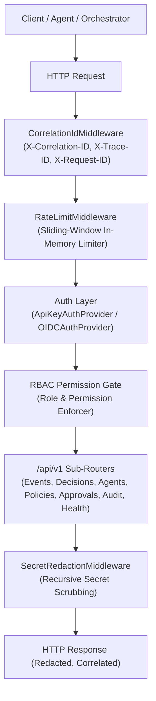

# RuntimeVerify Enterprise API Reference

The **RuntimeVerify Enterprise API** (`/api/v1`) provides a production-grade, vendor-neutral REST API interface for autonomous AI agent architectures, orchestration frameworks, microservices, and security operations platforms.

Interactive OpenAPI documentation is automatically served by the API instance:
- **Swagger UI**: `http://localhost:8000/docs`
- **ReDoc**: `http://localhost:8000/redoc`
- **OpenAPI Schema**: `http://localhost:8000/openapi.json`

---

## 1. Architecture & Security Invariants

The RuntimeVerify API is built on the following production standards:



### Correlation ID Tracking
Every request arriving at the API is assigned three tracking identifiers:
- `X-Correlation-ID`: Trace umbrella for cross-system correlation.
- `X-Trace-ID`: Distributed tracing ID.
- `X-Request-ID`: Unique ID for the specific HTTP round-trip.

If supplied by client headers (`X-Correlation-ID`, `X-Trace-ID`, `X-Request-ID`), they are preserved. If omitted, they are automatically generated as UUID4 strings and echoed back in the response headers.

### Sliding-Window Rate Limiting
Requests are rate-limited via `InMemoryRateLimiter` per client IP or authenticated client key. When a client exceeds the threshold (configurable via `rate_limit_per_minute`, default 10,000 req/min), the server responds with:
- **HTTP 429 Too Many Requests**
- Header: `Retry-After: 60`
- Structured error response: `{"error": {"code": "RATE_LIMIT_EXCEEDED", ...}}`

### Automated Secret Redaction
All outgoing response bodies are scanned by `SecretRedactionMiddleware` wrapping `SecretRedactor`.
- Keys matching sensitive fields (`password`, `token`, `secret`, `api_key`, `credentials`, `private_key`) are masked as `"[REDACTED]"`.
- Regex matching masks high-entropy API secrets (OpenAI `sk-...`, AWS `AKIA...`, GitHub `ghp_...`, Bearer tokens, private keys) even if they appear nested within string values or error messages.

### Standardized Error Envelope
All error responses (validation errors, policy blocks, internal exceptions) follow a consistent structure:
```json
{
  "error": {
    "code": "EXECUTION_BLOCKED",
    "message": "Action blocked by policy: deny-aws-credentials",
    "details": {
      "policy_id": "deny-aws-credentials",
      "severity": "CRITICAL"
    },
    "correlation_id": "c7a8b301-49e5-4f06-bf2a-9f57d6052cf3",
    "timestamp": "2026-09-25T14:00:00Z"
  }
}
```

---

## 2. Authentication & Authorization (RBAC)

The authentication system is completely vendor-neutral, defined via `AuthProvider` abstractions.

### Authentication Providers

1. **`AnonymousAuthProvider`**:
   - Default when authentication is disabled. Grants `Role.ANONYMOUS` with read and event ingestion permissions.
2. **`ApiKeyAuthProvider`**:
   - Authenticates clients via `X-API-Key` or `Authorization: Bearer <token>` headers.
   - Pre-configured API keys map to designated roles and permissions.
3. **`OIDCAuthProvider`**:
   - Production-ready adapter for **Keycloak**, Okta, Auth0, or standard OIDC Identity Providers.
   - Decodes JWT tokens, validates issuer and audience, and parses user identity.
   - Extracts roles from Keycloak `realm_access.roles` and `resource_access.{client_id}.roles`.
4. **`CompositeAuthProvider`**:
   - Chains multiple providers (e.g., checks API Key first, then falls back to OIDC Bearer tokens).

### Standard Roles & Permissions

| Role | Description | Assigned Permissions |
| :--- | :--- | :--- |
| **`ADMIN`** | Full platform control | All permissions (`*`) |
| **`OPERATOR`** | Human approvers & DevOps | `HEALTH_READ`, `EVENTS_READ`, `EVENTS_WRITE`, `DECISIONS_READ`, `DECISIONS_EVALUATE`, `POLICIES_READ`, `POLICIES_WRITE`, `APPROVALS_READ`, `APPROVALS_DECIDE`, `AUDIT_READ`, `AGENTS_READ` |
| **`AUDITOR`** | Security auditors & compliance | `HEALTH_READ`, `EVENTS_READ`, `DECISIONS_READ`, `POLICIES_READ`, `APPROVALS_READ`, `AUDIT_READ`, `AGENTS_READ` |
| **`AGENT`** | Automated agent runtimes | `HEALTH_READ`, `EVENTS_WRITE`, `EVENTS_READ`, `DECISIONS_EVALUATE`, `DECISIONS_READ`, `POLICIES_READ` |
| **`ANONYMOUS`** | Unauthenticated callers | `HEALTH_READ`, `EVENTS_WRITE`, `DECISIONS_EVALUATE` |

---

## 3. Endpoints Reference (`/api/v1`)

### 3.1 Health & Probes

#### `GET /api/v1/health`
Returns system status, active version, uptime, storage status, and engine readiness.

**Response:**
```json
{
  "status": "healthy",
  "version": "1.0.0",
  "uptime_seconds": 1284.5,
  "storage": "connected",
  "engine": "active"
}
```

#### `GET /api/v1/health/ready`
Kubernetes readiness probe. Returns `{"status": "ready"}` (HTTP 200).

#### `GET /api/v1/health/live`
Kubernetes liveness probe. Returns `{"status": "alive"}` (HTTP 200).

---

### 3.2 Canonical Events (`/api/v1/events`)

#### `POST /api/v1/events`
Ingest a canonical agent event into the verification pipeline and audit log.

**Request Body:**
```json
{
  "event_id": "evt-019283-abc",
  "event_type": "FILE_READ",
  "session_id": "sess-4029",
  "agent_id": "coding-assistant",
  "timestamp": "2026-09-25T14:10:00Z",
  "data": {
    "path": "/workspace/src/app.py",
    "mode": "r"
  }
}
```

**Response (HTTP 201):**
```json
{
  "status": "ingested",
  "event_id": "evt-019283-abc",
  "received_at": "2026-09-25T14:10:00.123456Z"
}
```

#### `GET /api/v1/events`
Query ingested canonical events with pagination and filtering.

**Query Parameters:**
- `page`: Page number (default: `1`).
- `page_size`: Items per page (default: `20`, max: `100`).
- `session_id`: Filter by session ID.
- `agent_id`: Filter by agent ID.
- `event_type`: Filter by event type (`FILE_READ`, `SHELL_COMMAND`, etc.).

**Response:**
```json
{
  "items": [
    {
      "event_id": "evt-019283-abc",
      "event_type": "FILE_READ",
      "session_id": "sess-4029",
      "agent_id": "coding-assistant",
      "timestamp": "2026-09-25T14:10:00Z",
      "data": {"path": "/workspace/src/app.py"}
    }
  ],
  "total": 1,
  "page": 1,
  "page_size": 20,
  "pages": 1
}
```

#### `GET /api/v1/events/{id}`
Retrieve a specific event by its `event_id`.

---

### 3.3 Decisions & Action Gating (`/api/v1/decisions`)

#### `POST /api/v1/decisions/evaluate`
Pre-execution gating. Evaluates intended actions against deterministic security policies, semantic risk classifiers, Markov behavioral models, and SPRT sequential verification.

**Request Body:**
```json
{
  "action_type": "shell",
  "target": "rm -rf /",
  "parameters": {"command": "rm -rf /"},
  "agent_id": "coding-agent",
  "session_id": "sess-1029",
  "mode": "enforce"
}
```

**Response (HTTP 200 for ALLOW / REVIEW, HTTP 403 when blocked in enforce mode):**
```json
{
  "decision_id": "dec-91823-xyz",
  "decision": "BLOCK",
  "status": "BLOCK",
  "execution_permitted": false,
  "action_type": "shell",
  "target": "rm -rf /",
  "policy_id": "deny-destructive-rm",
  "severity": "CRITICAL",
  "reason": "Dangerous recursive deletion command.",
  "confidence": 1.0,
  "approval_ticket_id": null,
  "agent_id": "coding-agent",
  "session_id": "sess-1029",
  "timestamp": "2026-09-25T14:15:00Z"
}
```

#### `GET /api/v1/decisions`
List past decisions with pagination and filtering by `decision` (`ALLOW`, `REVIEW`, `BLOCK`), `agent_id`, and `session_id`.

#### `GET /api/v1/decisions/{id}`
Retrieve full decision record and verification breakdown by ID.

---

### 3.4 Agents & Sessions (`/api/v1/agents`)

#### `GET /api/v1/agents`
List monitored agent profiles, active session counts, risk profiles, and status.

#### `GET /api/v1/agents/{id}`
Retrieve a single agent's profile, aggregate decision metrics, and known sessions.

#### `GET /api/v1/agents/{id}/sessions/{session_id}`
Retrieve a session's trajectory, state transitions, detector scores, and full event sequence.

---

### 3.5 Policies (`/api/v1/policies`)

#### `GET /api/v1/policies`
List active security policies loaded into the runtime verification engine.

#### `GET /api/v1/policies/{id}`
Retrieve a specific policy rule by policy ID.

#### `POST /api/v1/policies/validate`
Validate YAML or JSON policy content for syntax, schema, and structural correctness.

**Request Body:**
```json
{
  "content": "policies:\n  - id: block-ssh\n    decision: BLOCK\n    severity: HIGH\n    match:\n      event_type: FILE_READ\n      path: {glob: '~/.ssh/*'}",
  "format": "yaml"
}
```

**Response:**
```json
{
  "valid": true,
  "policy_count": 1,
  "errors": [],
  "warnings": []
}
```

#### `POST /api/v1/policies/test`
Test candidate policies against test events to verify deterministic match behavior before deployment.

---

### 3.6 Human-in-the-Loop Approvals (`/api/v1/approvals`)

#### `GET /api/v1/approvals`
List approval requests. Filter by status (`PENDING`, `APPROVED`, `DENIED`, `EXPIRED`) and `agent_id`.

#### `GET /api/v1/approvals/{id}`
Retrieve full details of an approval request, including risk tier, reason, evidence, expiration, and current status.

#### `POST /api/v1/approvals/{id}/approve`
Submit human approval permitting action execution. Requires `APPROVALS_DECIDE` permission.

**Request Body:**
```json
{
  "reason": "Authorized production deployment after code review."
}
```

**Response:**
```json
{
  "request_id": "appr-8192-bcd",
  "status": "APPROVED",
  "approved_by": "operator@company.com",
  "decision_timestamp": "2026-09-25T14:20:00Z"
}
```

#### `POST /api/v1/approvals/{id}/deny`
Deny an approval request. Replay attacks and duplicate decisions are strictly rejected.

#### `GET /api/v1/approvals/{id}/audit`
Retrieve the tamper-evident audit trail of all lifecycle events for this approval request.

---

### 3.7 Structured Audit Log (`/api/v1/audit`)

#### `GET /api/v1/audit`
Retrieve structured audit records with multi-dimensional correlation.

**Query Parameters:**
- `trace_id`: Filter by distributed trace ID.
- `session_id`: Filter by agent session ID.
- `agent_id`: Filter by agent ID.
- `event_id`: Filter by canonical event ID.
- `record_type`: Filter by audit record type (`EVENT`, `POLICY_DECISION`, `APPROVAL_REQUEST`, `EXECUTION_RESULT`, etc.).
- `severity`: Filter by severity (`DEBUG`, `INFO`, `WARNING`, `HIGH`, `CRITICAL`).
- `page`, `page_size`: Pagination parameters.

#### `GET /api/v1/audit/{id}`
Retrieve a specific audit record by record ID.

#### `POST /api/v1/audit/prune`
Prune historical audit records according to age and storage retention limits. Requires `AUDIT_PRUNE` permission.

**Request Body:**
```json
{
  "max_age_days": 30,
  "max_records": 50000
}
```

**Response:**
```json
{
  "pruned_count": 1420,
  "remaining_count": 48580
}
```

---

## 4. Legacy Endpoints Compatibility

The API maintains 100% backward compatibility with legacy endpoints:
- `GET /health`: Core health status.
- `GET /metrics`: Telemetry and monitoring metrics.
- `GET /monitor`: Terminal and UI monitoring feed.
- `GET /session/{session_id}`: Legacy session state retrieval.
- `GET /decision/{decision_id}`: Legacy decision retrieval.
- `GET /recent_decisions`: Recent decision stream.
- `POST /train`: Retrain Markov behavioral model.
- `GET /`: Serves static web dashboard.
