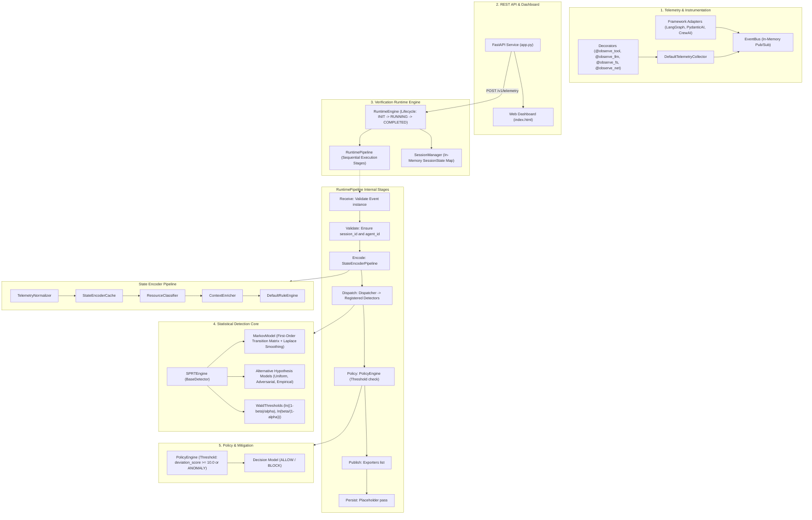
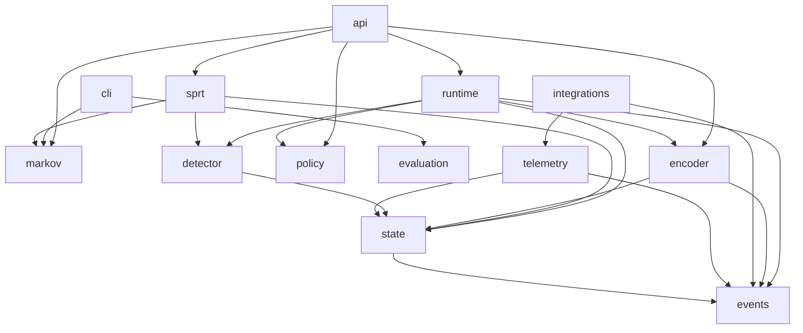

# Current Architecture Audit: RuntimeVerify

**Version:** 0.1.0 (Baseline Audit)  
**Date:** September 2026  
**Status:** Baseline Architectural Audit  
**Target Repository:** [RadeshKK/Runtime-Verify](https://github.com/RadeshKK/Runtime-Verify)

---

## 1. Executive Summary

`RuntimeVerify` is a statistical runtime verification and behavioral monitoring framework designed for autonomous AI agents. Unlike traditional LLM-based critics ("guardrail agents") that incur significant token costs and latency penalties (often >500ms), `RuntimeVerify` treats agent executions as discrete stochastic processes. It learns a behavioral baseline using first-order Markov chains and uses **Wald's Sequential Probability Ratio Test (SPRT)** to detect anomalies and behavioral drift in streaming runtime transitions with sub-millisecond overhead.

This audit provides a comprehensive, rigorous examination of the current repository structure, mathematical implementations, execution flow, quality health, capabilities, architectural limitations, and metadata discrepancies.

---

## 2. Current Architecture Diagram

The existing runtime system executes telemetry events sequentially through an in-memory pipeline:



---

## 3. Current Module Dependency Map

The table below details all top-level modules in `src/runtimeverify/`, their inbound and outbound dependencies, and their responsibilities:

```
src/runtimeverify/
├── events/          -> [Pydantic] (Leaf domain models: Event, ToolEvent, LLMEvent, FilesystemEvent, NetworkEvent, MemoryEvent)
├── state/           -> [events, Pydantic] (State categories, hierarchy, context, execution state, provenance, registry)
├── telemetry/       -> [events, state] (Bus, collectors, emitters, context, serializers, decorators, middleware)
├── markov/          -> [numpy, scipy] (Transition counters, probability matrix, trainer, predictor, metrics, persistence, explainers)
├── detector/        -> [state, Pydantic] (BaseDetector ABC, DetectorResult, DetectorMetadata, registry)
├── sprt/            -> [detector, markov, state] (SPRT engine, hypotheses, Wald thresholds, alternative models)
├── encoder/         -> [events, state] (Normalizers, classifiers, enrichers, rule engine, cache, StateEncoderPipeline)
├── policy/          -> [detector, Pydantic] (PolicyEngine, policy evaluation)
├── runtime/         -> [events, state, encoder, detector, policy] (RuntimeEngine, RuntimePipeline, SessionManager, Dispatcher, Lifecycle)
├── evaluation/      -> [events, state, markov, sprt, runtime] (TraceGenerator, SessionReplayer, baselines, metrics, benchmarks)
├── integrations/    -> [events, telemetry] (LangGraphAdapter, PydanticAIAdapter, CrewAIAdapter)
├── api/             -> [runtime, sprt, markov, encoder, policy, FastAPI] (REST endpoints, dashboard serving)
├── dashboard/       -> [HTML5, Tailwind, Chart.js] (Single page dark-mode dashboard)
├── cloud/           -> [requests] (CloudVerificationClient for remote telemetry push)
├── vscode/          -> [JSON, JS] (VS Code extension manifest & stub script)
└── cli.py           -> [markov, sprt, runtime, Typer, Rich, PyYAML] (Command-line interface verify)
```

### Direct Module Coupling Analysis



---

## 4. Audit of Existing Subsystems

### 4.1 Event System (`runtimeverify.events`)
- **Strengths**: Strict Pydantic v2 schemas (`Event`, `ToolEvent`, `LLMEvent`, `FilesystemEvent`, `NetworkEvent`, `MemoryEvent`). All events include `id` (UUID4 default), `session_id`, `agent_id`, `timestamp` (UTC), `type`, and `metadata`.
- **Limitations**: Missing schema versioning (e.g., `schema_version = "1.0"`). No event validation against a canonical external JSON schema. Serialization logic is partly duplicated between Pydantic `.model_dump()` and `serializers.py:EventSerializer`.

### 4.2 Telemetry SDK (`runtimeverify.telemetry`)
- **Strengths**: Context propagation via `contextvars` (`active_context`, `TelemetryContext`). Thread-safe in-memory `EventBus`. Asynchronous and synchronous function decorators (`@observe_tool`, `@observe_llm`, `@observe_filesystem`, `@observe_network`).
- **Limitations**:
  1. **Post-execution observation only**: In `@observe_tool`, the function `output = f(*args, **kwargs)` runs *before* `manager.collector.collect_tool(...)` is called. It cannot intercept or prevent execution.
  2. **Orphaned EventBus**: In the core runtime, `RuntimeEngine` does not subscribe to `EventBus`. The bus is only subscribed to in unit tests.
  3. **No Batching / Buffering**: Events are emitted synchronously one by one without background queueing or backpressure.

### 4.3 Semantic State Representation & Encoder (`runtimeverify.state`, `runtimeverify.encoder`)
- **Strengths**: 5-stage encoding pipeline (`Normalizer` -> `Cache` -> `Classifier` -> `Enricher` -> `RuleEngine`). Generates strongly-typed `ExecutionState` with taxonomy categorization (`StateCategory`) and hierarchical dot paths (e.g., `tool.filesystem.write`).
- **Limitations**:
  1. **Unbounded Memory Leak**: `StateEncoderPipeline` keeps `_name_history: Dict[str, List[str]]` and `_state_history: Dict[str, List[ExecutionState]]` across all sessions without eviction, max length, or TTL.
  2. **Rule Configuration Disconnect**: Rules are defined via Python objects in code; the generated `.runtimeverify/rules.json` template created by `verify init` is never read or loaded.

### 4.4 Markov Behavioral Baseline (`runtimeverify.markov`)
- **Strengths**: Clean mathematical implementation of first-order Markov chains. `TransitionCounter` accurately accumulates state frequencies and transitions. `ProbabilityMatrix` supports Maximum Likelihood Estimation (MLE) and Laplace add-$\alpha$ smoothing (default $\alpha = 10^{-6}$). Serialization to JSON is cleanly abstracted in `MarkovPersistence`. Includes Shannon entropy and sparsity calculation in `MarkovMetrics`.
- **Limitations**:
  1. Limited to first-order dependencies ($P(s_t \mid s_{t-1})$). Contextual history $s_{t-2}, s_{t-3}$ is ignored.
  2. Floating-point division by zero edge-cases were recently patched with $10^{-6}$ smoothing, but out-of-vocabulary penalty is hardcoded to `virtual_vocab_size = len(states) + 1000`.

### 4.5 Sequential Probability Ratio Test Engine (`runtimeverify.sprt`)
- **Strengths**: Implements Wald's SPRT adapted for Markov-dependent transitions. Log-likelihood ratio $\Lambda_t$ accumulation:
  $$\Lambda_t = \Lambda_{t-1} + \ln \left(\frac{P(s_t \mid s_{t-1}; H_1)}{P(s_t \mid s_{t-1}; H_0)}\right)$$
  Configurable LLR increment capping (`llr_cap`) prevents numerical overflow. Supports three alternative models ($H_1$): `UniformAlternativeModel`, `AdversarialAlternativeModel`, and `EmpiricalAlternativeModel`. Includes basic session TTL cleanup (`session_ttl=3600.0`).
- **Limitations**:
  1. Session cleanup runs synchronously on every single transition observation (`_cleanup_sessions()` scans the entire `_session_last_access` dictionary), creating an $O(N)$ overhead per transition under high session cardinality.
  2. Not thread-safe for concurrent events within the same session.

### 4.6 Policy Engine (`runtimeverify.policy`)
- **Strengths**: Clean separation of statistical output (`DetectorResult`) from security decisions (`Decision`).
- **Limitations**:
  1. Extremely simplistic decision logic: only checks `deviation_score >= threshold` (hardcoded default 10.0) or `res.decision == "ANOMALY"`.
  2. Binary output: Only produces `ALLOW` or `BLOCK`. Does not support `REVIEW`, `WARN`, or `QUARANTINE`.
  3. No support for deterministic policies (e.g., deny-lists, regex boundary checks, parameter validation, role-based tool restrictions).

### 4.7 Runtime Orchestration (`runtimeverify.runtime`)
- **Strengths**: `RuntimeEngine` has a formal lifecycle (`INITIALIZED`, `RUNNING`, `PAUSED`, `COMPLETED`, `FAILED`). `RuntimePipeline` features fail-closed exception handling (any uncaught stage exception automatically returns a fallback `BLOCK` decision).
- **Limitations**:
  1. `SessionManager` stores complete `history: List[ExecutionState]` in memory indefinitely without compaction or eviction.
  2. `RuntimePipeline._default_persist` is an empty `pass` placeholder. No traces or decisions are written to disk or database.

### 4.8 Framework Integrations (`runtimeverify.integrations`)
- **Strengths**: Working adapters for LangGraph (`LangGraphAdapter.instrument_node`), PydanticAI (`PydanticAIAdapter.instrument_agent`), and CrewAI (`CrewAIAdapter.create_task_callback`).
- **Limitations**:
  1. Emits events only; cannot perform pre-execution policy gating or action cancellation.
  2. Does not capture tool return values or error traces across complex multi-step graphs.

### 4.9 REST API & Web Dashboard (`runtimeverify.api`, `runtimeverify.dashboard`)
- **Strengths**: FastAPI app providing `/v1/telemetry`, `/v1/status`, `/v1/metrics`, `/v1/decisions`, `/v1/train`, `/v1/explain`, and static dashboard serving. Dashboard provides dark-mode UI with live Chart.js timelines of SPRT LLR metrics.
- **Limitations**:
  1. Ephemeral in-memory storage (`session_db: Dict`, `decisions_cache: Dict`). All historical metrics and sessions are lost on restart.
  2. No authentication, API keys, or RBAC.
  3. Type errors present in `app.py:observe_telemetry` where `event` is inferred as `ToolEvent`.

### 4.10 Developer CLI (`runtimeverify.cli`)
- **Strengths**: Typer-based CLI `verify` with subcommands: `init`, `train`, `inspect`, `explain`, `doctor`, `version`. Dynamic plugin discovery via Python entrypoints (`runtimeverify.cli`).
- **Limitations**:
  1. Subcommands `verify serve` and `verify monitor` mentioned in docs/roadmap are not implemented.
  2. Configuration file written by `init` (`.runtimeverify/config.yaml`) is never consumed by the runtime or API.

### 4.11 Evaluation & Benchmarks (`runtimeverify.evaluation`)
- **Strengths**: Comprehensive synthetic evaluation suite. `TraceGenerator` generates realistic agent sessions. `SessionReplayer` simulates sequential replay. `BenchmarkRunner` computes precision, recall, F1, false positive rate, and detection delay steps. `MonteCarloBenchmarkRunner` empirically validates Type I ($\alpha$) and Type II ($\beta$) error rates against theoretical bounds.
- **Limitations**:
  1. Type error in `benchmark.py` (`MockState` defines property `context` as read-only and misses `agent_id`).
  2. Low test coverage on `benchmark.py` (59%).

---

## 5. Existing Capabilities Matrix

| # | Product Direction Capability | Current Codebase Status | Notes |
| :---: | :--- | :---: | :--- |
| **1** | Agent telemetry collection | **Partial** | Async/sync decorators exist, but operate only post-execution. |
| **2** | Canonical agent event schema | **Partial** | Pydantic models exist (`Tool`, `LLM`, `Filesystem`, etc.), but unversioned. |
| **3** | Deterministic security policies | **Minimal** | Encoder has rule mapping, but PolicyEngine has no deterministic deny/allow lists. |
| **4** | Semantic risk classification | **Minimal** | Basic substring heuristic in `DefaultResourceClassifier`; no risk tiers. |
| **5** | Behavioral anomaly detection | **Complete** | First-order Markov chain with Laplace smoothing and transition matrices. |
| **6** | Statistical sequential verification | **Complete** | Full SPRT with Wald thresholds, alternative models, and LLR capping. |
| **7** | Runtime ALLOW / REVIEW / BLOCK | **Partial** | Emits `ALLOW` or `BLOCK`; no `REVIEW` or human gating state. |
| **8** | Human approval workflows | **Missing** | Zero implementation (no approval queues, tokens, or resolution webhooks). |
| **9** | Audit trails | **Missing** | `_default_persist` is a no-op; all history is ephemeral in-memory. |
| **10** | SDK/API integrations | **Partial** | LangGraph, PydanticAI, CrewAI adapters exist, but log-only. |
| **11** | CLI | **Partial** | `init`, `train`, `inspect`, `explain`, `doctor`, `version` exist; `serve` missing. |
| **12** | Dashboard | **Partial** | Dark-mode HTML5 UI exists, but read-only and unauthenticated. |
| **13** | Benchmarks | **Complete** | Synthetic trace generation, confusion matrix metrics, Monte Carlo validation. |
| **14** | Multi-agent verification | **Missing** | Sessions tracked by flat ID; no agent topologies or delegation graphs. |
| **15** | Enterprise deployment | **Missing** | No persistent DB, no auth/RBAC, no Docker/Helm, no OpenTelemetry export. |

---

## 6. Architectural Weaknesses & Risks

1. **Passive Logging vs. Active Interception**:
   The telemetry decorators execute the wrapped function *before* emitting the event. Consequently, the framework cannot block malicious actions in real time when using the standard decorators.
2. **Unbounded In-Memory State**:
   - `StateEncoderPipeline._state_history` and `_name_history` append state objects indefinitely.
   - `SessionManager._sessions` keeps unbounded `history: List[ExecutionState]`.
   - `api/app.py:session_db` and `decisions_cache` grow unbounded with no eviction policy.
3. **Configuration Disconnect**:
   `verify init` generates `.runtimeverify/config.yaml` and `.runtimeverify/rules.json`, but these files are completely ignored by `RuntimeEngine`, `PolicyEngine`, and `FastAPI`.
4. **Lack of Structured Logging**:
   `src/runtimeverify` relies on unformatted `logging.getLogger` in only two files. There is no structured JSON logging, correlation IDs, or log level configuration.
5. **No Persistent Audit Storage**:
   Decisions, evidence, and state transitions are discarded when the process exits. Compliance auditing is impossible without persistent storage.
6. **Bleeding-Edge Python Dependency**:
   `pyproject.toml` requires `python = ">=3.14"`. Because Python 3.14 is unreleased/pre-release, standard enterprise environments (running Python 3.10–3.13) cannot install or run the library.
7. **No CI/CD Pipeline**:
   The repository contains no `.github/workflows/` directory. Automated linting, type-checking, and cross-platform testing are not enforced on commits or pull requests.

---

## 7. Duplicate & Dead Functionality

1. **Dead `RuntimeExecutor`**:
   `src/runtimeverify/runtime/executor.py` defines a thread pool executor that is never utilized by `RuntimeEngine` or `RuntimePipeline`.
2. **Unused Global Runtime References**:
   `src/runtimeverify/runtime/manager.py` exposes `get_global_engine()` and `set_global_engine()`, but neither the API nor decorators reference it.
3. **Redundant History Tracking**:
   `StateEncoderPipeline` and `SessionManager` both independently maintain chronological lists of `ExecutionState` for every session.
4. **Dead / Broken `MockState` in Benchmark**:
   `src/runtimeverify/evaluation/benchmark.py` defines `MockState` with a broken property override that triggers Mypy errors; `BenchmarkState` is already implemented and used instead.

---

## 8. Public APIs That Must Remain Backward Compatible

Any future architectural enhancements must maintain strict backward compatibility for the following interfaces:

1. **Telemetry Decorators**:
   `@observe_tool`, `@observe_llm`, `@observe_filesystem`, `@observe_network` must preserve their current signature and kwargs (`name`, `model`, `action`).
2. **Event Schema Models**:
   `Event`, `ToolEvent`, `LLMEvent`, `FilesystemEvent`, `NetworkEvent`, `MemoryEvent` field names must not be removed or renamed.
3. **Statistical Models**:
   `MarkovModel.train()`, `MarkovModel.observe()`, `MarkovModel.transition_probability()`, `MarkovModel.save()`, `MarkovModel.load()`.
4. **SPRT Interfaces**:
   `SPRTEngine.observe()`, `SPRTEngine.observe_sprt()`, `Hypothesis`, `WaldThresholds`, and alternative models (`UniformAlternativeModel`, `AdversarialAlternativeModel`, `EmpiricalAlternativeModel`).
5. **Markov Serialization Format**:
   JSON schema containing `schema_version`, `model_version`, `states`, `state_counts`, `transition_counts`, `probabilities`, and `smoothing`.
6. **CLI Commands**:
   `verify init`, `verify train`, `verify inspect`, `verify explain`, `verify doctor`, `verify version`.
7. **BaseDetector Contract**:
   `BaseDetector.fit()`, `BaseDetector.observe()`, `BaseDetector.metadata()`, `DetectorResult`.

---

## 9. Identified Metadata Discrepancies

1. **`pyproject.toml`**:
   - `description = "Add your description here"` is a placeholder.
   - Missing author, maintainer, repository URL, project URLs, and license metadata.
   - `requires-python = ">=3.14"` needlessly locks out enterprise Python versions (3.10, 3.11, 3.12, 3.13).
2. **`CITATION.cff`**:
   - Lists `url: "https://github.com/google-deepmind/runtime-verify"` instead of the actual repository `https://github.com/RadeshKK/Runtime-Verify`.
   - Authors listed as `"DeepMind Agentic Coding Team"` from upstream template.
3. **`SECURITY.md`**:
   - Points security vulnerability submissions to `agent-security@google.com`.
4. **`README.md`**:
   - Build status badge link is empty (`()`).
5. **`docs/` Documentation Files**:
   - Outdated relative links pointing to non-existent root paths (`runtimeverify/encoder/` instead of `src/runtimeverify/encoder/`).
   - Mismatched API names in docs (`trace_tool` instead of `observe_tool`, `BaseStateEncoder` instead of `BaseEncoder`).
