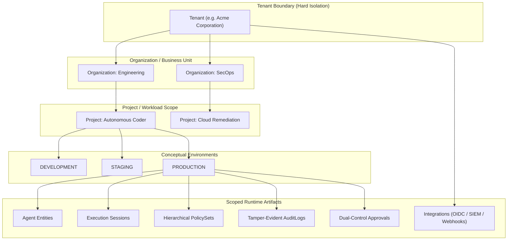
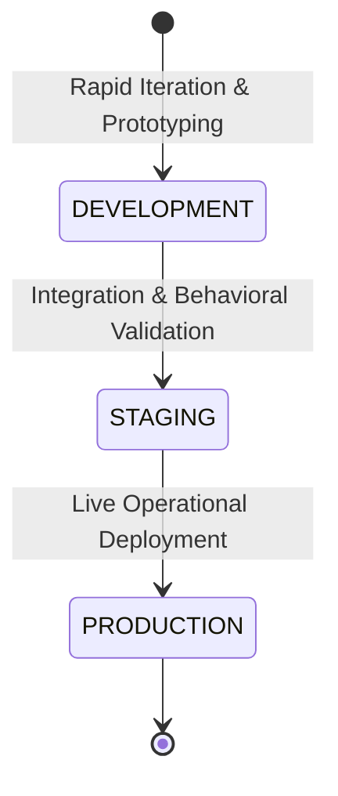
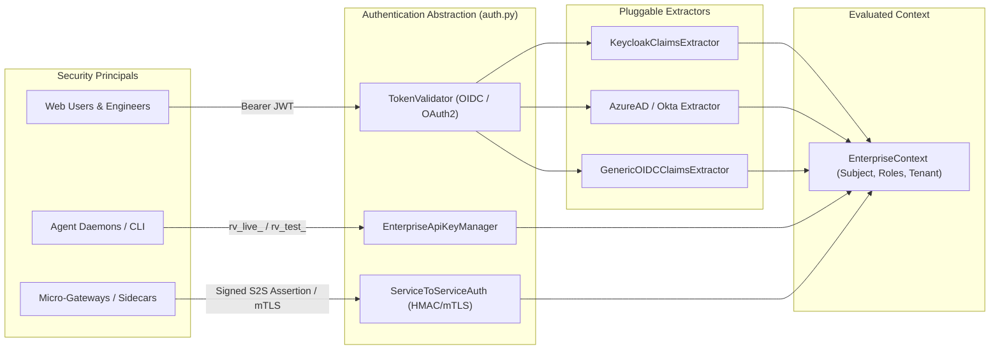
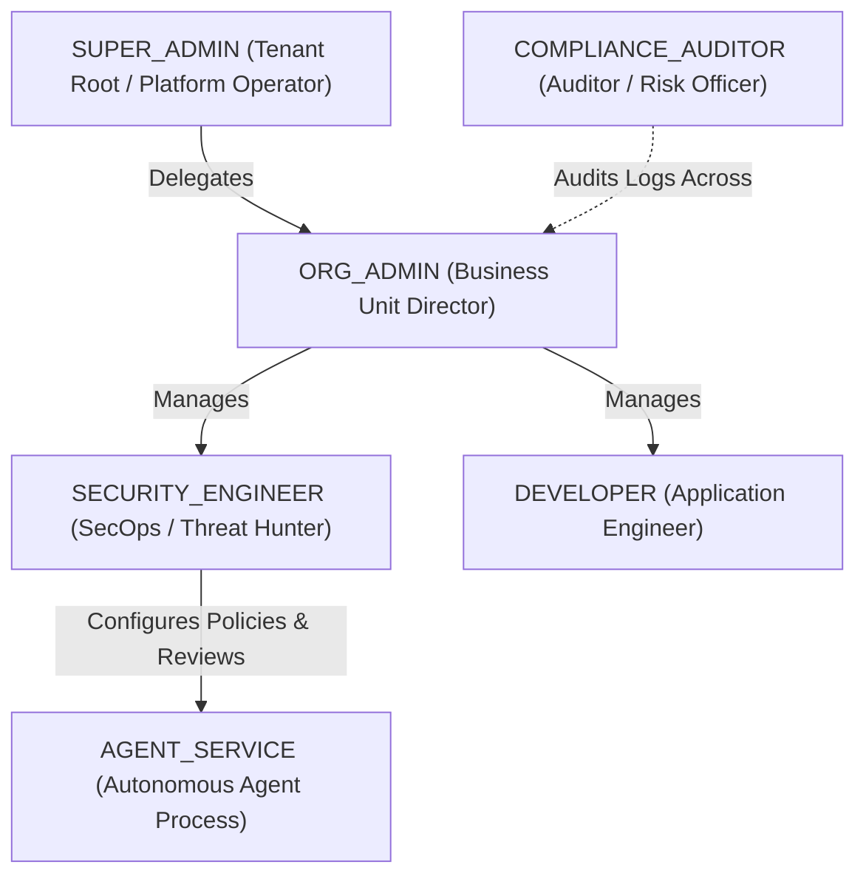
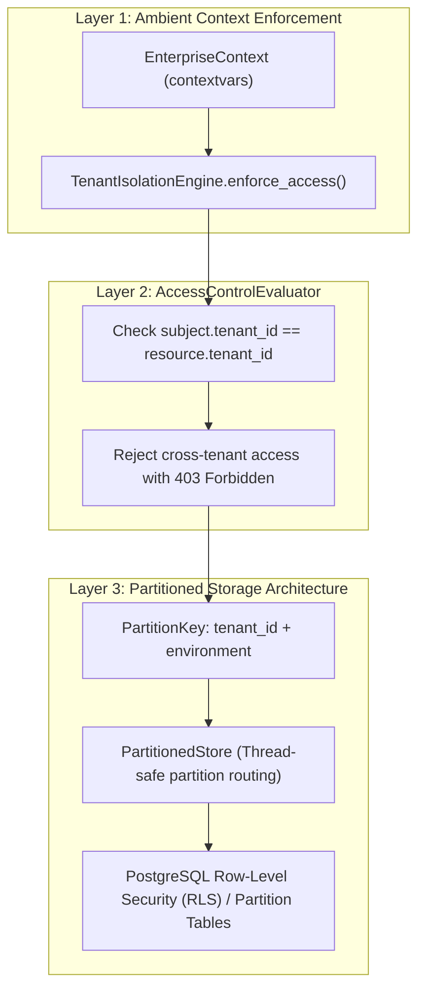
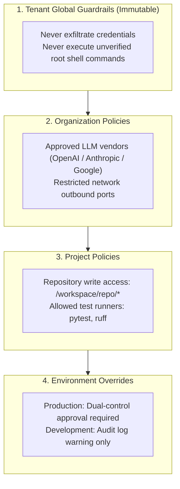
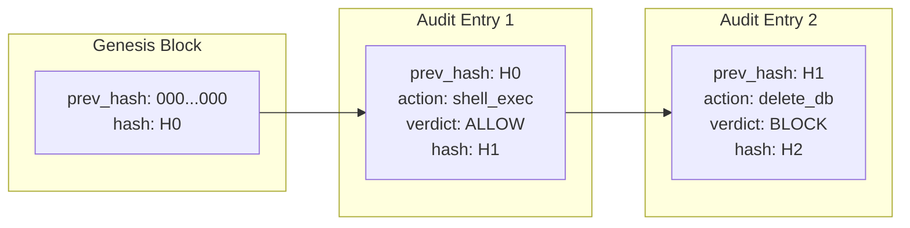
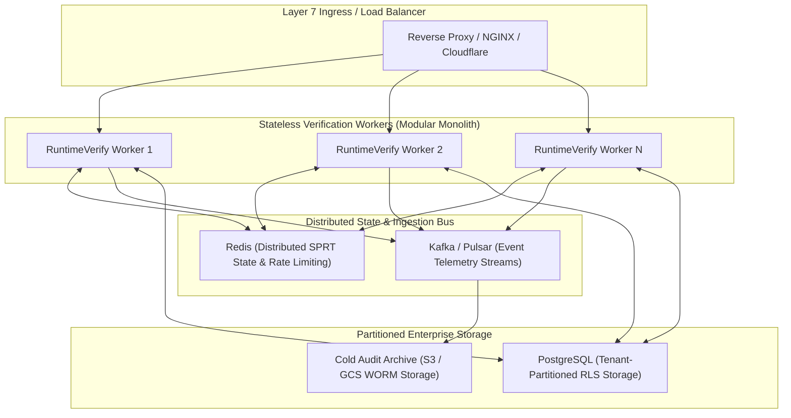

# Enterprise Architecture Specification

> **Phase 18 Specification**: Organization-Scale Deployment Architecture for RuntimeVerify.
> **Architectural Pattern**: Modular Monolith with Decoupled Bounded Contexts.
> **Target Scale**: Multi-Tenant, Multi-Organization, Multi-Project Enterprise Environments.

---

## 1. Executive Summary & Architectural Philosophy

RuntimeVerify delivers real-time behavioral verification and deterministic security controls for autonomous AI agents. As organizations scale from individual developer sandboxes to enterprise-wide swarms of agents, the architecture must support rigorous multi-tenancy, strict authorization boundaries, hierarchical policy sets, and regulatory compliance without introducing premature operational overhead.

### Why a Modular Monolith?

RuntimeVerify explicitly rejects premature microservice decomposition in favor of a **Modular Monolith**:

1. **Sub-Millisecond Verification Latency**:
   Agent verification requires evaluating deterministic policies, semantic classifications, Markov state transitions, and Wald Sequential Probability Ratio Tests (SPRT) in under 1 millisecond. Decomposing these verification engines into remote HTTP/gRPC microservices would incur 5–20 ms of network serialization latency per agent action, unacceptably degrading interactive agent workflows.
2. **Atomic Context Propagation**:
   Verifying security constraints across organizational hierarchies requires atomic access to ambient enterprise contexts (`Tenant`, `Organization`, `Project`, `Environment`, `Roles`). In-process modular boundaries enforce clean decoupling while eliminating distributed state inconsistency.
3. **Operational Simplicity & Cost Efficiency**:
   A modular monolith can be developed, tested, and containerized as a single unified service. Horizontal scaling is achieved simply by running stateless worker instances behind standard layer-7 load balancers, backed by a partitioned PostgreSQL datastore and optional Redis cache.

---

## 2. Enterprise Entity Hierarchy

RuntimeVerify models enterprise governance through a clean 5-tier organizational hierarchy:

### Entity Schema Taxonomy

| Entity | Primary Key Format | Boundary Scope | Immutability & Lifecycle |
|---|---|---|---|
| **Tenant** | `tenant-<uuid12>` | Root Legal & Data Isolation Boundary | Immutable ID; hard boundary preventing cross-tenant leakage. |
| **Organization** | `org-<uuid12>` | Business Unit / Department | Bound to single Tenant; can have parent-child org hierarchies. |
| **Project** | `proj-<uuid12>` | Application / Initiative | Bound to Org and Tenant; contains scoped agents and policy sets. |
| **Agent** | `string` (e.g. `coder-01`) | Registered Identity | Scoped to Project and Environment (`dev`, `staging`, `prod`). |
| **Environment** | `Enum` | Operational Environment | `DEVELOPMENT`, `STAGING`, `PRODUCTION`. |
| **PolicySet** | `polset-<uuid12>` | Governance Rule Bundle | Scoped to Tenant (Guardrail), Org, or Project. |
| **Session** | `string` (e.g. `sess-<uuid>`) | Ephemeral Trajectory | Bound to Agent, Project, and Environment. |
| **AuditLog** | `audit-<uuid16>` | Immutable Lineage Record | Cryptographically chained (`prev_hash`) SHA-256 ledger. |
| **Approval** | `appr-<uuid16>` | Escalation Workflow | Configurable multi-approver dual control (e.g. 2 approvers in prod). |
| **Integration** | `integ-<uuid12>` | Third-Party Connector | Secrets reference vault or hashed config; never exposed in API. |

---

## 3. Conceptual Environments

RuntimeVerify natively recognizes three deployment tiers with distinct security profiles:

### Environment Governance Profiles

| Feature / Behavior | DEVELOPMENT | STAGING | PRODUCTION |
|---|---|---|---|
| **Enforcement Mode** | Permissive / Monitor | Strict Enforce | Strict Enforce |
| **Fail-Closed on Unknowns** | False (Logs warning) | True | True (Immediate BLOCK) |
| **Approval Thresholds** | 1 Approver (Self-approval allowed in local tests) | 1 Approver (Mandatory Role) | **2 Distinct Approvers (Dual Control)** |
| **Segregation of Duties (SOD)**| Optional | Enforced | **Strictly Enforced** |
| **Audit Verification** | In-memory append | Partitioned verification | **Cryptographic Tamper-Evident Chaining** |
| **Developer Policy Editing** | Allowed | Review Required | **Forbidden (Security Engineers / Admins Only)** |
| **API Key Prefix** | `rv_test_...` | `rv_test_...` | `rv_live_...` |

---

## 4. Authentication Architecture

RuntimeVerify provides a **vendor-neutral authentication abstraction** that decouples token verification and claim extraction from concrete Identity Providers (IdP).

### 1. Keycloak & OpenID Connect Compatibility
- **Vendor-Neutral Interfaces**: `TokenValidator` validates standard JWT claims (`iss`, `sub`, `aud`, `exp`, `nbf`).
- **Keycloak Mapping**:
  - Realm Roles: Extracted from `claims["realm_access"]["roles"]`.
  - Client Roles: Extracted from `claims["resource_access"][client_id]["roles"]`.
  - Multi-Tenancy: Extracted from `claims["attributes"]["tenant_id"]` or token `tenant` claim.
- **Okta & Azure AD Mapping**: Standard `groups` and `roles` array extraction via `GenericOIDCClaimsExtractor`.

### 2. Enterprise API Key Management
- Format: `rv_<env_prefix>_<key_id>_<secret>` (e.g. `rv_live_k10a8f7c_93f821ba...` or `rv_test_k88b12e3_12ac94df...`).
- **Zero Secret Exposure**: The raw secret is generated using `secrets.token_hex(24)` and **never stored**. Only `sha256(secret)` is stored.
- **Environment Scoping**: Live keys (`rv_live_`) cannot be utilized in development endpoints; test keys (`rv_test_`) cannot access production sessions.
- **Constant-Time Verification**: Verification utilizes `hmac.compare_digest` to prevent timing attacks.

### 3. Service-to-Service (S2S) Machine Authentication
- Employs signed HMAC-SHA256 service assertions containing `service_name`, `tenant_id`, `audience`, and microsecond timestamps.
- Supports mTLS certificate identity extraction from reverse proxy headers (`X-Client-Cert-DN`, `X-Forwarded-Client-Cert`).

---

## 5. Role-Based Access Control (RBAC) & Authorization

RuntimeVerify implements a fine-grained RBAC matrix enforcing least-privilege principles and environment boundaries:

### Role Responsibility Hierarchy

### RBAC Permission Matrix

| Enterprise Permission | SUPER_ADMIN | ORG_ADMIN | SECURITY_ENGINEER | COMPLIANCE_AUDITOR | DEVELOPER | AGENT_SERVICE |
|---|:---:|:---:|:---:|:---:|:---:|:---:|
| `tenant:admin` | **YES** | NO | NO | NO | NO | NO |
| `org:write` | **YES** | **YES** | NO | NO | NO | NO |
| `project:write` | **YES** | **YES** | NO | NO | NO | NO |
| `policy:write` | **YES** | **YES** | **YES** | NO | NO* | NO |
| `policy:publish` | **YES** | **YES** | **YES** | NO | NO | NO |
| `event:ingest` | **YES** | NO | NO | NO | **YES** | **YES** |
| `event:read` | **YES** | **YES** | **YES** | **YES** | **YES** | NO |
| `decision:evaluate`| **YES** | NO | **YES** | NO | NO | **YES** |
| `approval:request` | **YES** | NO | NO | NO | NO | **YES** |
| `approval:approve` | **YES** | **YES** | **YES** | NO | NO* | NO |
| `audit:read` | **YES** | **YES** | **YES** | **YES** | NO | NO |
| `audit:verify` | **YES** | NO | **YES** | **YES** | NO | NO |
| `agent:register` | **YES** | **YES** | NO | NO | **YES** | NO |

*\*Note: Developers have local read permissions, but cannot modify policies or approve actions in PRODUCTION.*

### Segregation of Duties (SOD)
RuntimeVerify enforces strict Segregation of Duties:
1. **No Self-Approval**: A security engineer or developer who requested an action or authored a script cannot approve their own escalation request.
2. **Dual-Control Human Sign-Off**: High-risk actions in `PRODUCTION` require signatures from at least two distinct authorized accounts before execution unblocks.

---

## 6. Multi-Tenant Isolation & Storage Partitioning

Tenant isolation is enforced across three defensive layers:

- **In-Memory Thread-Safe Partitions**: `PartitionedStore[T]` separates objects by `f"{tenant_id}:{environment.value}"`.
- **Database Partitioning Strategy**: In PostgreSQL deployments, tables are partitioned by `tenant_id` and tables declare Row-Level Security (RLS) policies matching `current_setting('app.current_tenant')`.

---

## 7. Hierarchical PolicySet Governance

Enterprises enforce guardrails that cascade from corporate compliance down to individual repositories:

### Resolution Rules:
1. **Immutability Protection**: Tenant global guardrails (`immutable: true`) cannot be deleted, modified, or overridden by downstream org or project policies.
2. **Precedence Hierarchy**: `Tenant Immutable > Tenant Standard > Organization > Project`.
3. **Deterministic Conflict Resolution**: Deny/Block directives take precedence over Allow directives (`DENY > BLOCK > REVIEW > ALLOW`).
4. **Digest Verification**: Every resolved policy bundle generates a cryptographic SHA-256 digest (`PolicySetResolutionResult.digest`) that is linked into the audit log for reproducibility.

---

## 8. Cryptographic Tamper-Evident Audit Ownership

Every event, policy evaluation, and human approval creates an immutable audit record chained via SHA-256:

$$H_0 = \text{GENESIS\_HASH}$$
$$H_i = \text{SHA-256}(H_{i-1} \parallel \text{tenant\_id} \parallel \text{org\_id} \parallel \text{proj\_id} \parallel \text{env} \parallel \text{actor\_id} \parallel \text{action} \parallel \text{verdict} \parallel t_i)$$

- **Continuous Integrity Audits**: `EnterpriseAuditManager.verify_chain(tenant_id, env)` verifies every link in $O(N)$ time. Any alteration of an event payload or hash is immediately detected and flagged.
- **Export Verification**: Auditors (`COMPLIANCE_AUDITOR`) can export digitally verifiable audit bundles for external compliance certifications (SOC2, ISO 27001).

---

## 9. Horizontal Scale Path (Roadmap to Distributed Cloud)

When throughput requirements exceed single-node capacity (e.g. > 10,000 actions/sec), RuntimeVerify transitions smoothly from in-process storage to distributed cloud infrastructure without changing domain code:

1. **Stateless Verification Nodes**: Workers run the identical modular monolith codebase in containerized pods (Kubernetes / ECS).
2. **SPRT & Session Caching**: Wald Likelihood Ratios and Markov transition states are serialized in Redis with automatic TTL pruning.
3. **Write-Once-Read-Many (WORM) Audit Archival**: Sealed audit chains are periodically exported to immutable cloud object storage (AWS S3 Object Lock / Google Cloud Storage Bucket Lock) for legal hold compliance.
