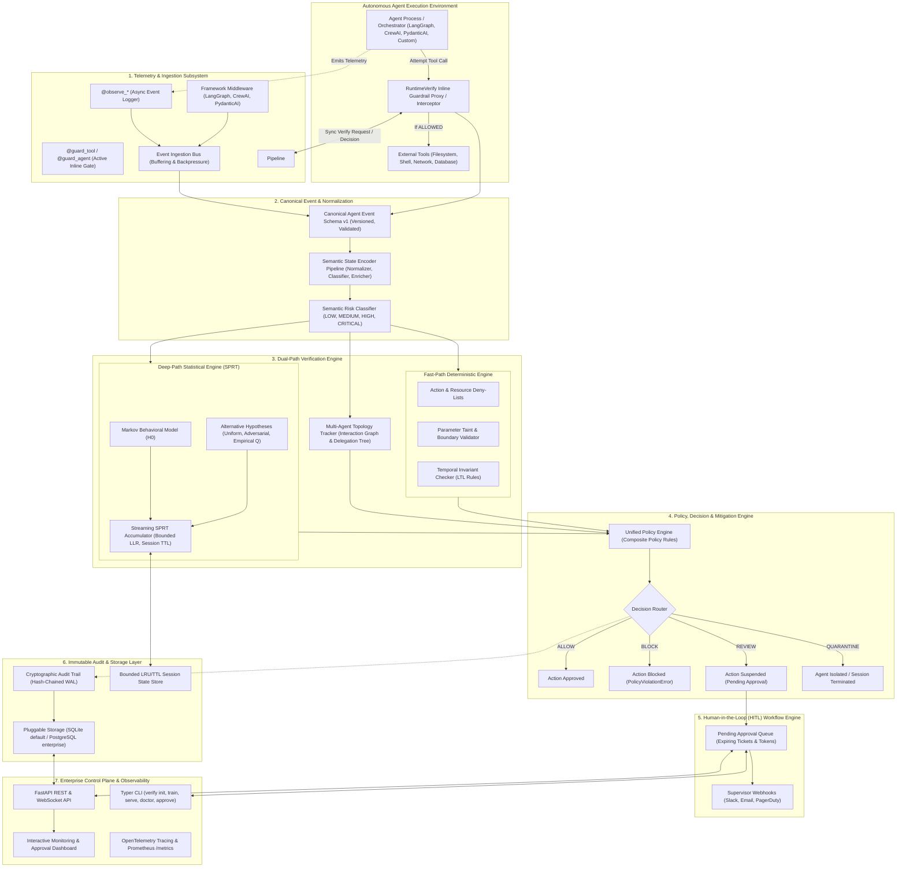

# Target Architecture Specification: RuntimeVerify

**Version:** 1.0.0 (Target Specification)  
**Date:** September 2026  
**Status:** Approved Design Document  
**Target Repository:** [RadeshKK/Runtime-Verify](https://github.com/RadeshKK/Runtime-Verify)

---

## 1. Vision & Architectural Principles

`RuntimeVerify` is evolving into an **industry-grade, vendor-neutral runtime security and behavioral verification platform for autonomous AI agents**. 

The target architecture is governed by five non-negotiable architectural principles:

1. **Vendor Neutrality**: Zero hard dependencies on specific LLM vendors (OpenAI, Anthropic, Google) or agent frameworks (LangGraph, CrewAI, AutoGen, PydanticAI). Integrations adapt standard protocols to the canonical event model.
2. **Dual-Path Verification**: 
   - **Fast-Path Deterministic Guardrails**: Evaluates sub-millisecond invariant checks, deny-lists, parameter sanitization, and temporal safety rules *before* actions execute.
   - **Deep-Path Statistical Process Control**: Preserves the mathematical rigor of first-order Markov baseline models and **Wald's Sequential Probability Ratio Test (SPRT)** to identify stealthy, multi-step behavioral drift without LLM critics.
3. **Fail-Closed by Design**: If any part of the critical verification pipeline errors or crashes, execution defaults to a safe mitigation (`BLOCK` or `REVIEW`) rather than an unverified bypass.
4. **Active Interception & Passive Telemetry**: Support both synchronous inline gating (blocking unsafe actions *before* execution) and asynchronous streaming telemetry (for low-latency out-of-band analytics).
5. **Strict Backward Compatibility**: Existing Markov training formats, SPRT accumulator algorithms, decorator signatures, and CLI commands must remain 100% operational without regression.

---

## 2. Target Architecture Diagram



---

## 3. Subsystem Breakdown

### 3.1 Ingestion & Interception Subsystem
The target system provides two distinct operational modes:
1. **Passive Telemetry (`@observe_*`)**: Asynchronously streams telemetry for post-hoc behavioral modeling, compliance records, and dashboard monitoring without adding execution latency.
2. **Active Inline Guardrails (`@guard_tool`, `@guard_agent`)**: Synchronously intercepts function calls **before execution**. 
   - Constructs a canonical transition event.
   - Evaluates fast-path deterministic policies and statistical SPRT state transitions.
   - If the decision is `ALLOW`, the tool executes normally.
   - If `BLOCK`, raises a `PolicyViolationError` preventing execution.
   - If `REVIEW`, suspends execution and enters the HITL approval loop.

### 3.2 Canonical Agent Event Schema (v1)
Establishes a vendor-neutral, versioned event contract (`schema_version: "1.0.0"`) encompassing the entire agent lifecycle:
- **`AgentLifecycleEvent`**: Initialization, step start, step end, termination.
- **`ToolExecutionEvent`**: Tool request, parameter hash, sanitization status, execution output, error code.
- **`ModelInferenceEvent`**: Model identifier, prompt hash, token metrics, latency, reasoning tokens.
- **`ResourceAccessEvent`**: Filesystem paths, network endpoints, database schemas, environment variables.
- **`DelegationEvent`**: Parent-child agent task handoffs, subagent invocation, response routing.

### 3.3 Semantic Risk Classification
Augments state encoding with formal risk tiers:
- **`LOW`**: Read-only operations in standard directories, internal reasoning steps, harmless queries.
- **`MEDIUM`**: File modifications in project workspace, outbound requests to known APIs.
- **`HIGH`**: Execution of bash/shell commands, file modifications outside workspace, modification of sensitive configurations (`.env`, `pyproject.toml`).
- **`CRITICAL`**: Privilege escalation, unauthorized network connections, deletion of critical directories, reading system credentials.

### 3.4 Dual-Path Verification Engine

#### Fast-Path: Deterministic Policy Engine
Runs in $<0.2\text{ms}$ to verify strict security boundaries:
- **Resource Deny-Lists**: Hard blocks against protected paths (`/etc/*`, `C:\Windows\*`, `~/.ssh/*`).
- **Taint & Parameter Analysis**: Prevents command injection syntax (e.g., `; rm -rf`, `&& curl`).
- **Temporal Invariants (LTL Rules)**: Enforces required ordering (e.g., `READ_SPEC -> WRITE_CODE -> RUN_TESTS`; forbids `READ_SECRETS -> EXTERNAL_HTTP`).

#### Deep-Path: Statistical Verification Engine (Markov + SPRT)
Preserves and hardens existing algorithms:
- **Markov Behavioral Baseline**: Learns normal state sequences from golden execution traces. Computes $P(s_t \mid s_{t-1}; H_0)$ with Laplace smoothing.
- **Sequential Probability Ratio Test (SPRT)**: Accumulates evidence ratio $\Lambda_t$. Avoids false-positive spikes from single unusual transitions while decisively tripping alerts when systemic drift occurs.
- **Bounded Memory & Multi-Tenant Session Isolation**: Session state stored with bounded LRU eviction and deterministic TTL cleanups, preventing memory exhaustion under millions of sessions.

### 3.5 Runtime Decisions & Action Mitigation
Expands decision outcomes from binary `ALLOW`/`BLOCK` to four enterprise states:
1. **`ALLOW`**: Transition satisfies statistical and deterministic invariants; execution proceeds.
2. **`REVIEW`**: Suspicious behavior detected (e.g., high SPRT warning threshold or high-risk tool call); execution pauses for human authorization.
3. **`BLOCK`**: Policy boundary or critical SPRT anomaly confirmed; execution is rejected.
4. **`QUARANTINE`**: Severe breach detected; session is immediately terminated and agent isolated.

### 3.6 Human-in-the-Loop (HITL) Workflow Engine
- When an action triggers `REVIEW`, an `ApprovalTicket` is registered with a cryptographically secure token and an expiration TTL (e.g., 300 seconds).
- The agent's execution thread is safely paused (or asynchronously suspended via coroutine futures).
- Webhook notifications dispatch to Slack, email, or incident consoles.
- Supervisors can approve or deny requests through the Web Dashboard or CLI (`verify approve <ticket_id>`).
- If the ticket times out, a configurable fallback policy executes (default: `BLOCK`).

### 3.7 Multi-Agent Topology Tracking
- Models agent fleets as a dynamic Directed Acyclic Graph (DAG) of interactions.
- Tracks parent agent session IDs, child subagent session IDs, and delegation depths.
- Detects cascade anomalies: an agent delegating unexpected high-privilege tasks to an unprivileged subagent.

### 3.8 Immutable Audit Trail & Pluggable Storage
- **Local Embedded Mode**: SQLite database using Write-Ahead Logging (WAL) for zero-configuration, high-performance embedded persistence.
- **Enterprise Mode**: PostgreSQL backend for distributed multi-instance deployments.
- **Audit Verification**: Every event and resulting decision is linked via an append-only, SHA-256 hash chain, providing verifiable tamper-evidence for enterprise compliance (SOC2, ISO 27001).

### 3.9 Enterprise Observability & Control Plane
- **OpenTelemetry & Prometheus**: Standard `/metrics` endpoint exporting transition rates, SPRT LLR distribution histograms, anomaly rates, and average detection latency.
- **Structured JSON Logging**: Standardized JSON logs with trace correlation IDs compatible with Datadog, Splunk, and CloudWatch.
- **Production CLI**: Adds `verify serve` to launch the API and dashboard, and `verify approve` for CLI-based approvals.

---

## 4. Recommended Package Structure

The target package structure preserves all existing modules in their current locations while introducing modular enterprise extensions:

```
src/runtimeverify/
├── __init__.py
├── py.typed                           # PEP 561 typing marker
├── cli.py                             # Typer CLI (init, train, inspect, explain, doctor, serve, approve)
│
├── core/                              # [NEW] Shared infrastructure & config
│   ├── __init__.py
│   ├── config.py                      # Pydantic v2 unified Settings loader (reads .runtimeverify/config.yaml)
│   ├── logging.py                     # Structured JSON logging & correlation IDs
│   ├── exceptions.py                  # Domain exception hierarchy (PolicyViolationError, VerificationError)
│   └── types.py                       # Common type definitions & enums (DecisionStatus, RiskLevel)
│
├── events/                            # [EXISTING - HARDENED]
│   ├── __init__.py
│   ├── base.py                        # Base Event with schema_version="1.0.0"
│   ├── canonical.py                   # [NEW] Canonical Agent Event Schema v1 definitions
│   ├── tool.py                        # ToolEvent
│   ├── llm.py                         # LLMEvent
│   ├── filesystem.py                  # FilesystemEvent
│   ├── network.py                     # NetworkEvent
│   ├── memory.py                      # MemoryEvent
│   └── delegation.py                  # [NEW] Multi-agent DelegationEvent
│
├── state/                             # [EXISTING - PRESERVED]
│   ├── __init__.py
│   ├── base.py                        # StateInterface protocol
│   ├── categories.py                  # StateCategory enum (expanded with RISK tiers)
│   ├── context.py                     # StateContext
│   ├── execution.py                   # ExecutionState
│   ├── hierarchy.py                   # StateHierarchy
│   ├── metadata.py                    # StateMetadata
│   ├── provenance.py                  # StateProvenance
│   └── registry.py                    # StateRegistry
│
├── telemetry/                         # [EXISTING - HARDENED]
│   ├── __init__.py
│   ├── bus.py                         # EventBus
│   ├── collector.py                   # TelemetryCollector
│   ├── context.py                     # TelemetryContext
│   ├── decorators.py                  # @observe_* (Passive) + @guard_* (Active inline interceptors)
│   ├── emitter.py                     # TelemetryEmitter
│   ├── manager.py                     # TelemetryManager
│   ├── middleware.py                  # TelemetryMiddleware
│   └── serializers.py                 # Event serializers
│
├── encoder/                           # [EXISTING - HARDENED]
│   ├── __init__.py
│   ├── base.py                        # BaseEncoder ABC
│   ├── cache.py                       # StateEncoderCache
│   ├── classifier.py                  # ResourceClassifier (enhanced with semantic risk scoring)
│   ├── context.py                     # ContextEnricher
│   ├── normalizer.py                  # TelemetryNormalizer
│   ├── pipeline.py                    # StateEncoderPipeline (with bounded history buffer)
│   ├── registry.py                    # EncoderRegistry
│   └── rules.py                       # RuleEngine (loads from config / rules.json)
│
├── markov/                            # [EXISTING - MATHEMATICS PRESERVED]
│   ├── __init__.py
│   ├── explain.py                     # MarkovExplainer
│   ├── matrix.py                      # TransitionCounter, ProbabilityMatrix (MLE + Laplace)
│   ├── metrics.py                     # Shannon entropy, matrix sparsity
│   ├── model.py                       # MarkovModel
│   ├── persistence.py                 # MarkovPersistence (JSON format preserved)
│   ├── predictor.py                   # MarkovPredictor
│   ├── trainer.py                     # MarkovTrainer
│   └── transition.py                  # TransitionExtractor
│
├── sprt/                              # [EXISTING - MATHEMATICS PRESERVED]
│   ├── __init__.py
│   ├── alternative.py                 # Uniform, Adversarial, Empirical alternative models
│   ├── decision.py                    # SPRTDecision model
│   ├── engine.py                      # SPRTEngine (with bounded session LRU / TTL eviction)
│   ├── hypothesis.py                  # Hypothesis configuration
│   └── thresholds.py                  # WaldThresholds calculation
│
├── detector/                          # [EXISTING - PRESERVED]
│   ├── __init__.py
│   ├── base.py                        # BaseDetector ABC
│   ├── registry.py                    # DetectorRegistry
│   └── results.py                     # DetectorResult & DetectorExplanation
│
├── policy/                            # [EXISTING - EXPANDED]
│   ├── __init__.py
│   ├── engine.py                      # Unified PolicyEngine (Deterministic + Statistical evaluation)
│   ├── rules.py                       # [NEW] Deterministic policy rules (DenyList, InvariantRule)
│   └── evaluator.py                   # [NEW] Multi-factor decision evaluator
│
├── hitl/                              # [NEW] Human-in-the-Loop approval workflows
│   ├── __init__.py
│   ├── models.py                      # ApprovalTicket, ApprovalToken, ApprovalStatus
│   ├── broker.py                      # In-memory & DB-backed approval queue
│   └── notifications.py              # Webhook dispatcher (Slack, Generic HTTP)
│
├── multiagent/                        # [NEW] Multi-agent topology tracking
│   ├── __init__.py
│   ├── graph.py                       # Agent interaction topology graph (DAG)
│   ├── tracker.py                     # Delegation and hierarchy tracker
│   └── anomalies.py                   # Cascade anomaly detector
│
├── storage/                           # [NEW] Persistence & Audit trails
│   ├── __init__.py
│   ├── base.py                        # StorageBackend ABC (sessions, decisions, audit)
│   ├── sqlite.py                      # SQLite WAL embedded backend (default)
│   ├── postgres.py                    # PostgreSQL enterprise backend
│   └── audit.py                       # Hash-chained append-only audit logger
│
├── runtime/                           # [EXISTING - HARDENED]
│   ├── __init__.py
│   ├── context.py                     # ExecutionContext, Decision (expanded with REVIEW/QUARANTINE)
│   ├── dispatcher.py                  # Dispatcher
│   ├── engine.py                      # RuntimeEngine (wired to Storage & Policy)
│   ├── lifecycle.py                   # RuntimeLifecycle
│   ├── pipeline.py                    # RuntimePipeline (persisting to storage)
│   ├── registry.py                    # PipelineRegistry
│   └── session.py                     # SessionManager (bounded memory)
│
├── integrations/                      # [EXISTING - EXPANDED]
│   ├── __init__.py
│   ├── langgraph.py                   # LangGraphAdapter (Passive telemetry + Active guard nodes)
│   ├── pydanticai.py                  # PydanticAIAdapter (Agent instrumentation + Tool gating)
│   └── crewai.py                      # CrewAIAdapter (Task callbacks + Tool guards)
│
├── api/                               # [EXISTING - EXPANDED]
│   ├── __init__.py
│   ├── app.py                         # FastAPI service (endpoints for telemetry, decisions, HITL)
│   ├── routes/                        # [NEW] Modular API route routers
│   │   ├── telemetry.py
│   │   ├── decisions.py
│   │   ├── approval.py                # HITL endpoints (/v1/approvals)
│   │   └── models.py
│   └── metrics.py                     # [NEW] Prometheus /metrics endpoint
│
├── evaluation/                        # [EXISTING - PRESERVED]
│   ├── __init__.py
│   ├── baselines.py                   # Random, Threshold, Frequency detectors
│   ├── benchmark.py                   # BenchmarkRunner, MonteCarloBenchmarkRunner
│   ├── generators.py                  # TraceGenerator
│   ├── metrics.py                     # EvaluationMetrics
│   ├── replay.py                      # SessionReplayer
│   └── reports.py                     # ReportGenerator
│
├── cloud/                             # [EXISTING - HARDENED]
│   ├── __init__.py
│   └── client.py                      # CloudVerificationClient (with structured logging & retries)
│
├── dashboard/                         # [EXISTING - ENHANCED]
│   └── index.html                     # Upgraded dashboard with approval buttons & SPRT charts
│
└── vscode/                            # [EXISTING - PRESERVED]
    ├── extension.js
    └── package.json
```

---

## 5. Backward Compatibility Guarantees

The target architecture is strictly additive and guarantees zero breaking changes for existing users:

1. **Existing Imports Continue to Work**:
   All current import paths (`from runtimeverify.markov.model import MarkovModel`, `from runtimeverify.sprt import SPRTEngine`, `from runtimeverify.telemetry.decorators import observe_tool`) remain intact.
2. **Model Persistence Compatibility**:
   `MarkovPersistence` maintains version `1.0` schema compatibility. Model files trained on the existing engine will load and execute seamlessly without re-training.
3. **Passive Observability Preserved**:
   `@observe_tool` and `@observe_llm` remain non-blocking. Active inline blocking is introduced via dedicated new decorators (`@guard_tool`, `@guard_agent`) or an explicit configuration flag (`mode="blocking"`).
4. **Existing CLI Commands Preserved**:
   `verify init`, `verify train`, `verify inspect`, `verify explain`, `verify doctor`, and `verify version` maintain identical argument schemas and output semantics.
