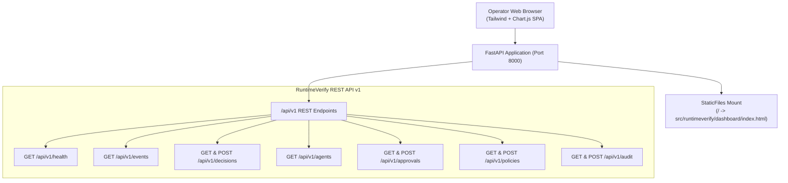

# Runtime Security Operations Dashboard Architecture

The **RuntimeVerify Dashboard** provides a unified, operator-facing single-page application (SPA) for real-time agent telemetry observation, pre-execution action gating, statistical anomaly inspection, human-in-the-loop authorization, deterministic policy administration, and audit verification.

Served directly by the FastAPI backend at `http://localhost:8000/`, the dashboard requires zero node/npm build dependencies and integrates natively with the `/api/v1` REST API.

---

## 1. Design System & Frontend Principles

The dashboard interface adheres strictly to the **Leonxlnx/taste-skill** frontend design standards:

> **Design Read:** Enterprise Runtime Security Operations Dashboard for security analysts and DevOps, with a Linear/Datadog-inspired dark-mode data-dense language, leaning toward native Tailwind + clean tabular layout + crisp status badges + restrained micro-interactions.

### Tunable Dial Parameters
- **`DESIGN_VARIANCE: 4`**: High structural symmetry, predictable operational tables, and aligned data grids.
- **`MOTION_INTENSITY: 2`**: Snappy, restrained transitions (150ms ease), zero disorienting layout shifts.
- **`VISUAL_DENSITY: 8`**: Data-dense security cockpit featuring monospace hashes, timestamps, parameters, and telemetry tags.

### Anti-Default Discipline
- **No AI-Purple Clichés**: No random neon gradients, purple button glows, or dark mesh blobs.
- **High-Contrast Neutral Base**: Slate dark theme (`bg-slate-950`, cards `bg-slate-900/50`, borders `border-slate-800`, text `text-slate-100`).
- **Semantic Status Hierarchy**: Distinct, high-contrast badges for all operational states:
  - **`Observed`**: Monitored passive telemetry (`bg-sky-500/10 text-sky-400 border-sky-500/20`)
  - **`Evaluated`**: Multi-engine verified action (`bg-indigo-500/10 text-indigo-400 border-indigo-500/20`)
  - **`Allowed`**: Verified safe; permitted for execution (`bg-emerald-500/10 text-emerald-400 border-emerald-500/20`)
  - **`Awaiting Approval`**: Paused in REVIEW state; requires human signoff (`bg-amber-500/10 text-amber-400 border-amber-500/20 animate-pulse`)
  - **`Blocked`**: Policy violation or anomaly threshold breached (`bg-rose-500/10 text-rose-400 border-rose-500/20`)

---

## 2. Dashboard Architecture & Views

### The 7 Core Operational Views

#### 1. Overview (`#overview`)
- **Key Metric Indicators (KPIs)**:
  - **Active Agents**: Unique monitored agent entities.
  - **Total Events**: Cumulative canonical telemetry ingested.
  - **Allowed**: Safe actions permitted for execution.
  - **Review / Approval**: Actions paused for human operator signoff.
  - **Blocked**: Interventions prevented by deterministic policies or sequential anomaly bounds.
  - **Anomaly Rate**: Empirical percentage $(\text{Blocked} + \text{Review}) / \text{Total}$.
- **SPRT Likelihood Accumulation Line Chart**:
  - Live Chart.js visualization plotting cumulative Log-Likelihood Ratio ($LLR_n$) against Wald upper boundary ($B = 2.944$) and Wald lower boundary ($A = -2.944$).
- **Verdict Distribution Donut**:
  - Breakdown of ALLOW vs REVIEW vs BLOCK decisions.
- **Active Interventions List**:
  - Highlights recent violations with policy IDs, agent names, and timestamps.

#### 2. Agent Fleet View (`#agents`)
- Fleet table listing all registered autonomous agents (`agent_id`, active session count, total event volume, total interventions, behavioral baseline status, and last activity).
- Search bar for quick agent filtering.
- "Sessions" action to inspect historical trajectories for any specific agent.

#### 3. Event Timeline (`#events`)
- Chronological telemetry stream displaying canonical events.
- Filter controls: filter by Event Type (`shell`, `filesystem`, `network`, `tool`, `llm`), target resource, or agent ID.
- Displays correlated verification state badge (`Observed`, `Evaluated`, `Allowed`, `Blocked`, `Awaiting Approval`).

#### 4. Decisions Log & Slide-Out Inspector (`#decisions`)
- Evaluated decisions table filterable by verdict (`ALLOW`, `REVIEW`, `BLOCK`).
- **Slide-out Deep Inspection Drawer**:
  - Target resource and parameter summary.
  - Verification verdict, confidence score, risk tier, and latency (ms).
  - **4-Tier Verification Evidence**:
    1. **Deterministic Policy Engine**: Matched rule IDs, severity, pattern match, and description.
    2. **Semantic Intent Classifier**: Semantic category, risk tier, and decision signal.
    3. **Behavioral Markov Model**: State transition $S_t \to S_{t+1}$, normal probability $P$, anomaly probability $Q$.
    4. **Sequential SPRT State**: Cumulative $LLR$, Wald boundaries, and hypothesis verdict.
  - Raw JSON viewer with one-click copy to clipboard.

#### 5. Human Authorization Queue (`#approvals`)
- Table of pending and historical approval requests.
- Filter by status: `PENDING`, `APPROVED`, `DENIED`, `EXPIRED`, `ALL`.
- Interactive action controls:
  - Operator name and justification note prompt.
  - **Approve**: Calls `POST /api/v1/approvals/{id}/approve`.
  - **Deny**: Calls `POST /api/v1/approvals/{id}/deny`.
  - Status updates in real-time, removing approved tickets from the pending queue.

#### 6. Policy Management (`#policies`)
- Active loaded policy rules table (Rule ID, domain, severity, decision, description).
- **Interactive Policy Syntax Validator**:
  - YAML/JSON policy editor with sample template insertion.
  - "Validate Syntax" button calling `POST /api/v1/policies/validate`, displaying parse validity, rule count, and syntax errors.

#### 7. Structured Audit Log (`#audit`)
- Real-time immutable audit trail.
- Correlation tracking across `trace_id`, `session_id`, `event_id`, and `agent_id`.
- Secret Redaction status indicator (`Redacted: Yes`).
- **Retention Pruning Modal**: Allows operators with `AUDIT_PRUNE` permission to trigger retention pruning (`POST /api/v1/audit/prune`) by age and record count limits.

---

## 3. Interactive Modals & Controls

1. **Simulate Action (Gating Evaluation)**:
   - Available via "Simulate Action" in top nav.
   - Allows operators to evaluate arbitrary commands (`rm -rf /`, `~/.aws/credentials`, `git status`, `pytest`) through `POST /api/v1/decisions/evaluate`.
   - Supports dry-run toggle: when disabled, commits action to the session database and creates an approval request if the action yields `REVIEW`.
2. **API Authentication Settings**:
   - Modal for configuring `X-API-Key` or `Authorization: Bearer <jwt>` credentials in browser `localStorage`.
   - Automatically included in all outgoing API requests.
3. **Live Auto-Refresh**:
   - Checkbox toggle polling the API every 4 seconds.

---

## 4. Security Reality & Defense-in-Depth

The dashboard prominently features a security model disclaimer:
> **RUNTIME DEFENSE LAYER**: Deterministic policy gating & SPRT sequential anomaly detection. Continuous risk mitigation; automated verification does not claim absolute or infallible security.

Automated verification tools mitigate risk by establishing mathematical bounds and enforcing deterministic rules. No automated monitoring system can guarantee 100% security against novel zero-days or untrusted model hallucination.

---

## 5. UI Lifecycle State Handling

- **Loading State**: Table rows display animated skeletal loaders during network fetches.
- **Empty State**: Contextual empty states guide the user on how to generate data (e.g. running CLI commands or using the in-dashboard simulator).
- **Error State**: Global error banner alerts when network connections fail, with a one-click "Retry" button.
- **Permission State**: 401/403 responses trigger clear error messages directing the operator to configure appropriate credentials in the Authentication modal.
