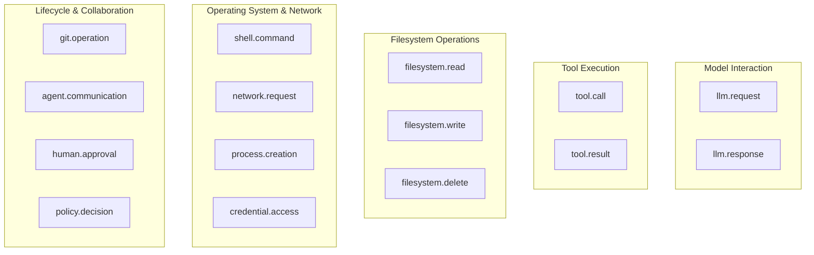

# Canonical Runtime Event Schema Specification

**Schema Version:** `1.0`  
**Status:** Stable / Canonical  
**Package:** `runtimeverify.events`  
**Target Repository:** [RadeshKK/Runtime-Verify](https://github.com/RadeshKK/Runtime-Verify)

---

## 1. Overview & Architectural Rationale

In multi-agent and autonomous agent systems, execution behavior has traditionally been captured through heterogeneous, vendor-locked formats (e.g. OpenAI function call payloads, LangChain Run objects, CrewAI task outputs, raw shell logs). This fragmentation makes cross-platform behavioral verification, policy enforcement, and audit compliance difficult.

The **RuntimeVerify Canonical Event Schema v1.0** establishes a vendor-neutral, strongly typed, immutable event model representing all critical actions an AI agent performs during execution.

### Key Characteristics:
- **Vendor-Neutral & Framework-Agnostic**: Normalizes events across LangGraph, CrewAI, PydanticAI, AutoGen, and custom Python loops.
- **Microsecond Serialization Performance**: Built on Pydantic v2 with native C-speed validation and JSON serialization.
- **Strict Immutability**: All events are frozen (`frozen=True`) upon instantiation, preventing in-memory tampering within the verification pipeline.
- **Distributed Correlation**: Native support for distributed tracing (`trace_id`, `span_id`, `parent_event_id`) matching OpenTelemetry conventions.
- **Strict UTC Localization**: Every timestamp is guaranteed to be timezone-aware UTC.
- **Non-Breaking Schema Evolution**: Configured with `extra="allow"`, enabling future schema versions or custom agent frameworks to introduce attributes without breaking existing consumers.

---

## 2. Top-Level Field Catalog

Every canonical event conforms to the following top-level schema:

| Field Name | Type | Required | Description | Example |
| :--- | :--- | :---: | :--- | :--- |
| `schema_version` | `str` | Yes | Semantic version of the canonical event schema. Defaults to `"1.0"`. | `"1.0"` |
| `event_id` | `str` (UUID4) | Yes | Globally unique identifier for this specific event. Aliased to `id`. | `"a1b2c3d4-e5f6-4a1b-8c2d-3e4f5a6b7c8d"` |
| `timestamp` | `datetime` | Yes | ISO-8601 UTC timestamp when the action occurred. Naive datetimes are localized to UTC. | `"2026-09-25T12:00:00Z"` |
| `session_id` | `str` | Yes | Identifier of the agent session, task boundary, or evaluation run. | `"session_coder_90210"` |
| `trace_id` | `str` | No | Distributed trace identifier linking causally connected events across systems. | `"trace_998877665544"` |
| `span_id` | `str` | No | Distributed tracing span identifier representing an individual execution unit. | `"span_11223344"` |
| `parent_event_id` | `str` | No | Identifier of the causal parent event (e.g. tool call parent of tool result). | `"c3d4e5f6-a1b2-4c3d-8e4f-5a6b7c8d9e0f"` |
| `agent_id` | `str` | Yes | Unique name or identifier of the agent initiating the action. | `"code_architect_agent"` |
| `agent_type` | `str` | No | Architectural archetype or role of the agent (`AgentType` enum or custom string). | `"coder"` |
| `event_type` | `str` | Yes | Hierarchical dot-separated event classification (`EventType` enum or string). | `"tool.call"` |
| `action` | `str` | Yes | Normalized action verb describing the operation performed (`EventAction` enum or string). | `"call"` |
| `target` | `str` | No | Primary entity, resource, or destination acted upon. | `"write_to_file"` |
| `source` | `str` | Yes | Originating subsystem (`EventSource` enum or string: `agent`, `tool`, `human`, `verifier`). | `"agent"` |
| `environment` | `str` | Yes | Execution boundary (`EventEnvironment` enum or string: `development`, `production`). | `"production"` |
| `context` | `EventContext` | Yes | Diagnostic execution environment context (directory, user, host, PID, git branch). | `{ "current_directory": "/workspace" }` |
| `metadata` | `dict` | Yes | Arbitrary user-defined context metadata. Defaults to `{}`. | `{ "tag": "eval_run" }` |
| `payload` | `dict` | Yes | Domain-specific structured attributes for the given event type. Defaults to `{}`. | `{ "tool_name": "bash", ... }` |

---

## 3. The 15 Standardized Canonical Event Types

The framework defines 15 canonical event types covering the full spectrum of AI agent behavior:



### Detailed Payload Specifications

#### 1. `llm.request`
- **Class**: [`LLMRequestEvent`](file:///D:/runtime-verify/src/runtimeverify/events/canonical.py)
- **Target**: Model name (e.g. `"claude-3-5-sonnet"`, `"gpt-4o"`)
- **Action**: `"request"`
- **Payload Schema**:
  - `model` (`str`): Target LLM model name.
  - `prompt` (`str` | `list`): Input prompt text or list of message objects.
  - `temperature` (`float`, optional): Sampling temperature.
  - `max_tokens` (`int`, optional): Maximum generation tokens configured.
  - `tools_provided` (`list[str]`, optional): Tool definitions made available in this inference call.
- **Example**: [llm_request.json](file:///D:/runtime-verify/docs/events/examples/llm_request.json)

#### 2. `llm.response`
- **Class**: [`LLMResponseEvent`](file:///D:/runtime-verify/src/runtimeverify/events/canonical.py)
- **Target**: Model name
- **Action**: `"response"`
- **Payload Schema**:
  - `model` (`str`): Generating model name.
  - `response` (`str`, optional): Textual completion or tool invocation request.
  - `prompt_tokens` (`int`, optional): Input token count.
  - `completion_tokens` (`int`, optional): Output token count.
  - `total_tokens` (`int`, optional): Combined token usage.
  - `finish_reason` (`str`, optional): Reason for completion (`stop`, `tool_calls`, `length`).
  - `duration_ms` (`float`, optional): Total API round-trip duration in milliseconds.
- **Example**: [llm_response.json](file:///D:/runtime-verify/docs/events/examples/llm_response.json)

#### 3. `tool.call`
- **Class**: [`ToolCallEvent`](file:///D:/runtime-verify/src/runtimeverify/events/canonical.py)
- **Target**: Tool name (e.g. `"write_to_file"`, `"bash"`)
- **Action**: `"call"`
- **Payload Schema**:
  - `tool_name` (`str`): Name of the invoked tool.
  - `arguments` (`dict`): Input parameter dictionary passed to the tool.
  - `call_id` (`str`, optional): Unique correlation identifier for this invocation instance.
- **Example**: [tool_call.json](file:///D:/runtime-verify/docs/events/examples/tool_call.json)

#### 4. `tool.result`
- **Class**: [`ToolResultEvent`](file:///D:/runtime-verify/src/runtimeverify/events/canonical.py)
- **Target**: Tool name
- **Action**: `"result"`
- **Payload Schema**:
  - `tool_name` (`str`): Tool name that executed.
  - `output` (`any`, optional): Returned output payload (serialized string or structured object).
  - `status` (`str`): Execution status (`"success"` or `"error"`).
  - `error_message` (`str`, optional): Error description if execution failed.
  - `duration_ms` (`float`, optional): Tool run execution latency in milliseconds.
  - `call_id` (`str`, optional): Correlation ID linking back to the `tool.call`.
- **Example**: [tool_result.json](file:///D:/runtime-verify/docs/events/examples/tool_result.json)

#### 5. `filesystem.read`
- **Class**: [`FilesystemReadEvent`](file:///D:/runtime-verify/src/runtimeverify/events/canonical.py)
- **Target**: File path (e.g. `"/workspace/pyproject.toml"`)
- **Action**: `"read"`
- **Payload Schema**:
  - `path` (`str`): Absolute or relative filesystem path.
  - `bytes_read` (`int`, optional): Total bytes read from disk.
  - `status` (`str`): Read operation result status.
- **Example**: [filesystem_read.json](file:///D:/runtime-verify/docs/events/examples/filesystem_read.json)

#### 6. `filesystem.write`
- **Class**: [`FilesystemWriteEvent`](file:///D:/runtime-verify/src/runtimeverify/events/canonical.py)
- **Target**: File path
- **Action**: `"write"`
- **Payload Schema**:
  - `path` (`str`): Target file destination path.
  - `bytes_written` (`int`, optional): Total bytes committed to disk.
  - `content_hash` (`str`, optional): SHA-256 hash digest of the content written.
  - `status` (`str`): Write operation status.
- **Example**: [filesystem_write.json](file:///D:/runtime-verify/docs/events/examples/filesystem_write.json)

#### 7. `filesystem.delete`
- **Class**: [`FilesystemDeleteEvent`](file:///D:/runtime-verify/src/runtimeverify/events/canonical.py)
- **Target**: File path
- **Action**: `"delete"`
- **Payload Schema**:
  - `path` (`str`): File or directory path targeted for deletion.
  - `status` (`str`): Removal status.
- **Example**: [filesystem_delete.json](file:///D:/runtime-verify/docs/events/examples/filesystem_delete.json)

#### 8. `shell.command`
- **Class**: [`ShellCommandEvent`](file:///D:/runtime-verify/src/runtimeverify/events/canonical.py)
- **Target**: Command executable name (e.g. `"pytest"`, `"git"`, `"rm"`)
- **Action**: `"execute"`
- **Payload Schema**:
  - `command` (`str`): Complete raw command-line string.
  - `arguments` (`list[str]`): Parsed command-line argument tokens.
  - `working_directory` (`str`, optional): Working directory where execution occurred.
  - `exit_code` (`int`, optional): Process exit return code.
  - `output` (`str`, optional): Standard output / error summary.
  - `duration_ms` (`float`, optional): Total execution duration.
- **Example**: [shell_command.json](file:///D:/runtime-verify/docs/events/examples/shell_command.json)

#### 9. `network.request`
- **Class**: [`NetworkRequestEvent`](file:///D:/runtime-verify/src/runtimeverify/events/canonical.py)
- **Target**: Complete destination URL
- **Action**: `"request"`
- **Payload Schema**:
  - `url` (`str`): Full destination endpoint URL.
  - `method` (`str`): HTTP method verb (`"GET"`, `"POST"`, etc.).
  - `headers` (`dict`, optional): Outbound headers (sanitized, excluding auth secrets).
  - `status_code` (`int`, optional): HTTP response status code.
  - `bytes_sent` (`int`, optional): Outbound payload bytes.
  - `bytes_received` (`int`, optional): Inbound response bytes.
  - `duration_ms` (`float`, optional): Round-trip network latency.
- **Example**: [network_request.json](file:///D:/runtime-verify/docs/events/examples/network_request.json)

#### 10. `git.operation`
- **Class**: [`GitOperationEvent`](file:///D:/runtime-verify/src/runtimeverify/events/canonical.py)
- **Target**: Repository or target branch name
- **Action**: Git operation name (`"commit"`, `"push"`, `"checkout"`, `"clone"`)
- **Payload Schema**:
  - `operation` (`str`): Git operation verb.
  - `repository` (`str`, optional): Git remote or local repository name.
  - `branch` (`str`, optional): Active branch name.
  - `commit_hash` (`str`, optional): Git commit SHA hash.
  - `message` (`str`, optional): Commit message text.
  - `files_changed` (`list[str]`, optional): List of affected file paths.
- **Example**: [git_operation.json](file:///D:/runtime-verify/docs/events/examples/git_operation.json)

#### 11. `credential.access`
- **Class**: [`CredentialAccessEvent`](file:///D:/runtime-verify/src/runtimeverify/events/canonical.py)
- **Target**: Credential or environment variable key name
- **Action**: `"access"`
- **Payload Schema**:
  - `resource_name` (`str`): Name of the secret resource (e.g. `"GITHUB_TOKEN"`).
  - `secret_type` (`str`): Secret category (`"api_key"`, `"token"`, `"ssh_key"`).
  - `access_mode` (`str`): Access intent (`"read"`, `"write"`, `"revoke"`).
  - `sanitized` (`bool`): Invariant indicating raw secret values are redacted.
- **Example**: [credential_access.json](file:///D:/runtime-verify/docs/events/examples/credential_access.json)

#### 12. `process.creation`
- **Class**: [`ProcessCreationEvent`](file:///D:/runtime-verify/src/runtimeverify/events/canonical.py)
- **Target**: Executable binary name or process command
- **Action**: `"spawn"`
- **Payload Schema**:
  - `command` (`str`): Executable invocation string.
  - `pid` (`int`, optional): OS process ID of the spawned child.
  - `parent_pid` (`int`, optional): OS PID of the invoking parent.
  - `environment_variables` (`list[str]`, optional): Names of exported environment variables.
- **Example**: [process_creation.json](file:///D:/runtime-verify/docs/events/examples/process_creation.json)

#### 13. `agent.communication`
- **Class**: [`AgentCommunicationEvent`](file:///D:/runtime-verify/src/runtimeverify/events/canonical.py)
- **Target**: Recipient agent ID
- **Action**: `"send"` or `"receive"`
- **Payload Schema**:
  - `recipient_agent_id` (`str`): Destination agent identifier.
  - `sender_agent_id` (`str`, optional): Originating agent identifier.
  - `message_type` (`str`): Communication classification (`"task_delegation"`, `"query"`).
  - `content_summary` (`str`, optional): Summary description of the communicated message.
- **Example**: [agent_communication.json](file:///D:/runtime-verify/docs/events/examples/agent_communication.json)

#### 14. `human.approval`
- **Class**: [`HumanApprovalEvent`](file:///D:/runtime-verify/src/runtimeverify/events/canonical.py)
- **Target**: Approval ticket ID
- **Action**: Human decision (`"approve"`, `"reject"`, `"timeout"`)
- **Payload Schema**:
  - `ticket_id` (`str`): Pending approval authorization ticket ID.
  - `decision` (`str`): Authorization decision (`"approved"`, `"rejected"`).
  - `approver_id` (`str`, optional): Identifier of the human supervisor.
  - `reason` (`str`, optional): Justification rationale provided by the approver.
  - `action_requested` (`str`, optional): The original action requiring authorization.
- **Example**: [human_approval.json](file:///D:/runtime-verify/docs/events/examples/human_approval.json)

#### 15. `policy.decision`
- **Class**: [`PolicyDecisionEvent`](file:///D:/runtime-verify/src/runtimeverify/events/canonical.py)
- **Target**: Policy name or rule identifier
- **Action**: Enforcement action (`"allow"`, `"block"`, `"review"`, `"quarantine"`)
- **Payload Schema**:
  - `policy_name` (`str`): Security policy evaluated.
  - `decision` (`str`): Mitigation verdict (`"ALLOW"`, `"BLOCK"`, `"REVIEW"`).
  - `deviation_score` (`float`, optional): Calculated SPRT log-likelihood ratio or deviation score.
  - `triggered_rules` (`list[str]`, optional): Specific security invariant clauses tripped.
  - `evidence` (`dict`, optional): Diagnostic evidence explaining the policy decision.
- **Example**: [policy_decision.json](file:///D:/runtime-verify/docs/events/examples/policy_decision.json)

---

## 4. Standardized Enums

All enumerations are defined in [`runtimeverify.events.enums`](file:///D:/runtime-verify/src/runtimeverify/events/enums.py):

```python
from runtimeverify.events import (
    EventType,
    EventAction,
    AgentType,
    EventEnvironment,
    EventSource,
)
```

- **`EventType`**: `llm.request`, `llm.response`, `tool.call`, `tool.result`, `filesystem.read`, `filesystem.write`, `filesystem.delete`, `shell.command`, `network.request`, `git.operation`, `credential.access`, `process.creation`, `agent.communication`, `human.approval`, `policy.decision`, `generic`.
- **`EventAction`**: `request`, `response`, `call`, `result`, `read`, `write`, `delete`, `execute`, `connect`, `commit`, `push`, `pull`, `clone`, `checkout`, `access`, `spawn`, `send`, `receive`, `approve`, `reject`, `allow`, `block`, `review`, `unknown`.
- **`AgentType`**: `orchestrator`, `worker`, `researcher`, `coder`, `critic`, `planner`, `user_proxy`, `custom`.
- **`EventEnvironment`**: `development`, `staging`, `production`, `sandbox`, `test`.
- **`EventSource`**: `agent`, `tool`, `environment`, `human`, `verifier`, `system`.

---

## 5. Schema Evolution & Forward Compatibility

The canonical schema is designed to evolve gracefully across distributed deployments:

1. **Adding Optional Fields**:
   New optional fields introduced in schema v1.1+ (e.g. `cost_usd`, `co2_grams`) will not break v1.0 consumers because all models are configured with `extra="allow"`.
2. **Reading Future Fields**:
   Any unknown fields received from a future producer are captured in `event.__pydantic_extra__` and remain accessible via `getattr(event, "field_name")`.
3. **Polymorphic Deserialization**:
   The [`EventSerializer`](file:///D:/runtime-verify/src/runtimeverify/telemetry/serializers.py) inspects `event_type` and dynamically instantiates the correct specialized subclass. If an unrecognized event type is received, it gracefully falls back to `CanonicalEvent` or `Event`.
4. **Backward Compatibility Aliases**:
   - `event.id` $\leftrightarrow$ `event.event_id`
   - `event.type` $\leftrightarrow$ `event.event_type`
   Both forms are supported via Pydantic field aliases and dynamic properties.

---

## 6. Python Developer Guide

### Instantiation via Factory Methods (Recommended)

```python
from runtimeverify.events import CanonicalEvent

# Create a Tool Call Event
tool_call = CanonicalEvent.create_tool_call(
    session_id="session_42",
    agent_id="code_assistant",
    tool_name="read_file",
    arguments={"path": "src/main.py"},
    trace_id="tr_abc123",
)

# Create a Filesystem Write Event
fs_write = CanonicalEvent.create_filesystem_write(
    session_id="session_42",
    agent_id="code_assistant",
    path="src/main.py",
    bytes_written=1024,
    content_hash="sha256_e3b0c442...",
)
```

### Instantiation via Specialized Classes

```python
from runtimeverify.events import ToolCallEvent

event = ToolCallEvent(
    session_id="session_42",
    agent_id="code_assistant",
    tool_name="bash",
    arguments={"command": "npm test"},
)
print(event.target)     # "bash"
print(event.arguments)  # {"command": "npm test"}
```

### Serialization & Deserialization

```python
from runtimeverify.telemetry.serializers import EventSerializer

# Serialize to canonical JSON string
json_str = EventSerializer.serialize(tool_call)

# Polymorphically deserialize back to the specialized class
reconstructed = EventSerializer.deserialize(json_str)
assert isinstance(reconstructed, ToolCallEvent)
assert reconstructed.tool_name == "read_file"
```
