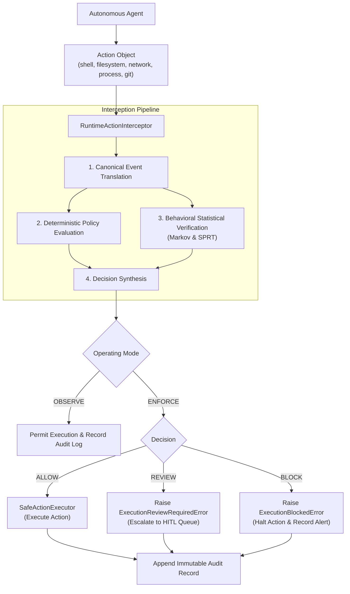

# Runtime Action Interception

## Overview

RuntimeVerify provides a vendor-neutral, pre-execution interception layer that observes and optionally enforces security decisions on autonomous agent actions before execution takes place.

Unlike reactive monitoring systems that only audit actions post-mortem, RuntimeVerify sits directly between the agent runtime (planner, LLM, or tool dispatch) and the target execution environment (OS shell, filesystem, network, git, or child processes).



---

## Operating Modes

RuntimeVerify supports two primary operational modes:

### 1. `OBSERVE` Mode
- **Purpose**: Shadow evaluation, baseline profiling, and non-intrusive security auditing.
- **Behavior**:
  1. Translates the `Action` into its canonical telemetry representation.
  2. Evaluates active policies and calculates behavioral transition probabilities.
  3. Records the synthesized decision in the audit trail.
  4. Always sets `execution_permitted = True` and permits the action to execute without disruption.

### 2. `ENFORCE` Mode
- **Purpose**: Active security enforcement, policy boundary control, and risk mitigation.
- **Behavior**:
  1. Evaluates incoming actions against the active `PolicySet` and behavioral engines.
  2. **ALLOW**: Permits the action and delegates execution to the registered `ActionExecutor`.
  3. **REVIEW**: Halts execution, records the action in an approval queue, and raises `ExecutionReviewRequiredError`.
  4. **BLOCK**: Immediately terminates the action, logs a security alert, and raises `ExecutionBlockedError`.
  5. **Fail-Closed**: If an internal evaluation or policy lookup fails, the interceptor immediately aborts execution and raises `SecurityFailClosedError`.

---

## Supported Action Types

| Action Type | Operational Verbs | Canonical Event Class | Target Example |
| :--- | :--- | :--- | :--- |
| `shell` | `execute` | `ShellCommandEvent` | `pytest tests/`, `rm -rf /` |
| `filesystem` | `read`, `write`, `delete` | `FilesystemReadEvent`, `FilesystemWriteEvent`, `FilesystemDeleteEvent` | `/app/.env`, `~/.ssh/id_rsa` |
| `network` | `GET`, `POST`, `CONNECT` | `NetworkRequestEvent` | `http://169.254.169.254`, `https://api.github.com` |
| `process` | `spawn`, `terminate` | `ProcessCreationEvent` | `python worker.py --port 8000` |
| `git` | `commit`, `push`, `pull`, `status` | `GitOperationEvent` | `push -> origin/main` |

---

## Threat Model, Assumptions & Limitations

### Security Guarantees & Assumptions

1. **Deterministic Guardrails**: Policy evaluation is 100% deterministic, sub-millisecond, and operates with zero LLM dependency.
2. **Fail-Closed Security**: Under `ENFORCE` mode, any internal failure during canonical event generation or policy evaluation halts execution immediately. Actions are never permitted by accidental exception fallthrough.
3. **Safe Execution Boundary**: The default `SafeActionExecutor` never executes arbitrary OS shell commands blindly for verification. Execution is strictly delegated to explicitly registered handlers or safe dry-run simulations.
4. **Audit Immutability**: Every action attempt—whether allowed, reviewed, blocked, or failed—generates an immutable `AuditLogEntry` capturing full diagnostic parameters.

### Boundary Limitations

1. **In-Process Boundary**: The Python interceptor operates at the agent application runtime tier. An attacker who achieves native arbitrary code execution (e.g., via a compromised C-extension or memory corruption) can bypass in-process hooks.
2. **Defense-in-Depth**: RuntimeVerify is designed to complement—not replace—kernel-level containment (e.g., Docker containers, gVisor sandboxes, Linux seccomp/AppArmor profiles).
3. **Shell Obfuscation & Path Canonicalization**: Advanced adversaries may attempt to bypass regexes via complex shell tricks (e.g., `$(echo cm0= | base64 -d) -rf /`). RuntimeVerify addresses this through semantic classification, Markov sequential anomaly detection, and recommended sandboxed subshells.

---

## Structured Exceptions Reference

All interception errors inherit from `InterceptionError` and provide rich audit metadata:

```python
from runtimeverify.interception import (
    RuntimeActionInterceptor,
    Action,
    ExecutionBlockedError,
    ExecutionReviewRequiredError,
    SecurityFailClosedError,
)

interceptor = RuntimeActionInterceptor()

try:
    act = Action.shell(command="rm -rf /", session_id="s1", agent_id="a1")
    decision, result = interceptor.intercept(act)
except ExecutionBlockedError as e:
    print(f"Policy '{e.policy_id}' blocked action: {e.reason}")
    print(f"Audit snapshot: {e.audit_record}")
except ExecutionReviewRequiredError as e:
    print(f"Action requires review by policy '{e.policy_id}': {e.reason}")
except SecurityFailClosedError as e:
    print(f"Security failure, aborted execution: {e}")
```

---

## CLI Reference

### 1. `runtimeverify check`
Pre-evaluates a single action against active policies:

```bash
# Check allowed command
runtimeverify check --type shell --target "git status"

# Check blocked command
runtimeverify check --type shell --target "rm -rf /"

# Check protected path
runtimeverify check --type filesystem --target "~/.ssh/id_rsa"
```

### 2. `runtimeverify policy validate`
Validates policy YAML syntax, uniqueness, and regex patterns:

```bash
runtimeverify policy validate examples/policies/default.yaml
```

### 3. `runtimeverify monitor`
Monitors agent actions in observe or enforce mode:

```bash
runtimeverify monitor --mode observe
```
