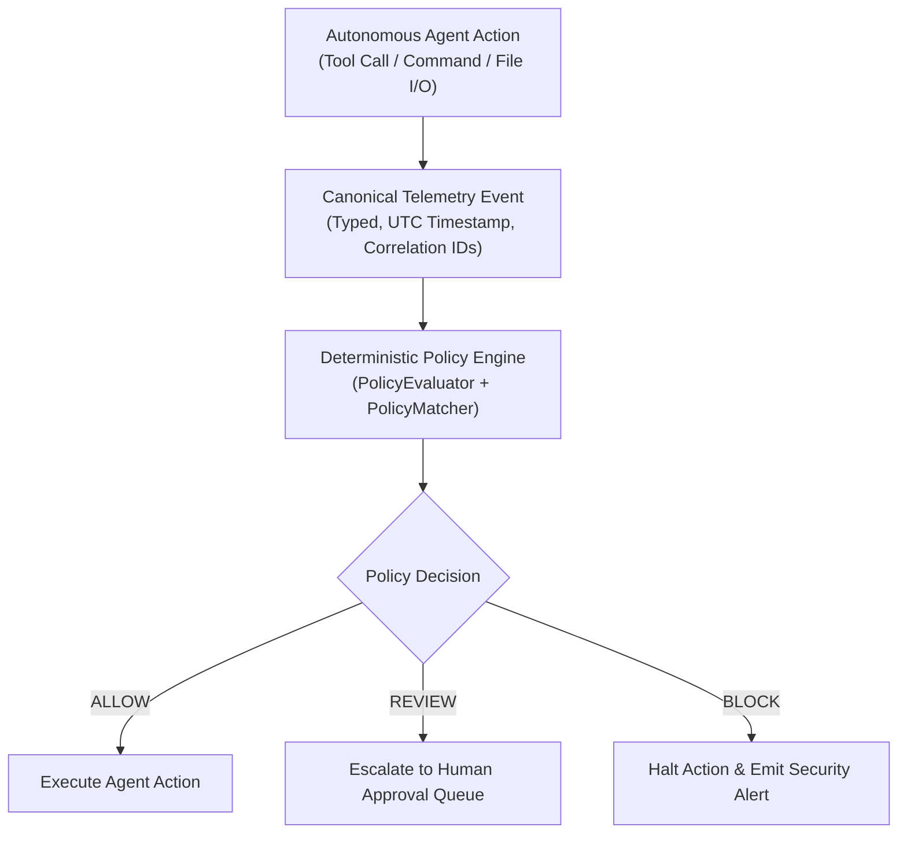

# Deterministic Policy Engine

## Overview

RuntimeVerify includes a production-quality, deterministic policy engine designed to inspect and evaluate autonomous agent actions **before execution**. 

The policy engine acts as the first line of defense in the agent runtime lifecycle, enforcing non-negotiable security boundaries, access controls, and human-in-the-loop escalation workflows with sub-millisecond latency and zero LLM dependency.



---

## Architecture & Principles

1. **Pre-Execution Boundary**: Evaluates agent intents before mutations occur (preventing data loss, exfiltration, or credential leaks).
2. **Deterministic & Explainable**: Rules are evaluated using exact pattern matching, regexes, and CIDR checks. Every decision provides the winning `policy_id`, `severity`, `reason`, and `matched_rule`.
3. **Multi-Domain Coverage**:
   - Filesystem paths (wildcards, regex, directory traversal `../` prevention)
   - Shell commands (detecting destructive commands, privilege escalation, pipe-to-shell patterns like `curl | bash`)
   - Network destinations (cloud IMDS endpoints, internal subnets, untrusted internet egress)
   - Git operations (branch protections, commit and push rules)
   - Process lifecycles (executables, arguments)
   - Credential & secret access
   - Tool calls and arguments
   - Agent identity & environment boundaries

---

## Policy Language & Schema

Policies are authored in readable, versioned YAML or JSON files.

### Schema Definition

```yaml
version: "1.0"
name: "policy-set-name"
description: "High-level summary of the policy set"
conflict_resolution: "most_restrictive"  # most_restrictive | highest_severity | highest_priority | first_match
default_decision: "ALLOW"               # ALLOW | REVIEW | BLOCK
default_severity: "INFO"                # INFO | LOW | MEDIUM | HIGH | CRITICAL

policies:
  - id: "policy-identifier"             # Unique string ID
    name: "Human-Readable Name"
    description: "Policy intent description"
    enabled: true                       # true | false
    decision: "BLOCK"                   # ALLOW | REVIEW | BLOCK
    severity: "CRITICAL"                # INFO | LOW | MEDIUM | HIGH | CRITICAL
    priority: 100                       # Integer priority (higher evaluates first in priority mode)
    match:
      event_type: "filesystem.read"     # Canonical event type or security category
      path:
        glob: "~/.aws/*"                # Glob, regex, prefix, exact, contains
    reason: "Access to AWS credentials is prohibited."
```

### Match Criteria Reference

| Criteria Field | Type | Description |
| :--- | :--- | :--- |
| `event_types` | `List[str]` | Matches canonical event types (e.g. `filesystem.read`, `shell.command`) |
| `security_categories` | `List[str]` | Matches canonical security states (e.g. `SHELL_DESTRUCTIVE`, `FILE_READ`) |
| `risk_levels` | `List[str]` | Matches risk ratings (e.g. `HIGH`, `CRITICAL`) |
| `environments` | `List[str]` | Matches runtime environment (e.g. `production`, `sandbox`) |
| `path` | `PathPattern` | Filesystem path matching (`glob`, `regex`, `prefix`, `block_traversal`) |
| `command` | `ShellPattern` | Shell command inspection (`destructive`, `privileged`, `pipe_to_shell`, `command`) |
| `network` | `NetworkPattern` | Network egress matching (`domains`, `ip_ranges`, `sensitive_only`, `unknown_only`, `ports`) |
| `git` | `GitPattern` | Git operations (`operations: ["push"]`, `branches: ["main"]`) |
| `process` | `ProcessPattern` | Process execution (`executable`, `command_line`) |
| `credential` | `CredentialPattern`| Secret and credential access (`credential_types`, `target`) |
| `tool` | `ToolPattern` | Tool invocations (`names`, `arguments`) |
| `agent` | `AgentPattern` | Agent archetype filtering (`agent_ids`, `agent_types`) |

---

## Conflict Resolution Rules

When an incoming event matches multiple policy rules, the engine deterministically resolves the winning decision using one of four configurable strategies:

1. **`most_restrictive` (Default)**:
   - `BLOCK` overrides `REVIEW`.
   - `REVIEW` overrides `ALLOW`.
   - Ties broken by highest severity (`CRITICAL` > `HIGH` > `MEDIUM` > `LOW` > `INFO`).
   - Secondary ties broken by numerical `priority`.

2. **`highest_severity`**:
   - The policy with the highest severity rating wins (`CRITICAL` down to `INFO`).
   - Ties broken by `most_restrictive`.

3. **`highest_priority`**:
   - The policy with the highest numerical `priority` integer wins.
   - Ties broken by `most_restrictive`.

4. **`first_match`**:
   - The first matching policy rule in document order wins.

---

## Policy Decision Structure

Every evaluation produces a structured, immutable `PolicyDecision`:

```python
class PolicyDecision(BaseModel):
    decision: PolicyDecisionType       # ALLOW, REVIEW, BLOCK
    policy_id: str                     # Triggering rule ID (or 'default')
    severity: PolicySeverity           # Severity rating of winning rule
    reason: str                        # Human-readable explanation
    matched_rule: Optional[Dict]       # Complete definition of winning rule
    matched_policies: List[Dict]       # Summary of all matching rules
    timestamp: datetime                # UTC evaluation timestamp
```

---

## Quickstart

### 1. Evaluating Events in Python

```python
from runtimeverify.policy import PolicyEvaluator, load_policy_from_yaml
from runtimeverify.events.canonical import FilesystemReadEvent, ShellCommandEvent

# Load policy set from file
evaluator = PolicyEvaluator(policy_set=load_policy_from_yaml("examples/policies/default.yaml"))

# Evaluate sensitive file read
event = FilesystemReadEvent(
    agent_id="agent-coder-01",
    session_id="session-trace-101",
    path="/home/user/.aws/credentials",
)
decision = evaluator.evaluate(event)

if decision.decision == "BLOCK":
    print(f"Action blocked by {decision.policy_id}: {decision.reason}")
elif decision.decision == "REVIEW":
    print(f"Action held for human review: {decision.reason}")
else:
    print("Action permitted.")
```

### 2. Available Example Policies

- [`examples/policies/default.yaml`](file:///D:/runtime-verify/examples/policies/default.yaml): Standard enterprise baseline guardrails.
- [`examples/policies/strict.yaml`](file:///D:/runtime-verify/examples/policies/strict.yaml): Zero-trust policy set where all actions default to `BLOCK`.
- [`examples/policies/developer.yaml`](file:///D:/runtime-verify/examples/policies/developer.yaml): Permissive set for fast sandbox development.
