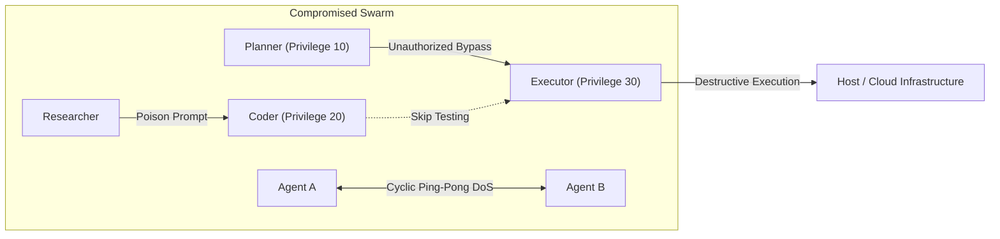
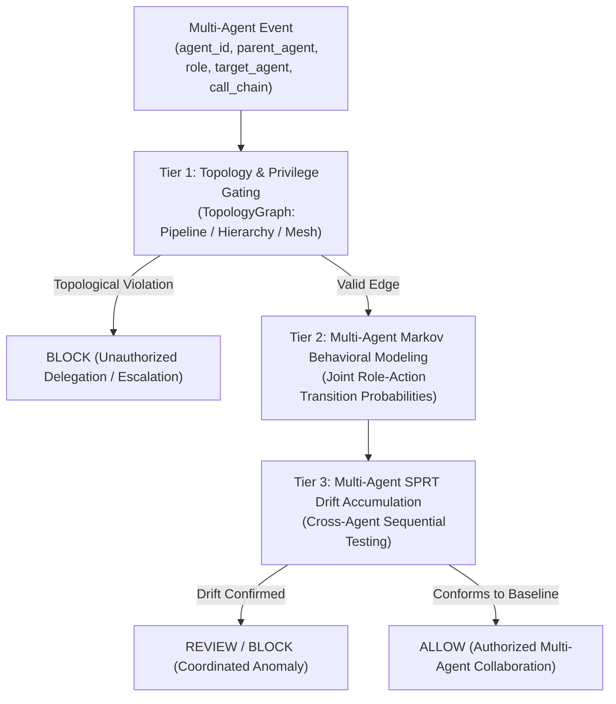

# Multi-Agent Security Threat Model & Verification Architecture

## 1. Executive Summary

As autonomous AI agents evolve from single, isolated workers into heterogeneous collaborative swarms (such as `planner -> coder -> tester -> executor` pipelines or orchestrator-worker swarms), the security boundary shifts from **individual tool verification** to **cross-agent interaction governance**.

In multi-agent systems, malicious behavior rarely appears as a single overtly destructive tool call from one agent. Instead, adversaries exploit:
1. **The Confused Deputy Problem**: Tricking a high-privilege execution agent via benign-looking delegations from a low-privilege research or planning agent.
2. **Topological Pipeline Bypasses**: Skipping critical validation or testing stages (e.g. `coder` directly handing off to `executor`).
3. **Distributed Evasion**: Splitting an attack trajectory across multiple agents to stay below individual anomaly detection thresholds.
4. **Denial-of-Service via Cyclic Handoffs**: Inducing infinite delegation ping-pong loops between collaborating agents.

RuntimeVerify Phase 17 addresses these challenges by extending runtime verification across multi-agent topologies without assuming that all inter-agent communication is malicious.

---

## 2. Multi-Agent Threat Vectors

### Threat Vector 1: Unauthorized Delegation & Pipeline Bypass
- **Description**: In a standard verification pipeline (`planner -> coder -> tester -> executor`), safety guarantees depend on the execution of intermediary validation steps (e.g. static tests, security linting). An adversary compromises or manipulates an upstream agent (e.g. planner) to delegate directly to a downstream executor.
- **Impact**: Untested, unverified code or commands are executed directly on target systems.
- **RuntimeVerify Mitigation**: `TopologyGraph.pipeline()` enforces strict directed edge progression. Any delegation jumping stages is identified as `UNEXPECTED_DELEGATION` and immediately blocked.

### Threat Vector 2: Cross-Agent Privilege Escalation (Confused Deputy)
- **Description**: Agent roles are assigned distinct privilege levels based on their functional responsibilities:
  - `planner` / `researcher`: Level 10 (read-only, research, design)
  - `coder` / `tester`: Level 20 (code generation, local test execution)
  - `executor`: Level 30 (system execution, deployment, infrastructure modification)
  A compromised researcher agent delegates tasks requiring root or system shell execution to the executor agent. The executor executes the command because it considers the instruction to come from an internal teammate.
- **Impact**: Complete compromise of host resources via indirect prompt injection through low-privilege agents.
- **RuntimeVerify Mitigation**: `TopologyGraph.validate_interaction()` evaluates the privilege gap between source and target roles. A privilege jump $\ge 15$ for execution actions triggers `PRIVILEGE_ESCALATION` and is blocked with `CRITICAL` severity.

### Threat Vector 3: Cyclic Handoff & Resource Exhaustion (DoS)
- **Description**: An adversary creates circular delegation requests (e.g. $A \to B \to A \to B \dots$) or deep recursive agent spawning to exhaust API tokens, compute quotas, and system threads.
- **Impact**: System lockup, denial of service, and excessive API billing.
- **RuntimeVerify Mitigation**: `TopologyGraph` analyzes the `call_chain` lineage sequence on every interaction. Repeated agent IDs in an active delegation chain trigger `CYCLIC_DELEGATION`. Interactions exceeding `max_call_depth` trigger `EXCESSIVE_DELEGATION_DEPTH` and are terminated.

### Threat Vector 4: Distributed Multi-Step Evasion
- **Description**: An adversary splits a malicious sequence across multiple agents (e.g. Agent 1 reads AWS keys, Agent 2 opens network socket, Agent 3 transmits payload). An isolated single-agent monitor sees only fragmented, seemingly benign operations.
- **Impact**: Single-agent behavioral models fail to detect the coordinated attack trajectory.
- **RuntimeVerify Mitigation**: `MultiAgentSPRTEngine` correlates events under the shared `session_id`, tracking joint multi-agent state transitions ($(\text{role}_t, \text{action}_t)$) and accumulating Wald's log-likelihood ratio across the entire agent swarm.

---

## 3. Defense-in-Depth Architecture

RuntimeVerify enforces multi-agent security through a multi-tier defense:

### 1. Empirical Topology Baselining
RuntimeVerify does not treat inter-agent communication as intrinsically malicious. Using `TopologyLearner`, systems can observe normal collaborative agent interactions, calculate empirical transition frequencies, and generate an authorized `TopologyGraph` baseline.

### 2. Multi-Agent Markov Behavioral State Space
Joint multi-agent states are serialized into canonical descriptors:
- Cross-agent delegation/handoff: `f"{SRC_ROLE}->{TGT_ROLE}:{ACTION}"` (e.g. `PLANNER->CODER:DELEGATE`)
- Intra-agent execution: `f"{ROLE}:{ACTION}"` (e.g. `CODER:WRITE`)

### 3. Sequential Probability Ratio Testing (SPRT)
`MultiAgentSPRTEngine` maintains session-level log-likelihood ratio accumulators. When cross-agent transition sequences conform to $H_0$ (normal collaborative pipeline), evidence accumulates toward $A$ (`ACCEPT_H0`). When transitions exhibit abnormal bypasses or anomalous actions, evidence rapidly accumulates toward $B$ (`ACCEPT_H1`), triggering proactive security intervention.
