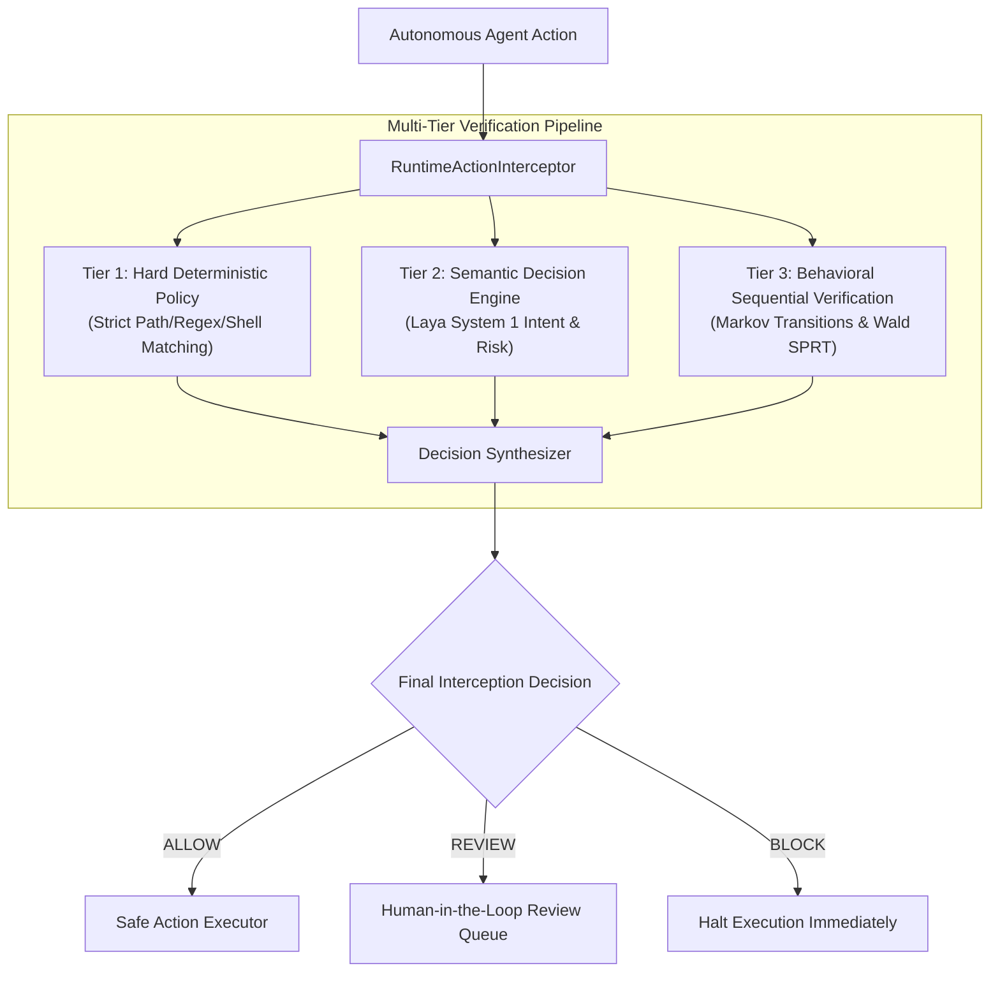

# Semantic Decision Engines in RuntimeVerify

## Overview

RuntimeVerify incorporates an extensible **Semantic Decision Engine** layer that provides real-time intent analysis, semantic risk classification, and calibrated decision signals for autonomous AI agent actions.

While deterministic policies enforce strict boundary guardrails (e.g., blocking `~/.ssh/*` or `rm -rf`), many sophisticated agent behaviors cannot be captured through static regexes or exact path matching alone. The semantic engine provides contextual awareness by evaluating unstructured inputs, natural language parameters, and execution intent.



---

## The 4-Tier Security Hierarchy

RuntimeVerify implements a strict priority hierarchy to ensure that probabilistic ML models can never undermine deterministic security guarantees:

1. **Tier 1: Hard Deterministic Policy (Authoritative)**
   - Hard policy rules (defined in YAML) are absolute.
   - A deterministic `BLOCK` **cannot** be overturned, weakened, or bypassed by any semantic engine signal.
   - A deterministic `REVIEW` **cannot** be downgraded to `ALLOW` by a semantic engine signal.

2. **Tier 2: Semantic Signal (Escalation Only)**
   - When deterministic policies permit an action (`ALLOW` or unclassified), the semantic engine evaluates risk.
   - If the semantic engine detects `CRITICAL` risk with high confidence ($\ge \text{threshold}$), it **escalates** the decision to `BLOCK`.
   - If the semantic engine detects `HIGH` risk or flags `requires_review`, it **escalates** the decision to `REVIEW`.
   - Semantic signals can only *tighten* security controls, never loosen them.

3. **Tier 3: Behavioral Verification (Statistical Anomaly Detection)**
   - If both deterministic policy and semantic evaluation permit the action (`ALLOW`), the sequential statistical engine (Wald's SPRT on Markov transition sequences) verifies behavioral consistency.
   - Trajectory drift or anomalous transition probabilities escalate the decision to `REVIEW`.

4. **Tier 4: Final Synthesized Decision**
   - Renders the unified verdict (`ALLOW`, `REVIEW`, or `BLOCK`) with a fully auditable reasoning chain documenting contributions from every tier.

---

## Threat Model & Security Disclaimer

> [!WARNING]
> **No Security Guarantees from Classifiers Alone**
> Semantic classifiers (including Laya, LLM critics, and embedding distance models) are **probabilistic heuristics**. They are susceptible to prompt injection, semantic obfuscation, payload smuggling, and adversarial evasion.
> 
> RuntimeVerify **does not** claim security guarantees from semantic classifiers alone. The semantic engine acts as an early-warning escalation sensor and semantic metadata enricher. Authoritative security guarantees are provided solely by Tier 1 deterministic policies and kernel-level sandboxing.

---

## Core Abstractions

### `DecisionEngine`
Abstract base class defining the provider-neutral contract:

```python
class DecisionEngine(ABC):
    @abstractmethod
    def evaluate(
        self,
        event_or_action: Any,
        context: Optional[ExecutionContext] = None,
    ) -> DecisionSignal:
        ...

    @abstractmethod
    def is_available(self) -> bool:
        ...
```

### `DecisionSignal`
Immutable structured result emitted by engines:
- `engine_name`: Identifier (e.g., `"laya"`, `"null"`, `"custom"`).
- `action_category`: Identified technical category (e.g., `filesystem`, `shell`, `network`, `credential`).
- `risk_level`: Standardized rating (`LOW`, `MEDIUM`, `HIGH`, `CRITICAL`, `UNKNOWN`).
- `confidence`: Calibrated score normalized to $[0.0, 1.0]$.
- `decision_signal`: Actionable recommendation (`ALLOW`, `REVIEW`, `BLOCK`, `NEUTRAL`).
- `fallback`: Boolean indicating whether the signal is a safe fallback due to timeout or error.
- `latency_ms`: Measured inference duration in milliseconds.

---

## Configuration

Semantic engines can be configured programmatically or embedded directly within policy YAML sets:

```yaml
version: "1.0"
name: "production-security-policy"

semantic_engine:
  enabled: true
  provider: "laya"
  timeout_ms: 50.0
  model_name: "english"
  min_confidence_threshold: 0.65
  escalate_on_critical: true
  escalate_on_high: true

policies:
  - id: "deny-credentials"
    match:
      path:
        glob: "~/.ssh/*"
    decision: "BLOCK"
```

### Configuration Options

| Option | Type | Default | Description |
| :--- | :--- | :--- | :--- |
| `enabled` | `bool` | `false` | Activates semantic evaluation in the interception pipeline. |
| `provider` | `str` | `"null"` | Provider identifier (`"null"`, `"laya"`, or custom registered provider). |
| `timeout_ms` | `float` | `50.0` | Maximum inference duration before triggering a graceful fallback signal. |
| `model_name` | `str` | `"english"` | Target checkpoint name or routing preference. |
| `device` | `str` | `null` | Hardware device (`"cpu"`, `"cuda"`, `"mps"`, `"xpu"`). |
| `min_confidence_threshold` | `float` | `0.60` | Minimum confidence required to trigger decision escalation. |
| `escalate_on_critical` | `bool` | `true` | Whether `CRITICAL` risk escalates deterministic `ALLOW` to `BLOCK`. |
| `escalate_on_high` | `bool` | `true` | Whether `HIGH` risk escalates deterministic `ALLOW` to `REVIEW`. |

---

## Supported Providers

- **`NullDecisionEngine`**: Zero-overhead pass-through engine when semantic evaluation is disabled. Always available, latency $\approx 0\text{ms}$.
- **`LayaDecisionEngine`**: Ultra-fast System 1 decision engine based on ModernBERT / mmBERT. Evaluates typed risk questions in $\approx 33\text{ms}$ with calibrated probabilities. See [Laya Documentation](file:///D:/runtime-verify/docs/semantic-engines/laya.md).
- **Custom Providers**: Register custom engines using `runtimeverify.semantic.register_engine_provider()`.
