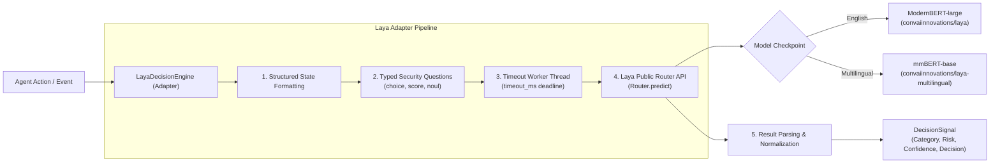
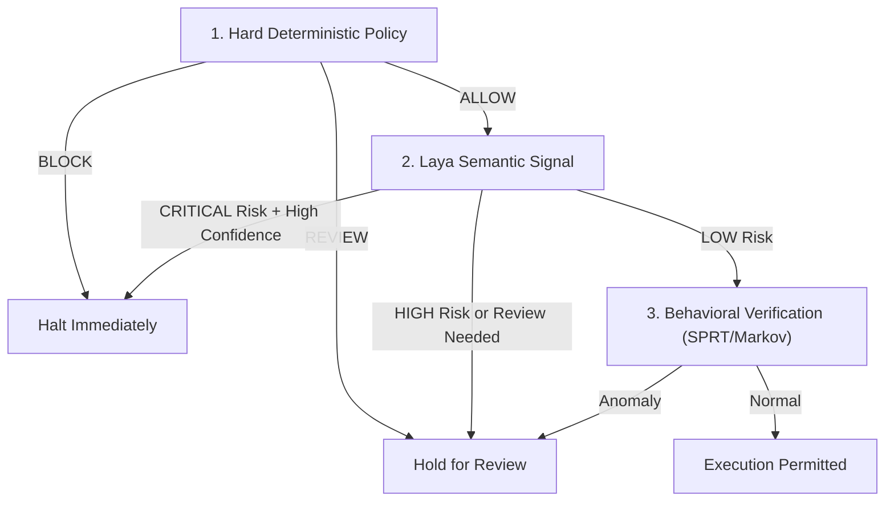

# Laya Semantic Decision Engine Integration

## Overview

[Laya](https://github.com/NandhaKishorM/laya) is an open-source, non-autoregressive "System 1" decision engine developed by Nandhakishor M. Unlike traditional autoregressive LLMs that generate token streams with high latency and token costs, Laya evaluates typed classification questions in a **single forward pass** ($\approx 33\text{ms}$ on GPU, $\approx 150\text{--}300\text{ms}$ on modern CPU) with calibrated probabilities.

RuntimeVerify integrates Laya via [`LayaDecisionEngine`](file:///D:/runtime-verify/src/runtimeverify/semantic/laya.py) as an optional Tier 2 semantic decision engine.

---

## Architecture & Integration

### Public API Compliance

RuntimeVerify interacts strictly with Laya's documented public API and does not depend on private internals:

- **Entry Point**: `from laya import Router`
- **Inference Method**: `router.predict(state: Union[str, dict, list], questions: Dict[str, Any], model: Optional[str] = None)`
- **Input Formatting**: Translates actions into structured execution state summaries.
- **Typed Questions Evaluated**:
  1. `action_category` (`choice`): Categorizes actions into `filesystem`, `shell`, `network`, `credential`, `git`, `process`, or `benign_query`.
  2. `risk_level` (`choice`): Assesses risk rating (`critical`, `high`, `medium`, `low`).
  3. `requires_review` (`noul`): Predicts probability ($[0.0, 1.0]$) that the action requires human approval or presents operational hazards.

---

## Resiliency & Safety Controls

1. **Zero Hard Dependency**:
   - The `laya` package is optional.
   - If not installed, `LayaDecisionEngine.is_available()` returns `False` and evaluation gracefully returns a fallback signal without throwing unhandled exceptions.
   - Installable via: `pip install laya`

2. **Timeout Safeguards**:
   - Model execution runs inside a dedicated thread pool bounded by `config.timeout_ms` (default: 50ms).
   - If inference exceeds the deadline, a fallback neutral signal is returned and execution continues safely.

3. **Confidence Calibration**:
   - Extracts calibrated confidence scores directly from Laya's choice distributions and strictly normalizes them to $[0.0, 1.0]$.
   - Only signals meeting or exceeding `min_confidence_threshold` (default: 0.60) are permitted to trigger decision escalation.

4. **Error Recovery**:
   - Catches runtime errors (e.g., CUDA OOM, tokenizer issues, or corrupted inputs), logs them cleanly, and emits an auditable fallback signal.

---

## Security Hierarchy & Governance

> [!CAUTION]
> **No Security Guarantees from Laya Alone**
> Laya is a statistical semantic classifier. It provides intent understanding and early-warning risk scoring, but **cannot guarantee security in isolation**.
>
> - Deterministic policies (Tier 1) always supersede Laya.
> - A hard policy `BLOCK` cannot be overturned or weakened by Laya claiming an action is safe.
> - A hard policy `REVIEW` cannot be downgraded to `ALLOW`.
> - Laya can only **escalate** security (e.g. escalating an unclassified action to `BLOCK` or `REVIEW`).

---

## Licensing & Model Attribution

RuntimeVerify maintains separate licensing boundaries between the core platform, the Laya library, and pretrained neural network weights:

| Component | License | Repository / Origin |
| :--- | :--- | :--- |
| **RuntimeVerify** | **MIT License** | [RadeshKK/Runtime-Verify](https://github.com/RadeshKK/Runtime-Verify) |
| **Laya Framework** | **Apache License 2.0** | [NandhaKishorM/laya](https://github.com/NandhaKishorM/laya) |
| **Laya Base Model** | **Apache License 2.0** | `convaiinnovations/laya` (ModernBERT-large) |
| **Laya Multilingual Model** | **Apache License 2.0** | `convaiinnovations/laya-multilingual` (mmBERT-base) |
| **Laya Typed Decisions** | **Apache License 2.0** | `convaiinnovations/laya-typed-decisions` |

RuntimeVerify does not redistribute model weights. Checkpoints are downloaded dynamically from Hugging Face Hub by Laya upon first initialization if configured, or can be preloaded and cached locally.
