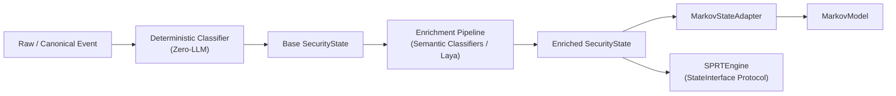

# Canonical Security-State Taxonomy

## Overview

RuntimeVerify provides an industry-grade, vendor-neutral security-state taxonomy used by its behavioral modeling and runtime verification engines. The taxonomy normalizes heterogeneous telemetry events emitted by autonomous AI agents into a standardized, discrete state space.

This state space feeds directly into RuntimeVerify's first-order **Markov Behavior Models** and **Sequential Probability Ratio Test (SPRT)** detection engines to detect behavioral deviations, policy violations, and adversarial subversion in real time.



---

## Canonical State Categories

The taxonomy defines **27 canonical security states** spanning 10 operational domains, plus a fallback `UNKNOWN` state:

| Category | Domain | Default Risk | Hierarchy Path | Description |
| :--- | :--- | :--- | :--- | :--- |
| `LLM_REQUEST` | LLM | `INFO` | `LLM.REQUEST` | Outbound prompt submission to a foundation model |
| `LLM_RESPONSE` | LLM | `INFO` | `LLM.RESPONSE` | Completion or response received from an LLM |
| `FILE_READ` | Filesystem | `INFO` | `FILESYSTEM.READ` | Read access to non-sensitive filesystem paths |
| `FILE_WRITE` | Filesystem | `LOW` | `FILESYSTEM.WRITE` | Creation, modification, or appending to files |
| `FILE_DELETE` | Filesystem | `MEDIUM` | `FILESYSTEM.DELETE` | Deletion or removal of files or directories |
| `SHELL_SAFE` | Execution | `INFO` | `EXECUTION.SHELL.SAFE` | Non-destructive, non-network shell commands (`ls`, `cat`, `pytest`) |
| `SHELL_NETWORK` | Execution | `MEDIUM` | `EXECUTION.SHELL.NETWORK` | Shell commands opening outbound connections (`curl`, `wget`, `ssh`) |
| `SHELL_PRIVILEGED` | Execution | `HIGH` | `EXECUTION.SHELL.PRIVILEGED` | Privilege escalation commands (`sudo`, `su`, `chmod 777`, `chown`) |
| `SHELL_DESTRUCTIVE` | Execution | `CRITICAL` | `EXECUTION.SHELL.DESTRUCTIVE` | Destructive operations (`rm -rf`, `mkfs`, `dd if=/dev/zero`, `format`) |
| `NETWORK_TRUSTED` | Network | `INFO` | `NETWORK.TRUSTED` | Requests to pre-configured trusted endpoints (`api.openai.com`, `github.com`) |
| `NETWORK_UNKNOWN` | Network | `LOW` | `NETWORK.UNKNOWN` | Requests to arbitrary external or untracked Internet domains |
| `NETWORK_SENSITIVE` | Network | `HIGH` | `NETWORK.SENSITIVE` | Requests to IMDS endpoints (`169.254.169.254`), localhost, or private RFC1918 subnets |
| `GIT_READ` | System | `INFO` | `SYSTEM.GIT.READ` | Read-only git operations (`status`, `log`, `diff`, `fetch`, `checkout`) |
| `GIT_COMMIT` | System | `LOW` | `SYSTEM.GIT.COMMIT` | Recording changes locally (`git commit`) |
| `GIT_PUSH` | System | `MEDIUM` | `SYSTEM.GIT.PUSH` | Publishing local commits to remote repositories (`git push`) |
| `PROCESS_CREATE` | System | `LOW` | `SYSTEM.PROCESS.CREATE` | Spawning child processes or background tasks |
| `PROCESS_TERMINATE` | System | `MEDIUM` | `SYSTEM.PROCESS.TERMINATE` | Terminating, stopping, or killing processes |
| `SECRET_ACCESS` | Security | `HIGH` | `SECURITY.SECRET.ACCESS` | Accessing `.env`, keyrings, Vault, or cloud secret managers |
| `CREDENTIAL_ACCESS` | Security | `HIGH` | `SECURITY.CREDENTIAL.ACCESS` | Accessing SSH keys, auth tokens, passwords, or credentials |
| `TOOL_CALL` | Tool | `LOW` | `TOOL.CALL` | Invocation of an external tool or function call |
| `TOOL_RESULT` | Tool | `LOW` | `TOOL.RESULT` | Returned output or execution status of a tool |
| `AGENT_MESSAGE` | Execution | `INFO` | `EXECUTION.AGENT.MESSAGE` | Inter-agent messaging in a multi-agent hierarchy |
| `AGENT_HANDOFF` | Execution | `LOW` | `EXECUTION.AGENT.HANDOFF` | Execution context delegation or role handoff to another agent |
| `HUMAN_APPROVAL` | Human | `LOW` | `HUMAN.APPROVAL` | Human-in-the-loop oversight, approval, or escalation |
| `POLICY_ALLOW` | Policy | `LOW` | `POLICY.ALLOW` | Deterministic policy evaluation permitting action |
| `POLICY_REVIEW` | Policy | `MEDIUM` | `POLICY.REVIEW` | Deterministic policy evaluation requesting escalation or warning |
| `POLICY_BLOCK` | Policy | `HIGH` | `POLICY.BLOCK` | Deterministic policy evaluation blocking an action |
| `UNKNOWN` | System | `INFO` | `SYSTEM.UNKNOWN` | Fallback classification for unrecognizable actions |

---

## Risk Ratings

The `SecurityRiskLevel` enum assigns operational security severity to each classified state:

1. `CRITICAL`: Immediate threat to system integrity or data existence (e.g., `SHELL_DESTRUCTIVE`).
2. `HIGH`: Severe security exposure, privilege escalation, or exfiltration risk (e.g., `SHELL_PRIVILEGED`, `NETWORK_SENSITIVE`, `CREDENTIAL_ACCESS`, `SECRET_ACCESS`, `POLICY_BLOCK`).
3. `MEDIUM`: Moderate impact requiring tracking or authorization (e.g., `FILE_DELETE`, `SHELL_NETWORK`, `GIT_PUSH`, `PROCESS_TERMINATE`, `POLICY_REVIEW`).
4. `LOW`: Standard agent state changes with mutating side effects (e.g., `FILE_WRITE`, `PROCESS_CREATE`, `TOOL_CALL`, `AGENT_HANDOFF`).
5. `INFO`: Routine, read-only, or informational state transitions (e.g., `LLM_REQUEST`, `SHELL_SAFE`, `FILE_READ`, `NETWORK_TRUSTED`, `AGENT_MESSAGE`).

---

## Architecture & Interfaces

### 1. SecurityState Model

`SecurityState` is an immutable Pydantic model implementing the `StateInterface` protocol:

```python
class SecurityState(BaseModel):
    id: str
    name: str  # Token string matching StateInterface (e.g. "SHELL_DESTRUCTIVE")
    security_category: SecurityStateCategory
    risk_level: SecurityRiskLevel
    category: StateCategory
    hierarchy: StateHierarchy
    context: StateContext
    metadata: StateMetadata
    confidence: float = 1.0
    attributes: Dict[str, Any] = Field(default_factory=dict)
    source_event_id: Optional[str] = None
    source_event_type: Optional[str] = None
    classifier_source: str = "deterministic"
    schema_version: str = "1.0"
```

Because `SecurityState` satisfies `StateInterface`, it directly integrates with existing RuntimeVerify components:
- `SPRTEngine.fit(sequences: List[List[StateInterface]])`
- `SPRTEngine.observe(state: StateInterface)`
- `AdversarialAlternativeModel` and `UniformAlternativeModel`

### 2. Deterministic Classifier (`DeterministicSecurityClassifier`)

- **Zero LLM Dependency**: Purely rule-based, deterministic, sub-millisecond execution.
- **Pattern Matching**:
  - Regex inspection of shell commands (destructive flags, `sudo`, `dd`, `chmod`, network utilities).
  - Target URI/host parsing (detecting AWS/GCP/Azure IMDS metadata endpoints like `169.254.169.254`, loopback addresses, or private RFC1918 subnets).
  - Filesystem path matching (detecting accesses to `.env`, `id_rsa`, `.aws/credentials`, etc.).

### 3. Extensible Enrichment Pipeline (`SecurityClassificationPipeline`)

To allow future semantic classification engines (such as **Laya**) to enrich states without replacing or breaking the deterministic foundation, RuntimeVerify provides the `BaseStateEnricher` interface:

```python
from runtimeverify.state import BaseStateEnricher, SecurityState
from runtimeverify.events import Event

class LayaSemanticClassifier(BaseStateEnricher):
    @property
    def enricher_name(self) -> str:
        return "laya_semantic_v1"

    def enrich(self, state: SecurityState, event: Event) -> SecurityState:
        # Inspect event semantics using embedding or LLM judge
        if "sensitive_intent" in event.metadata:
            return state.with_enrichment(
                risk_level=SecurityRiskLevel.HIGH,
                confidence=0.95,
                classifier_source="laya_semantic_v1",
                attributes_update={"intent": "exfiltration_attempt"},
            )
        return state
```

The pipeline executes the base deterministic classifier first, then sequentially executes all registered enrichers. If an enricher raises an exception, the pipeline gracefully logs the failure and falls back to the deterministic state.

---

## Markov Subsystem Integration (`MarkovStateAdapter`)

The `MarkovStateAdapter` seamlessly adapts runtime events and `SecurityState` objects into the existing first-order Markov behavioral model without modifying any core Markov algorithms:

```python
from runtimeverify.markov import MarkovModel
from runtimeverify.state import MarkovStateAdapter
from runtimeverify.events.canonical import ShellCommandEvent

# 1. Instantiate adapter with Markov model
adapter = MarkovStateAdapter(markov_model=MarkovModel(smoothing=1e-3))

# 2. Train on historical event sequences
trace = [
    ShellCommandEvent(agent_id="a1", session_id="s1", command="git status"),
    ShellCommandEvent(agent_id="a1", session_id="s1", command="cat config.json"),
    ShellCommandEvent(agent_id="a1", session_id="s1", command="pytest tests/"),
]
adapter.train_events([trace])

# 3. Stream real-time events and get transition probabilities
event = ShellCommandEvent(agent_id="a1", session_id="s1", command="ls -la")
state, prob = adapter.observe_event(previous="SHELL_SAFE", event=event)
print(f"Observed state: {state.name}, Transition Probability: {prob:.4f}")
```
